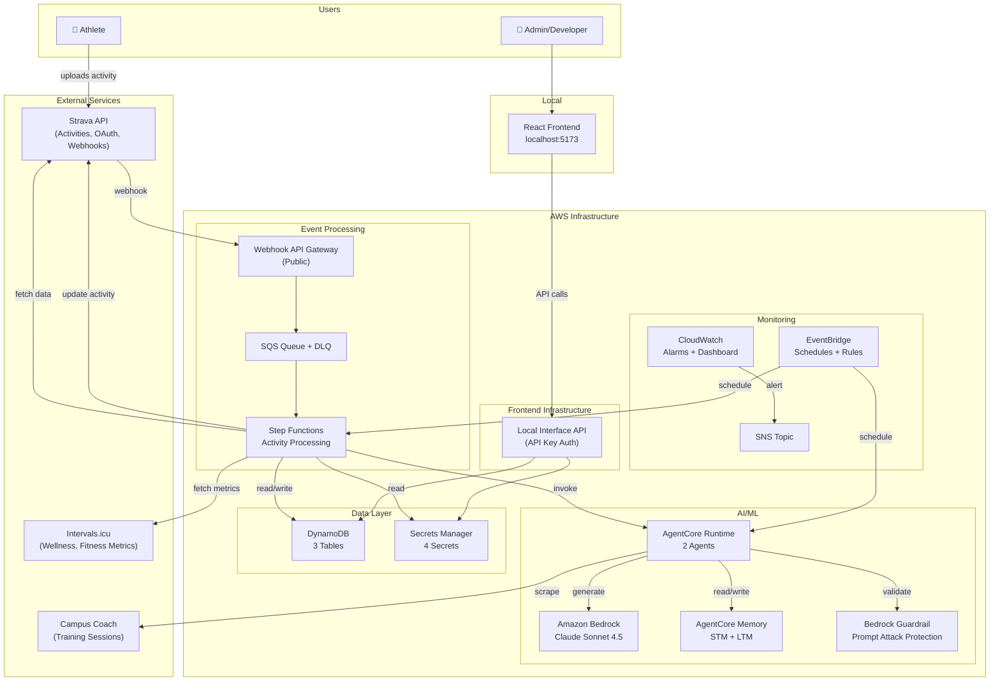
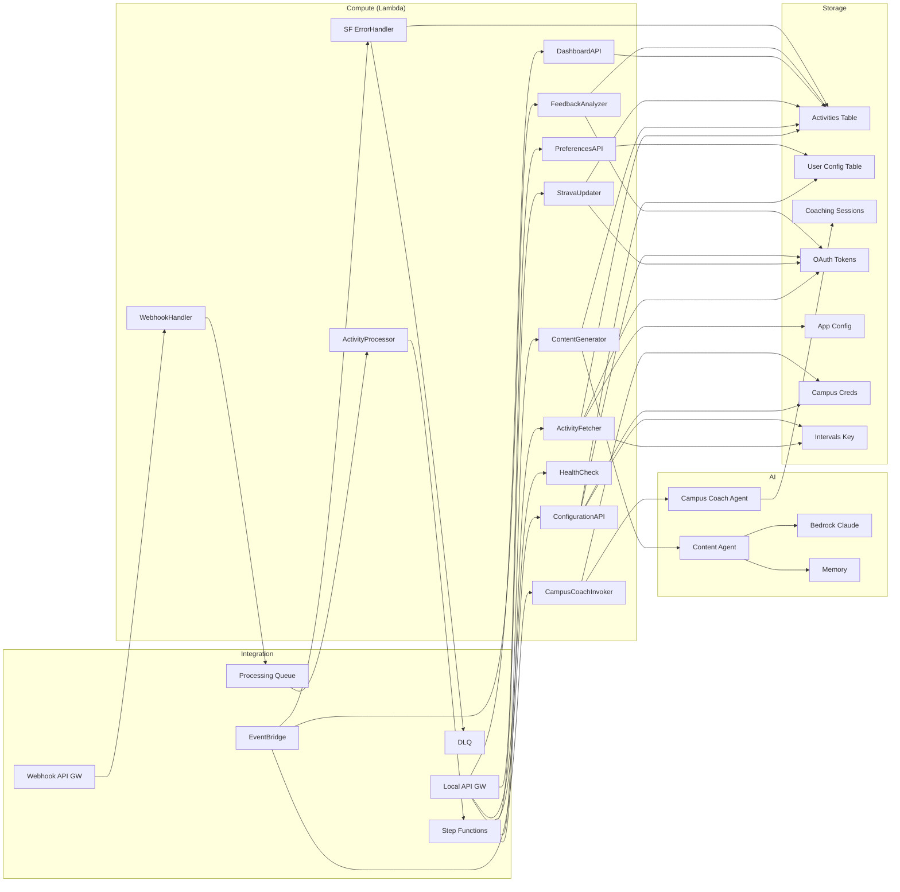
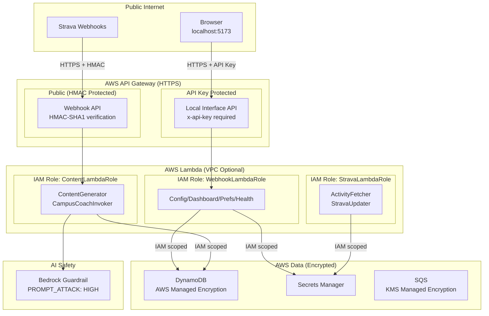

# Architecture Diagrams

## System Context Diagram

```mermaid
graph TB
    subgraph Users
        Athlete["🏃 Athlete"]
        Admin["👤 Admin/Developer"]
    end

    subgraph "External Services"
        Strava["Strava API<br/>(Activities, OAuth, Webhooks)"]
        Intervals["Intervals.icu<br/>(Wellness, Fitness Metrics)"]
        Campus["Campus Coach<br/>(Training Sessions)"]
    end

    subgraph "AWS Infrastructure"
        subgraph "Event Processing"
            WebhookAPI["Webhook API Gateway<br/>(Public)"]
            SQS["SQS Queue + DLQ"]
            SF["Step Functions<br/>Activity Processing"]
        end

        subgraph "AI/ML"
            Bedrock["Amazon Bedrock<br/>Claude Sonnet 4.5"]
            AgentCore["AgentCore Runtime<br/>2 Agents"]
            Memory["AgentCore Memory<br/>STM + LTM"]
            Guardrail["Bedrock Guardrail<br/>Prompt Attack Protection"]
        end

        subgraph "Data Layer"
            DDB["DynamoDB<br/>3 Tables"]
            SM["Secrets Manager<br/>4 Secrets"]
        end

        subgraph "Frontend Infrastructure"
            LocalAPI["Local Interface API<br/>(API Key Auth)"]
        end

        subgraph "Monitoring"
            CW["CloudWatch<br/>Alarms + Dashboard"]
            SNS["SNS Topic"]
            EB["EventBridge<br/>Schedules + Rules"]
        end
    end

    subgraph "Local"
        Frontend["React Frontend<br/>localhost:5173"]
    end

    Athlete -->|uploads activity| Strava
    Strava -->|webhook| WebhookAPI
    WebhookAPI --> SQS
    SQS --> SF
    SF -->|fetch data| Strava
    SF -->|fetch metrics| Intervals
    SF -->|invoke| AgentCore
    AgentCore -->|generate| Bedrock
    AgentCore -->|read/write| Memory
    AgentCore -->|validate| Guardrail
    AgentCore -->|scrape| Campus
    SF -->|read/write| DDB
    SF -->|read| SM
    SF -->|update activity| Strava

    Admin --> Frontend
    Frontend -->|API calls| LocalAPI
    LocalAPI --> DDB
    LocalAPI --> SM

    EB -->|schedule| AgentCore
    EB -->|schedule| SF
    CW -->|alert| SNS
```

## Service Communication Map

```mermaid
graph LR
    subgraph "Compute (Lambda)"
        L1["WebhookHandler"]
        L2["ActivityProcessor"]
        L3["ActivityFetcher"]
        L4["ContentGenerator"]
        L5["StravaUpdater"]
        L6["CampusCoachInvoker"]
        L7["ConfigurationAPI"]
        L8["DashboardAPI"]
        L9["PreferencesAPI"]
        L10["HealthCheck"]
        L11["FeedbackAnalyzer"]
        L12["SF ErrorHandler"]
    end

    subgraph "Integration"
        APIGW1["Local API GW"]
        APIGW2["Webhook API GW"]
        SQS1["Processing Queue"]
        SQS2["DLQ"]
        SF1["Step Functions"]
        EB1["EventBridge"]
    end

    subgraph "Storage"
        DDB1["Activities Table"]
        DDB2["User Config Table"]
        DDB3["Coaching Sessions"]
        SM1["OAuth Tokens"]
        SM2["App Config"]
        SM3["Campus Creds"]
        SM4["Intervals Key"]
    end

    subgraph "AI"
        AC1["Content Agent"]
        AC2["Campus Coach Agent"]
        BR1["Bedrock Claude"]
        MEM["Memory"]
    end

    APIGW2 --> L1
    L1 --> SQS1
    SQS1 --> L2
    L2 --> SF1
    SF1 --> L3
    SF1 --> L4
    SF1 --> L5
    L4 --> AC1
    AC1 --> BR1
    AC1 --> MEM
    EB1 --> L6
    L6 --> AC2
    EB1 --> L11
    EB1 --> L12

    APIGW1 --> L7
    APIGW1 --> L8
    APIGW1 --> L9
    APIGW1 --> L10

    L3 --> DDB1
    L4 --> DDB1
    L5 --> DDB1
    L7 --> DDB2
    L8 --> DDB1
    L9 --> DDB2
    L11 --> DDB1
    L12 --> DDB1
    L12 --> SQS2
    AC2 --> DDB3

    L3 --> SM1
    L3 --> SM2
    L3 --> SM4
    L5 --> SM1
    L7 --> SM1
    L7 --> SM3
    L7 --> SM4
    L6 --> SM3
    L11 --> SM1
```

## Security Boundaries

```mermaid
graph TB
    subgraph "Public Internet"
        Browser["Browser<br/>localhost:5173"]
        StravaExt["Strava Webhooks"]
    end

    subgraph "AWS API Gateway (HTTPS)"
        subgraph "API Key Protected"
            LocalAPI["Local Interface API<br/>x-api-key required"]
        end
        subgraph "Public (HMAC Protected)"
            WebhookAPI["Webhook API<br/>HMAC-SHA1 verification"]
        end
    end

    subgraph "AWS Lambda (VPC Optional)"
        subgraph "IAM Role: WebhookLambdaRole"
            APILambdas["Config/Dashboard/Prefs/Health"]
        end
        subgraph "IAM Role: ContentLambdaRole"
            ContentLambdas["ContentGenerator<br/>CampusCoachInvoker"]
        end
        subgraph "IAM Role: StravaLambdaRole"
            StravaLambdas["ActivityFetcher<br/>StravaUpdater"]
        end
    end

    subgraph "AWS Data (Encrypted)"
        DDB["DynamoDB<br/>AWS Managed Encryption"]
        SM["Secrets Manager"]
        SQS["SQS<br/>KMS Managed Encryption"]
    end

    subgraph "AI Safety"
        Guardrail["Bedrock Guardrail<br/>PROMPT_ATTACK: HIGH"]
    end

    Browser -->|HTTPS + API Key| LocalAPI
    StravaExt -->|HTTPS + HMAC| WebhookAPI
    LocalAPI --> APILambdas
    WebhookAPI --> ContentLambdas
    APILambdas -->|IAM scoped| DDB
    APILambdas -->|IAM scoped| SM
    ContentLambdas -->|IAM scoped| DDB
    StravaLambdas -->|IAM scoped| SM
    ContentLambdas --> Guardrail
```
