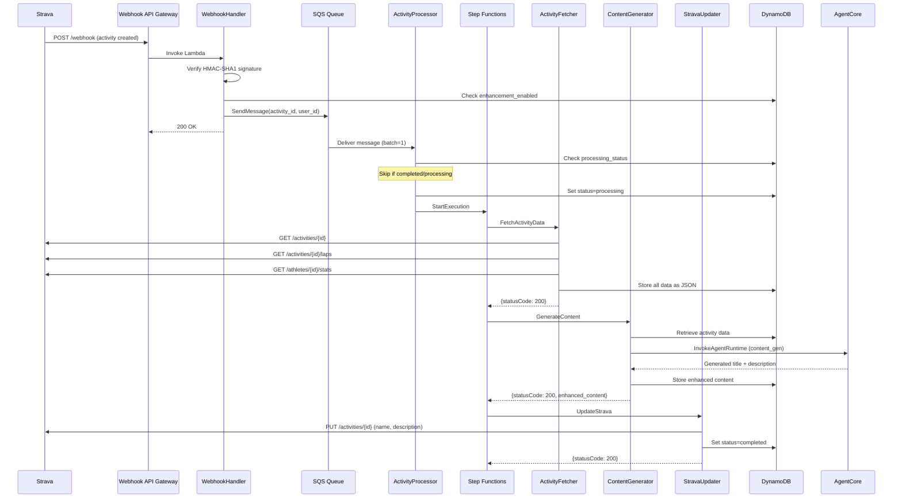
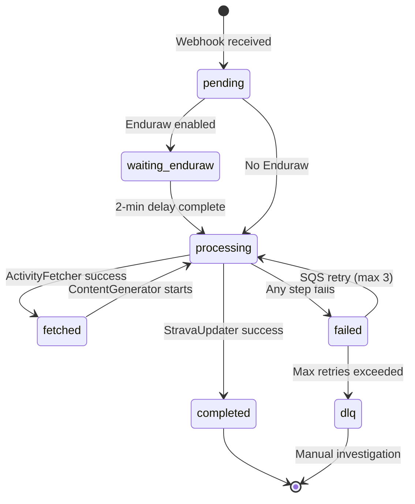
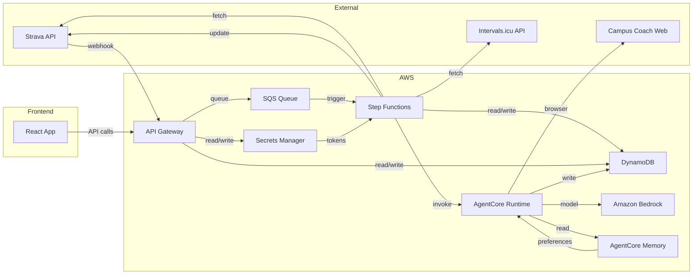

# Behavioral Diagrams

## Activity Enhancement Sequence Diagram

```mermaid
sequenceDiagram
    participant Strava
    participant APIGW as Webhook API Gateway
    participant WH as WebhookHandler
    participant SQS as SQS Queue
    participant AP as ActivityProcessor
    participant SF as Step Functions
    participant AF as ActivityFetcher
    participant CG as ContentGenerator
    participant SU as StravaUpdater
    participant DDB as DynamoDB
    participant AC as AgentCore

    Strava->>APIGW: POST /webhook (activity created)
    APIGW->>WH: Invoke Lambda
    WH->>WH: Verify HMAC-SHA1 signature
    WH->>DDB: Check enhancement_enabled
    WH->>SQS: SendMessage(activity_id, user_id)
    WH-->>APIGW: 200 OK

    SQS->>AP: Deliver message (batch=1)
    AP->>DDB: Check processing_status
    Note over AP: Skip if completed/processing
    AP->>DDB: Set status=processing
    AP->>SF: StartExecution

    SF->>AF: FetchActivityData
    AF->>Strava: GET /activities/{id}
    AF->>Strava: GET /activities/{id}/laps
    AF->>Strava: GET /athletes/{id}/stats
    AF->>DDB: Store all data as JSON
    AF-->>SF: {statusCode: 200}

    SF->>CG: GenerateContent
    CG->>DDB: Retrieve activity data
    CG->>AC: InvokeAgentRuntime (content_gen)
    AC-->>CG: Generated title + description
    CG->>DDB: Store enhanced content
    CG-->>SF: {statusCode: 200, enhanced_content}

    SF->>SU: UpdateStrava
    SU->>Strava: PUT /activities/{id} (name, description)
    SU->>DDB: Set status=completed
    SU-->>SF: {statusCode: 200}
```

## Activity Status Lifecycle

```mermaid
stateDiagram-v2
    [*] --> pending: Webhook received
    pending --> waiting_enduraw: Enduraw enabled
    waiting_enduraw --> processing: 2-min delay complete
    pending --> processing: No Enduraw
    processing --> fetched: ActivityFetcher success
    fetched --> processing: ContentGenerator starts
    processing --> completed: StravaUpdater success
    processing --> failed: Any step fails
    failed --> processing: SQS retry (max 3)
    failed --> dlq: Max retries exceeded
    completed --> [*]
    dlq --> [*]: Manual investigation
```

## Data Flow Diagram

```mermaid
graph LR
    subgraph External
        StravaAPI["Strava API"]
        IntervalsAPI["Intervals.icu API"]
        CampusWeb["Campus Coach Web"]
    end

    subgraph AWS
        APIGW["API Gateway"]
        SQS["SQS Queue"]
        SF["Step Functions"]
        DDB["DynamoDB"]
        SM["Secrets Manager"]
        Bedrock["Amazon Bedrock"]
        AgentCore["AgentCore Runtime"]
        Memory["AgentCore Memory"]
    end

    subgraph Frontend
        React["React App"]
    end

    StravaAPI -->|webhook| APIGW
    APIGW -->|queue| SQS
    SQS -->|trigger| SF
    SF -->|fetch| StravaAPI
    SF -->|fetch| IntervalsAPI
    SF -->|read/write| DDB
    SF -->|invoke| AgentCore
    AgentCore -->|model| Bedrock
    AgentCore -->|read| Memory
    SF -->|update| StravaAPI
    SM -->|tokens| SF

    React -->|API calls| APIGW
    APIGW -->|read/write| DDB
    APIGW -->|read/write| SM

    AgentCore -->|browser| CampusWeb
    AgentCore -->|write| DDB
    Memory -->|preferences| AgentCore
```
