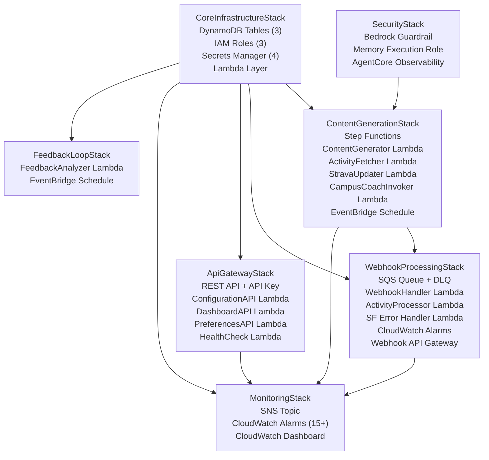
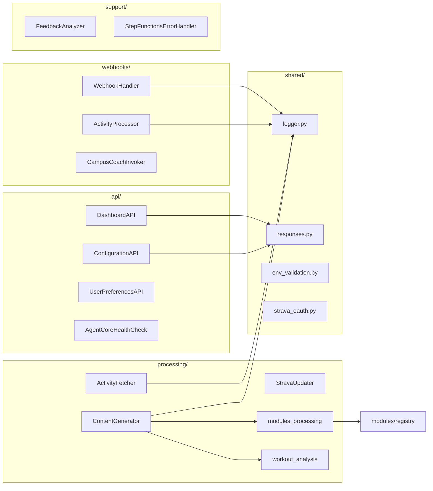
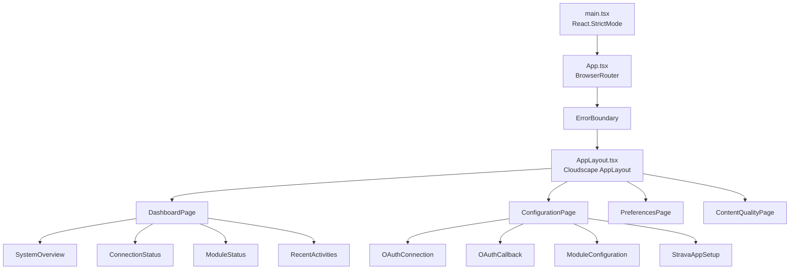

# Structural Diagrams

## CDK Stack Component Diagram

```mermaid
graph TD
    Core["CoreInfrastructureStack<br/>DynamoDB Tables (3)<br/>IAM Roles (3)<br/>Secrets Manager (4)<br/>Lambda Layer"]
    Security["SecurityStack<br/>Bedrock Guardrail<br/>Memory Execution Role<br/>AgentCore Observability"]
    Content["ContentGenerationStack<br/>Step Functions<br/>ContentGenerator Lambda<br/>ActivityFetcher Lambda<br/>StravaUpdater Lambda<br/>CampusCoachInvoker Lambda<br/>EventBridge Schedule"]
    Webhook["WebhookProcessingStack<br/>SQS Queue + DLQ<br/>WebhookHandler Lambda<br/>ActivityProcessor Lambda<br/>SF Error Handler Lambda<br/>CloudWatch Alarms<br/>Webhook API Gateway"]
    API["ApiGatewayStack<br/>REST API + API Key<br/>ConfigurationAPI Lambda<br/>DashboardAPI Lambda<br/>PreferencesAPI Lambda<br/>HealthCheck Lambda"]
    Monitoring["MonitoringStack<br/>SNS Topic<br/>CloudWatch Alarms (15+)<br/>CloudWatch Dashboard"]
    Feedback["FeedbackLoopStack<br/>FeedbackAnalyzer Lambda<br/>EventBridge Schedule"]

    Core --> Content
    Security --> Content
    Core --> Webhook
    Content --> Webhook
    Core --> API
    Core --> Monitoring
    Content --> Monitoring
    Webhook --> Monitoring
    API --> Monitoring
    Core --> Feedback
```

## Lambda Function Package Diagram

```mermaid
graph LR
    subgraph "api/"
        Config[ConfigurationAPI]
        Dashboard[DashboardAPI]
        Prefs[UserPreferencesAPI]
        Health[AgentCoreHealthCheck]
    end

    subgraph "processing/"
        Fetcher[ActivityFetcher]
        Generator[ContentGenerator]
        Updater[StravaUpdater]
        Modules[modules_processing]
        Workout[workout_analysis]
    end

    subgraph "webhooks/"
        WebhookH[WebhookHandler]
        Processor[ActivityProcessor]
        CoachInv[CampusCoachInvoker]
    end

    subgraph "shared/"
        Logger[logger.py]
        Responses[responses.py]
        EnvVal[env_validation.py]
        OAuth[strava_oauth.py]
    end

    subgraph "support/"
        FeedbackA[FeedbackAnalyzer]
        SFError[StepFunctionsErrorHandler]
    end

    Generator --> Modules
    Generator --> Workout
    Modules --> Registry["modules/registry"]
    Config --> Responses
    Dashboard --> Responses
    Processor --> Logger
    WebhookH --> Logger
    Generator --> Logger
    Fetcher --> Logger
```

## Frontend Component Hierarchy

```mermaid
graph TD
    Main["main.tsx<br/>React.StrictMode"]
    App["App.tsx<br/>BrowserRouter"]
    Layout["AppLayout.tsx<br/>Cloudscape AppLayout"]
    EB["ErrorBoundary"]

    Main --> App
    App --> EB
    EB --> Layout

    Layout --> Dashboard["DashboardPage"]
    Layout --> Config["ConfigurationPage"]
    Layout --> Pref["PreferencesPage"]
    Layout --> Quality["ContentQualityPage"]

    Dashboard --> SysOverview["SystemOverview"]
    Dashboard --> ConnStatus["ConnectionStatus"]
    Dashboard --> ModStatus["ModuleStatus"]
    Dashboard --> Recent["RecentActivities"]

    Config --> OAuthConn["OAuthConnection"]
    Config --> OAuthCB["OAuthCallback"]
    Config --> ModConfig["ModuleConfiguration"]
    Config --> StravaSetup["StravaAppSetup"]
```
