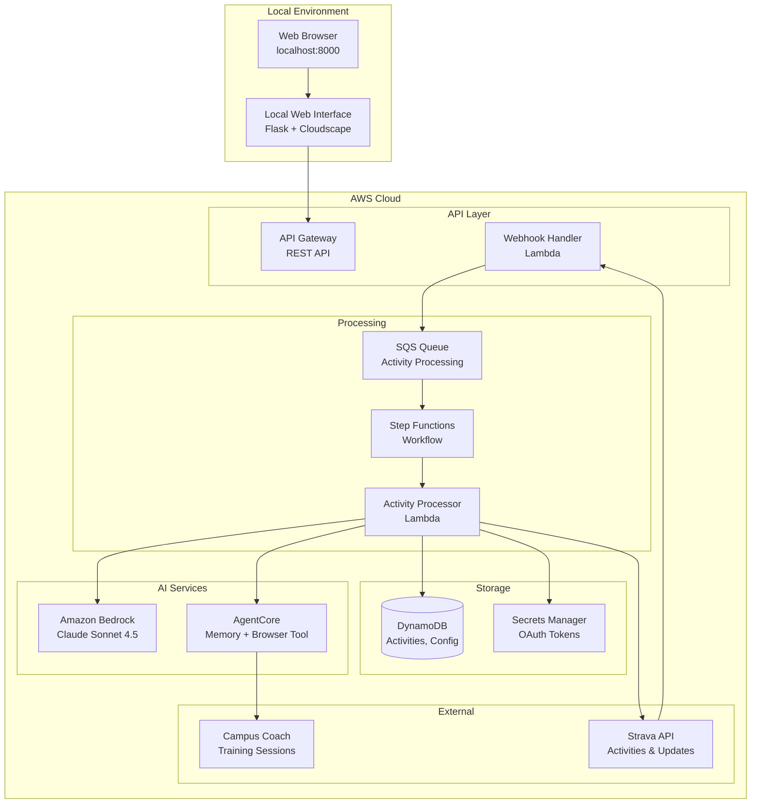
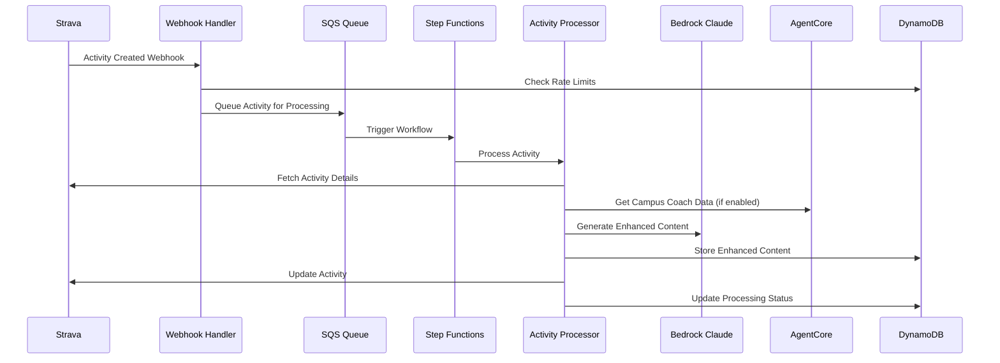

# Strava AI Boost

**Version:** v1.3.8  
**Status:** In Development - Documentation Synchronized

Strava AI Boost is a simplified, modular serverless application that automatically enhances Strava activity titles and descriptions using Amazon Bedrock AI. Built as a streamlined version of the existing Strava AI Coach project, it focuses on core functionality while maintaining modularity for future integrations.

## 🚀 Quick Start

**New to Strava AI Boost?** Get started in 5 minutes:

👉 **[Quick Start Guide](docs/getting-started/QUICK-START.md)**

## 📚 Documentation

**📖 [Complete Documentation Hub](docs/README.md)** - Single entry point to all documentation

**Quick Links:**
- 🚀 **[Quick Start Guide](docs/getting-started/QUICK-START.md)** - Get running in 5 minutes
- 🎯 **[First Activity Guide](docs/getting-started/FIRST-STEPS.md)** - Your first enhancement
- 🔧 **[Troubleshooting](docs/user-guide/TROUBLESHOOTING.md)** - Common issues

## 🎯 Choose Your Path

### I'm New - Just Want to Try It
→ **[Quick Start Guide](docs/getting-started/QUICK-START.md)**

### I Want Full Control and Understanding  
→ **[Complete Setup Guide](docs/getting-started/COMPLETE-SETUP.md)**

### I Have Issues or Questions
→ **[Troubleshooting Guide](docs/user-guide/TROUBLESHOOTING.md)**

### I Want to Understand the Technical Details
→ **[Architecture Documentation](docs/reference/ARCHITECTURE.md)** or **[AgentCore Guide](docs/advanced/AGENTCORE.md)**

### I Need to Run Tests or Validate the System
→ **[Testing Guide](docs/advanced/TESTING.md)** - Complete end-to-end testing suite

### I Want to Understand Test Results
→ **[Testing Guide](docs/advanced/TESTING.md)** - Comprehensive validation procedures

## Overview

The system uses a local web interface approach to avoid complexity of user management, authentication systems, and secure web hosting. This prioritizes simplicity and rapid deployment for individual users who can install the system in their own AWS environment.

### Key Features

- **Local Web Interface**: Python Flask application with AWS Cloudscape components
- **Modular Architecture**: Extensible module system starting with Campus Coach integration  
- **AI-Powered Enhancement**: Amazon Bedrock Claude Sonnet 4.5 for intelligent content generation
- **AgentCore Memory**: Persistent personalization avoiding repetitive expressions
- **Campus Coach Integration**: AgentCore Browser Tool for automated session extraction
- **Serverless Architecture**: Full AWS serverless stack for cost efficiency and scalability

## Prerequisites

### Required Services

1. **Strava Account** (social fitness platform)
   - API Limits: 100 req/15min, 1000 req/day
   - OAuth application registration required

2. **Campus Coach Account** (French training platform) - Optional Module
   - Subscription required for module activation
   - Website: https://campus.coach

3. **Enduraw Integration** (third-party Strava app) - Optional Module
   - Enhanced analytics (pace without wind, weather impact)
   - Processing delay: 2-7 minutes when enabled

4. **AWS Account**
   - Cost: ~$0.02 per activity (estimated)
   - Region: eu-west-1 recommended
   - AgentCore CLI access required

### Development Environment

- Python 3.12+
- AWS CDK CLI
- AgentCore CLI
- Node.js (for CDK)

## Architecture

### High-Level System Flow



### Detailed Processing Flow



### Technology Stack

**Infrastructure:**
- AWS CDK: Python constructs
- Python Runtime: 3.12
- Region: eu-west-1 (Ireland)
- AgentCore CLI: Shell script deployment

**AWS Services:**
- Lambda: Python 3.12 runtime
- DynamoDB: Core tables (activities, config, rate-limits, sessions)
- Step Functions: Activity processing workflow
- SQS: Message queuing with DLQ
- Bedrock: Claude Sonnet 4.5
- Secrets Manager: OAuth tokens and credentials
- API Gateway: Local interface REST API

**AI/ML Framework:**
- Strands Agents: Agent orchestration framework
- AgentCore Memory: Persistent personalization
- AgentCore Browser Tool: Campus Coach scraping
- Claude Sonnet 4.5: Content generation and analysis

## Performance Targets

- **Webhook Processing**: <5 seconds to queue
- **Content Generation**: <30 seconds end-to-end
- **Dashboard Loading**: <2 seconds
- **Configuration Changes**: <1 second
- **Cost per Activity**: ~$0.02 (target)

## Security

- **Data Encryption**: AWS managed encryption for all DynamoDB tables
- **Secure Communication**: HTTPS for all API endpoints
- **Credential Management**: AWS Secrets Manager with automatic rotation
- **IAM**: Least privilege principle with AWS managed policies
- **Local Interface**: Local-only access (127.0.0.1)

## Testing and Validation

The system includes a comprehensive testing suite that validates all core functionality:

- **End-to-End Pipeline Testing**: Complete webhook → SQS → Step Functions → Bedrock → Strava flow validation
- **Security Compliance Testing**: 100% encryption and IAM compliance verification  
- **Local Web Interface Testing**: Flask application component validation
- **Property-Based Testing**: Universal properties validation across all system components

Run the complete test suite:
```bash
# End-to-end pipeline test
python tests/test_end_to_end_pipeline.py

# Security compliance test (100% compliance achieved)
python tests/test_security_compliance.py

# Local web interface test
python tests/test_local_web_interface.py
```

For detailed testing procedures, see the **[Testing Guide](docs/advanced/TESTING.md)**.

## Contributing

1. Follow the property-based testing approach for all infrastructure changes
2. Update CHANGELOG.md for all significant changes
3. Ensure all tests pass before committing
4. Use AWS profile `your-aws-profile` for all AWS operations

## License

This project is licensed under the MIT License.

---

**Current Version:** v1.3.8  
**Last Updated:** 2025-12-23  
**Status:** Documentation Synchronized - All Core Functionality Validated