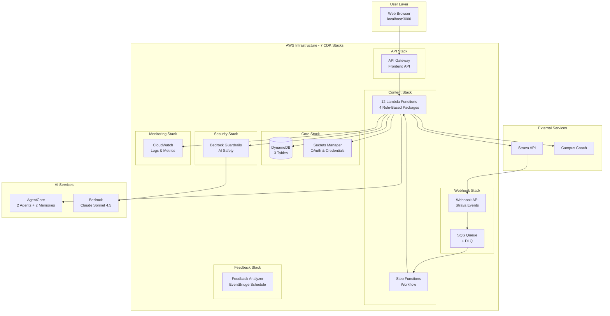
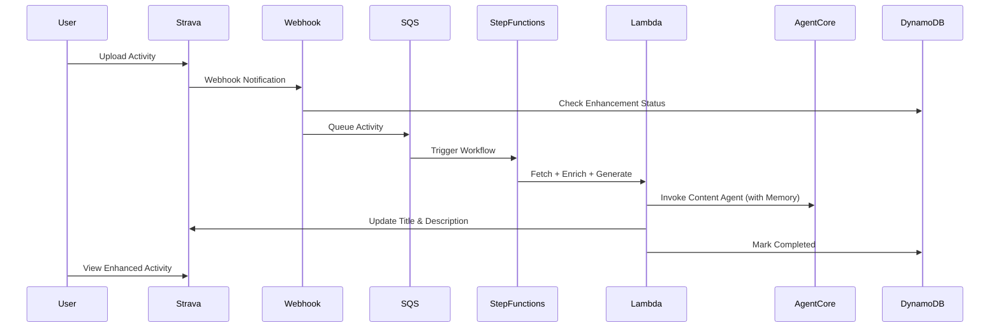

# Strava AI Boost

Strava AI Boost is a production-ready, modular serverless application that automatically enhances Strava activity titles and descriptions using Amazon Bedrock AI and AgentCore Memory. Built with a clean API Gateway + Lambda architecture, it provides secure, scalable functionality with zero direct AWS SDK dependencies in the frontend.

## Quick Start

### Prerequisites

- AWS Account with CLI configured
- Python 3.12+, Node.js (for CDK)
- AgentCore CLI (for Phase 2 only)
- Strava Account with API application registered

### Phase 1: Infrastructure Deployment (Required)

```bash
# 1. Clone and setup
git clone <repository-url>
cd strava-ai-boost
python -m venv venv
source venv/bin/activate
pip install -r requirements.txt
export AWS_PROFILE=<your-aws-profile>

# Optional: deploy to a different region (default: us-east-1)
export AWS_REGION=eu-west-1

# 2. Deploy CDK Infrastructure (~10-15 min)
./scripts/deploy.sh dev

# 3. Validate Deployment (~2 min)
./scripts/validate_deployment.sh dev

# 4. Setup Local Environment (~30 sec)
./scripts/setup_local_env.sh

# 5. Configure Strava Webhook (~1 min)
./scripts/configure_strava_webhook.sh dev --auto-configure
```

**What this deploys**: 7 CDK stacks, DynamoDB tables, 12 Lambda functions (grouped in 4 packages), Step Functions, Secrets Manager, Bedrock fallback mode (Claude Sonnet 4.5), structured logging with AWS Lambda Powertools. System is immediately functional.

### Phase 2: AgentCore Enhancement (Optional)

Add advanced personalization with Long-Term Memory:

```bash
# 1. Create AgentCore Memories (~3 min)
./scripts/create_agentcore_memories.sh

# 2. Deploy AgentCore Agents (~5-10 min)
./scripts/deploy_agentcore_agents.sh

# 3. Configure Integration (~2 min)
./scripts/configure_agentcore_integration.sh

# 4. Redeploy Agents with Guardrails (~5 min)
./scripts/deploy_agentcore_agents.sh

# 5. Final CDK Deployment (~5 min)
cdk deploy --all --require-approval never
```

### Start Using the System

```bash
cd frontend
cp .env.example .env.local  # Edit with your API Gateway URL, API key, and user ID
npm install && npm run dev
# Open http://localhost:3000
```

1. Click **"Connect with Strava"** and authorize the application
2. Configure your preferences (age, interests, style)
3. Enable modules (Campus Coach, Enduraw, Intervals.icu)
4. Upload or edit a Strava activity and watch it get enhanced!
5. Check the **Content Quality** page to track confidence, edit rates, and similarity scores

**Deployment Modes**: Phase 1 only gives a fully functional system with Bedrock fallback. Phase 1 + 2 adds advanced personalization with AgentCore Memory.

---

## Configuration

### Strava OAuth Setup

1. Go to https://www.strava.com/settings/api and create an app
2. Set **Authorization Callback Domain** to `localhost` (no http://, no port)
3. Store credentials in Secrets Manager:
   ```bash
   aws secretsmanager put-secret-value \
     --secret-id strava-ai-boost-app-config \
     --secret-string '{"client_id":"YOUR_CLIENT_ID","client_secret":"YOUR_CLIENT_SECRET"}' \
     --profile <your-aws-profile> --region <your-region>
   ```

### Module Configuration

#### Campus Coach (Optional)

Matches activities with planned training sessions from [campus.coach](https://campus.coach).

1. Go to Configuration > Modules, enable "Campus Coach"
2. Enter your Campus Coach username and password
3. Credentials are encrypted in AWS Secrets Manager

#### Enduraw Report (Optional)

Enhanced analytics with weather and wind impact analysis.

- **External setup required**: Configure at https://enduraw-report-strava.onrender.com first
- Then enable "Enduraw Integration" in modules
- System waits 2 minutes for Enduraw data via SQS delay (graceful fallback if unavailable)

#### Intervals.icu (Optional)

Fitness/fatigue context from [Intervals.icu](https://intervals.icu) training analytics.

1. Go to Configuration > Modules, enable "Intervals.icu"
2. Enter your Intervals.icu API key (Settings > Developer in Intervals.icu)
3. Provides unique data not available from Strava/Enduraw:
   - **CTL/ATL/Form**: Chronic training load, acute fatigue, and form balance — explains why legs feel heavy or light
   - **Ramp rate**: Training load progression speed — detects overtraining risk
   - **HRV**: Heart rate variability when available
   - **Decoupling**: Cardiac drift percentage — aerobic efficiency indicator for long runs

### Personal Profile

Customize AI content generation in Configuration > Personal Profile:

| Setting | Options |
|---------|---------|
| **Sport Approach** | Health & Wellness, Performance & Competition, Social & Fun, Personal Challenge, Stress Relief, Weight Management |
| **Content Length** | Short (~300 chars), Medium (~800), Detailed (~1500), Adaptive |
| **Tone** | Technical & Analytical, Motivational & Energetic, Casual & Friendly, Humorous & Fun, Authentic & Personal |
| **Emoji Usage** | None, Minimal (1-2), Moderate (3-5), Enthusiastic (5+) |
| **Technical Detail** | Basic, Intermediate, Advanced |
| **Language** | French, English, Spanish, German, Italian |

### Enhancement Control

- **Pause/Resume**: Toggle automatic enhancement from the dashboard
- **2-minute window**: When Enduraw is enabled, you can add your own title/description during the wait - they will be preserved and incorporated

### Environment Variables

Configure in `frontend/.env.local` (copy from `.env.example`):
```bash
VITE_API_GATEWAY_URL=https://your-api-id.execute-api.<your-region>.amazonaws.com/prod
VITE_API_GATEWAY_KEY=your-api-key-value
VITE_DEFAULT_USER_ID=YOUR_STRAVA_ATHLETE_ID
```

> **Important:** `VITE_API_GATEWAY_KEY` must be the API key **value** (long alphanumeric string), not the API key **ID**. You can find it with:
> ```bash
> aws apigateway get-api-keys --include-values --query 'items[?starts_with(name, `strava-ai-boost`)].value' --output text --profile <your-aws-profile> --region <your-region>
> ```

---

## Architecture Overview

### Key Architecture Decisions

1. **React Frontend** - No cloud hosting complexity, runs on localhost
2. **Zero AWS SDK in Frontend** - All AWS operations via API Gateway + Lambda
3. **Modular Design** - Extensible module system (Campus Coach, Enduraw, Intervals.icu)
4. **Dual-Mode AI** - AgentCore (primary) + Bedrock fallback (always available)
5. **Serverless** - Pay-per-use, auto-scaling, no server management
6. **Security First** - Guardrails, encryption, least privilege IAM

### System Components



### Infrastructure Components

| Component | Details |
|-----------|---------|
| **7 CDK Stacks** | Core, Security, Webhook, Content, API, Monitoring, Feedback |
| **12 Lambda Functions** | 4 API + 3 processing + 3 webhooks + 2 support (in role-based packages) |
| **3 DynamoDB Tables** | `activities` (GSI, TTL), `user_config`, `coaching_sessions` (GSI) |
| **2 AgentCore Agents** | `content_gen` (LTM memory), `campus_coach` (Browser Tool) |
| **External APIs** | Strava API, Campus Coach, Intervals.icu, Enduraw (all optional) |
| **Shared Utilities** | `lambda_functions/shared/` - Logger, responses, env validation, OAuth |

### Data Flow: Activity Enhancement



### Technology Stack

**Infrastructure**: AWS CDK (Python), Python 3.12, us-east-1 (configurable via `--context region=<region>`)

**AWS Services**: Lambda (12 functions, Powertools), DynamoDB (3 tables, GSI, TTL), Step Functions, SQS + DLQ, Bedrock (Claude Sonnet 4.5), Secrets Manager, API Gateway

**AI/ML**: Strands Agents, AgentCore Memory (2 LTM memories), AgentCore Browser Tool, Claude Sonnet 4.5

### Performance Targets

- Webhook Processing: <5s to queue
- Content Generation: <30s end-to-end
- Dashboard Loading: <2s
- Cost per Activity: ~$0.02

---

## Troubleshooting

### Quick Diagnostics

```bash
# Check AWS connectivity
aws sts get-caller-identity --profile <your-aws-profile>

# Check Lambda logs (structured JSON with correlation IDs)
aws logs tail /aws/lambda/StravaAIBoost-WebhookHandler --follow --profile <your-aws-profile>

# Filter by error level
aws logs filter-log-events \
  --log-group-name /aws/lambda/StravaAIBoost-ConfigurationAPI \
  --filter-pattern '{ $.level = "ERROR" }' \
  --profile <your-aws-profile>

# Validate deployment
./scripts/validate_deployment.sh dev
```

### Common Issues

**OAuth: "Failed to connect to Strava"**
- Verify callback domain is exactly `localhost` (no http://, no port)
- Check Client ID/Secret match your Strava app
- Try incognito mode to clear cached state

**Activities not being enhanced**
- Check enhancement is not paused (Dashboard > Resume Enhancement)
- Verify webhook: `./scripts/configure_strava_webhook.sh dev --validate-only`
- Check SQS queue and DLQ for stuck messages

**Modules showing disabled after OAuth refresh**
- Fixed in v2.4.0: `user_id` is now persisted at top level during OAuth callback
- If still occurring, disconnect and reconnect Strava OAuth

**Frontend won't load**
- Verify `frontend/.env.local` is configured (copy from `.env.example`)
- Check port 3000 is available: `lsof -i :3000`
- Restart: `cd frontend && npm install && npm run dev`

**Processing takes too long**
- Basic enhancement: 30-60s | With Campus Coach: 2-3min | With Enduraw: +2min wait
- Check CloudWatch for Lambda timeouts or Bedrock throttling

**Enhanced content is repetitive**
- Update personal profile with more specific preferences
- Verify AgentCore Memory service is working
- Check feedback loop is running (EventBridge schedule)

### DLQ Reprocessing

```bash
# Check DLQ message count
aws sqs get-queue-attributes \
  --queue-url $(aws sqs get-queue-url --queue-name strava-ai-boost-activity-processing-dlq --profile <your-aws-profile> --query 'QueueUrl' --output text) \
  --attribute-names ApproximateNumberOfMessages \
  --profile <your-aws-profile>

# Reprocess all DLQ messages
./scripts/reprocess_dlq.sh
```

### Webhook Infinite Loop Prevention

Strava sends `update` webhooks when activities are modified. The system prevents infinite loops by:
- Skipping activities with `completed` or `processing` status
- Skipping `update` webhooks for already-processed activities
- 1-hour cooldown for failed activities on update webhooks

---

## Known Issues

### 1. AgentCore Browser Tool - Cold Start (~30% first-call failure)

AgentCore Browser Tool experiences cold start delays. Exponential backoff retry (3 attempts) is implemented. Success rate: ~90% after retries.

### 2. Lambda Layer Cross-Stack Export Constraint

The Lambda Layer cannot be replaced via CDK due to CloudFormation cross-stack export limitations. New dependencies are installed directly into `lambda_functions/` via `pip install -t` and bundled with `Code.from_asset`. The Layer still provides original dependencies.

### 3. CDK Feature Flags Warning (Cosmetic)

58 unconfigured feature flags generate warnings during CDK operations. No functional impact. Run `cdk flags` to review.

---

## Testing

```bash
# Lambda unit tests (123 tests, ~0.7s — no AWS credentials needed)
pytest tests/unit/ -v

# Infrastructure/integration tests (73 tests — requires AWS credentials)
export AWS_PROFILE=<your-aws-profile>
pytest tests/ -v --ignore=tests/unit/

# Frontend unit tests (40 tests, ~4s)
cd frontend && npm test

# All backend tests
pytest tests/ -v
```

**Test coverage:** 236 total tests (123 Lambda unit + 40 frontend unit + 73 infra/integration).

## Cost Tracking

All resources are tagged for AWS Cost Explorer cost allocation:

| Tag | Value | Purpose |
|-----|-------|---------|
| `Project` | `StravaAIBoost` | Project identification |
| `Environment` | `dev` (default, via CDK context) | Environment separation |
| `Owner` | `admin` (default, via CDK context) | Resource ownership |
| `CostCenter` | `strava-ai-boost` | Cost allocation |
| `ManagedBy` | `CDK` or `AgentCore-CLI` | Deployment method |

**Coverage:**
- **CDK resources** (Lambda, DynamoDB, SQS, Step Functions, API Gateway, Secrets Manager, CloudWatch, Guardrails, IAM): Tagged automatically via `cdk.Tags.of(app)` in `app.py`
- **AgentCore resources** (2 runtimes, 2 memories, IAM execution roles): Tagged via `scripts/tag_agentcore_resources.sh` (called automatically by `deploy_agentcore_agents.sh`, also runnable standalone). IAM role tagging enables per-agent Bedrock cost attribution via CUR 2.0 IAM Principal data.

**To activate in Cost Explorer:** Billing console → Cost Allocation Tags → select `Project`, `Environment`, `Owner`, `CostCenter`, `ManagedBy` → Activate (takes ~24h to propagate).

## Security

- **Bedrock Guardrails**: AI safety and prompt injection protection
- **Data Encryption**: AWS managed encryption for all DynamoDB tables
- **HTTPS**: All API endpoints use secure communication
- **Secrets Manager**: OAuth tokens and credentials with automatic rotation
- **IAM**: Least privilege with scoped resource ARNs
- **Frontend**: Local-only access (localhost:3000), ErrorBoundary for graceful recovery
- **User Isolation**: Per-user configuration keyed by Strava athlete ID

## Documentation

- **[AGENTS.md](AGENTS.md)** - Complete development guide for AI assistants
- **[Scripts](scripts/README.md)** - Deployment and maintenance scripts
- **[Tests](tests/README.md)** - Test suite documentation

## Contributing

1. Follow property-based testing for infrastructure changes
2. Ensure all tests pass before committing
3. Set `AWS_PROFILE` before running commands

## License

This project is licensed under the MIT License.
