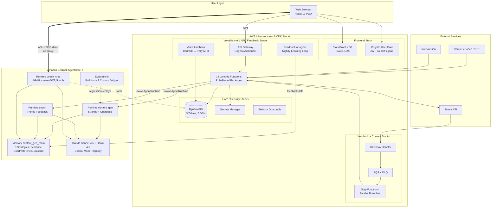
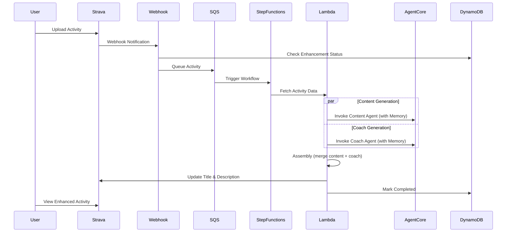

# Strava AI Boost

> **⚠️ Disclaimer — demo / personal-use sample, not production software**
>
> This project is a personal-use application published as an **inspiration sample** for building with Amazon Bedrock, AgentCore, and AWS CDK. It is **not intended for production use** and comes with no support or warranty (MIT-0 license). In particular:
>
> - **Single-user by design** — built for one athlete (per-user config exists, but no multi-tenant hardening)
> - **No CI/CD** — deployments are manual via `cdk deploy` and shell scripts for the AgentCore agents (`scripts/deploy_agentcore_agents.sh`)
> - **Known issues** — Lambda Layer cross-stack export constraint, cosmetic CDK feature-flag warnings (see [Known Issues](#known-issues))
> - **External dependencies may break** — Strava API (paid subscription required since 2026), Campus Coach and Intervals.icu integrations rely on undocumented or third-party APIs
> - **Costs** — deploying this stack incurs AWS charges (Bedrock, AgentCore, Lambda, DynamoDB, Polly, CloudFront). Review before deploying.
>
> Use it to learn the patterns (event-driven pipeline, AgentCore Memory, Guardrails, AG-UI streaming), not as a turnkey product.

Strava AI Boost is a modular serverless application that automatically enhances Strava activity titles and descriptions using Amazon Bedrock AI and AgentCore Memory. Built with a clean API Gateway + Lambda architecture, it provides secure, scalable functionality with zero direct AWS SDK dependencies in the frontend.

## Demo

<p align="center">
  
</p>

Full walkthrough of the frontend (Dashboard, Coach, Quality, Configuration, Preferences). The GIF above is a sped-up preview — see the [full-length walkthrough (MP4)](https://github.com/el-pedrito/strava-ai-boost/releases/tag/v0.1.0) attached to the v0.1.0 release.

## Quick Start

### Prerequisites

- AWS Account with CLI configured
- Python 3.12+, Node.js (for CDK)
- AgentCore CLI (for Phase 2 only)
- Strava Account with API application registered
- **Paid Strava subscription (required since 2026)** — Strava now gates all API access behind an active subscription. Accounts **without** a subscription have their API application deactivated (`403 Forbidden`, `Application Status: Inactive`), so no activities can be read or enhanced. Note: in our own deployment (with an active subscription, app staying `Active`) the exact symptom we hit during this policy change was an expired/downgraded OAuth token — fixed by a normal token refresh. See [Strava OAuth Setup](#strava-oauth-setup).

### Phase 1: Infrastructure Deployment (Required)

```bash
# 1. Clone and setup
git clone <repository-url>
cd strava-ai-boost
python -m venv venv
source venv/bin/activate
pip install -r requirements.txt
export AWS_PROFILE=<your-aws-profile>

# Optional: deploy to a different region (default: us-east-1)
export AWS_REGION=eu-west-1

# 2. Deploy CDK Infrastructure (~10-15 min)
./scripts/deploy.sh dev

# 3. Validate Deployment (~2 min)
./scripts/validate_deployment.sh dev

# 4. Setup Local Environment (~30 sec)
./scripts/setup_local_env.sh

# 5. Configure Strava Webhook (~1 min)
./scripts/configure_strava_webhook.sh dev --auto-configure
```

**What this deploys**: 8 CDK stacks, DynamoDB tables, 18 Lambda functions (grouped in role-based packages), Step Functions (parallel execution), Secrets Manager, Bedrock fallback mode (Claude Sonnet 4.5), structured logging with AWS Lambda Powertools, CloudFront-hosted frontend with Cognito authentication (User Pool). System is immediately functional. The conversational coach chat runs on a dedicated AgentCore Runtime (deployed separately in Phase 2).

### Phase 2: AgentCore Enhancement (Optional)

Add advanced personalization with Long-Term Memory:

```bash
# 1. Create AgentCore Memory (~3 min)
./scripts/create_agentcore_memories.sh

# 2. Deploy AgentCore Agents (~5-10 min)
./scripts/deploy_agentcore_agents.sh

# 3. Configure Integration (~2 min)
./scripts/configure_agentcore_integration.sh

# 4. Redeploy Agents with Guardrails (~5 min)
./scripts/deploy_agentcore_agents.sh

# 5. Final CDK Deployment (~5 min)
cdk deploy --all --require-approval never
```

### Start Using the System

The frontend is hosted on CloudFront with Cognito authentication:

**Live URL:** your CloudFront distribution domain (see `DistributionDomain` output of the Frontend stack)

1. **Create a user** (no self-registration — admin only):
   ```bash
   aws cognito-idp admin-create-user \
     --user-pool-id <pool-id> \
     --username your@email.com \
     --temporary-password "TempPass123!" \
     --user-attributes Name=email,Value=your@email.com \
     --profile <your-aws-profile> --region us-east-1
   ```
2. Open the CloudFront URL and log in with your email
3. On first login, you'll be prompted to change your password (12+ characters required)
4. Click **"Connect with Strava"** and authorize the application
5. Configure your preferences (age, interests, style)
6. Enable modules (Campus Coach, Enduraw, Intervals.icu)
7. Upload or edit a Strava activity and watch it get enhanced!
8. Check the **Content Quality** page to track confidence, edit rates, and similarity scores
9. Check the **Coach** page for training feedback, trends, athlete profile, and conversational coach. The chat is an **agentic** assistant running on a dedicated AgentCore Runtime: it calls tools to fetch your real activity data on demand and streams the answer token-by-token in real time (AG-UI protocol over SSE)

**Deployment Modes**: Phase 1 only gives a fully functional system with Bedrock fallback. Phase 1 + 2 adds advanced personalization with AgentCore Memory.

---

## Configuration

### Strava OAuth Setup

> **⚠️ Strava subscription required (policy change, 2026).** Strava moved API access to subscriber-only: *"We're updating API access to be subscriber-only. Start a subscription to maintain your access."* Accounts **without** an active paid subscription have their API application forced to `Inactive`, and API calls return `403 Forbidden` — subscribe at https://www.strava.com/subscribe to restore access. In our own deployment (active subscription, app staying `Active`), the exact symptom observed during this policy change was an **expired/downgraded OAuth token** (scope reduced to `read` only, losing `activity:read_all` and `activity:write`); a normal token refresh recovered the full `activity:read_all activity:write read` scope automatically. Note: the *"Upgrade your API"* option on the dashboard (higher rate limits / more athletes) is unrelated and **not** required for a personal single-athlete deployment.

1. Go to https://www.strava.com/settings/api and create an app
2. Set **Authorization Callback Domain** to your CloudFront domain (e.g., `dXXXXXXXXXXXXX.cloudfront.net`) — no http://, no path
3. Store credentials in Secrets Manager:
   ```bash
   aws secretsmanager put-secret-value \
     --secret-id strava-ai-boost-app-config \
     --secret-string '{"client_id":"YOUR_CLIENT_ID","client_secret":"YOUR_CLIENT_SECRET"}' \
     --profile <your-aws-profile> --region <your-region>
   ```

### Module Configuration

#### Campus Coach (Optional)

Matches activities with planned training sessions from [campus.coach](https://campus.coach). Uses direct REST API sync (login + GET /smart-training) to fetch up to 9 weeks of structured sessions with intervals and targets. Sync via EventBridge every 2h across the athlete's active window (05:00 to 21:00 UTC, 9 runs/day): a single daily run left the coach up to 13h behind a session completed during the day or a plan edited mid-afternoon.

1. Go to Configuration > Modules, enable "Campus Coach"
2. Enter your Campus Coach username and password
3. Credentials are encrypted in AWS Secrets Manager

#### Enduraw Report (Optional)

Enhanced analytics with weather and wind impact analysis.

- **External setup required**: Configure at https://enduraw-report-strava.onrender.com first
- Then enable "Enduraw Integration" in modules
- System waits 2 minutes for Enduraw data via SQS delay (graceful fallback if unavailable)

#### Intervals.icu (Optional)

Fitness/fatigue context from [Intervals.icu](https://intervals.icu) training analytics.

1. Go to Configuration > Modules, enable "Intervals.icu"
2. Enter your Intervals.icu API key (Settings > Developer in Intervals.icu)
3. Provides unique data not available from Strava/Enduraw:
   - **CTL/ATL/Form**: Chronic training load, acute fatigue, and form balance — explains why legs feel heavy or light
   - **Ramp rate**: Training load progression speed — detects overtraining risk
   - **HRV**: Heart rate variability when available
   - **Decoupling**: Cardiac drift percentage — aerobic efficiency indicator for long runs

### Conversational Coach (Agentic, Streaming)

The Coach chat (`Coach` page → `Chat` tab) is an **agentic** assistant: it calls
tools to fetch your real activity data on demand and streams the answer
**token-by-token** in real time using the [AG-UI protocol](https://docs.ag-ui.com)
over Server-Sent Events.

- **Backend**: a dedicated **AgentCore Runtime** (`coach_chat`) — a FastAPI app
  running a Strands agent (Claude Sonnet 4.5) with the AGUI protocol. The agent
  exposes 5 tools (`query_activities`, `get_campus_plan`, `get_pace_zones`,
  `get_intervals_metrics`, `get_coach_observations`) and runs the tool loop server-side, so it retrieves
  exactly the data a question needs instead of relying on a fixed context dump.
- **Transport**: the browser POSTs the AG-UI event stream **directly** to the
  AgentCore data plane (`bedrock-agentcore.{region}.amazonaws.com/runtimes/{arn}/invocations`).
  The data plane returns `access-control-allow-origin: *`, so no proxy Lambda is
  needed. Emits `RUN_STARTED → TOOL_CALL_* → TEXT_MESSAGE_* → RUN_FINISHED`.
- **Auth**: the runtime uses a **customJWT** authorizer bound to the Cognito User
  Pool. The frontend sends the Cognito **ID token** as a `Bearer` header (no SigV4,
  no Identity Pool). `user_id` is derived server-side from the `custom:strava_id`
  JWT claim, never trusted from the request body.
- **Config**: requires `coachRuntimeArn` in the frontend config (`config.json` /
  `VITE_COACH_RUNTIME_ARN`). This is the sole coach chat transport — there is no
  buffered fallback; on error the UI surfaces a clear message.
- **Deploy**: `scripts/deploy_agentcore_agents.sh` provisions the runtime
  (discovers the Cognito pool/client from CloudFormation outputs, configures the
  AGUI protocol + customJWT audience, attaches a scoped data-access IAM policy).

> The coach builds athlete context with an explicit **per-week breakdown** (`format_weekly_breakdown` in `shared/coach_context.py`): real run/km/strength counts per ISO week, so it answers "last week" with exact figures instead of extrapolating from a 4-week aggregate.

### Voice Features

**Voice Debrief**: Automatic audio summary per activity using Bedrock Haiku → Polly Generative engine with Ambre voice (FR) / Joanna (EN). MP3 stored in S3, presigned URL served to frontend AudioPlayer.

**Weekly Audio Recap**: Sunday 20:00 UTC + on-demand. Bedrock Sonnet script → Polly Generative Ambre → MP3. Enriched with AgentCore Memory, user preferences, PRs, pace zones, and Campus Coach goal context.

### Personal Profile

Customize AI content generation in Configuration > Personal Profile:

| Setting | Options |
|---------|---------|
| **Sport Approach** | Health & Wellness, Performance & Competition, Social & Fun, Personal Challenge, Stress Relief, Weight Management |
| **Content Length** | Short (~300 chars), Medium (~800), Detailed (~1500), Adaptive |
| **Tone** | Technical & Analytical, Motivational & Energetic, Casual & Friendly, Humorous & Fun, Authentic & Personal |
| **Emoji Usage** | None, Minimal (1-2), Moderate (3-5), Enthusiastic (5+) |
| **Technical Detail** | Basic, Intermediate, Advanced |
| **Language** | French, English, Spanish, German, Italian |
| **Athlete Profile** | Free-text field for objectives, training history, experience level |
| **FC Max** | Manual or calculated (Tanaka: 208 - 0.7 × age). Auto-updated if activity shows higher HR |
| **Body Weight** | `body_weight_kg` (30-250). Seeded automatically from your Strava profile, editable. A manual entry is authoritative and never overwritten by Strava. Used for bodyweight-exercise tonnage |
| **Height** | `height_cm` (100-250). Manual (Strava does not expose height) |
| **Personal Records** | Manual PRs with distance, time, date, event. Auto-calculates pace & speed |
| **Strength Program** | Structured strength sessions (Upper A, Upper B, Rappel). Exercises with sets/load/rest. Auto-tracked from Strava descriptions. Coach uses it for global weekly vision and progression tracking |

### Enhancement Control

- **Pause/Resume**: Toggle automatic enhancement from the dashboard
- **2-minute window**: When Enduraw is enabled, you can add your own title/description during the wait - they will be preserved and incorporated

### Environment Variables

Configure in `frontend/.env.local` (copy from `.env.example`):
```bash
VITE_API_GATEWAY_URL=https://your-api-id.execute-api.<your-region>.amazonaws.com/prod
VITE_COGNITO_USER_POOL_ID=us-east-1_XXXXXXXXX
VITE_COGNITO_CLIENT_ID=your-cognito-app-client-id
VITE_DEFAULT_USER_ID=YOUR_STRAVA_ATHLETE_ID
# Coach chat runtime (agentic AG-UI over SSE). Absent → the chat is disabled.
VITE_COACH_RUNTIME_ARN=arn:aws:bedrock-agentcore:<your-region>:<account>:runtime/coach_chat-XXXXXXXXXX
```

> In production this comes from `config.json` (`coachRuntimeArn`), populated by
> `scripts/deploy_agentcore_agents.sh` when it provisions the coach chat runtime.

> **Note:** API authentication is handled via Cognito JWT tokens (sent in the `Authorization` header). The frontend automatically manages token refresh after login.

**CDK Context** (`cdk.json`, or `cdk.context.json` which is gitignored):
```json
{
  "context": {
    "region": "us-east-1",
    "default_user_id": "YOUR_STRAVA_ATHLETE_ID",
    "strava_subscription_id": "YOUR_STRAVA_SUBSCRIPTION_ID"
  }
}
```

> The `default_user_id` is used by the dashboard Lambda to query activities via the `UserActivitiesIndex` GSI. Set it to your Strava athlete ID.

> `strava_subscription_id` feeds `STRAVA_SUBSCRIPTION_ID` on the webhook handler, which uses it to drop events that did not come from your own Strava subscription. **A missing value degrades silently**: the handler treats an empty string as "skip this check", so origin filtering stops even though `WEBHOOK_STRICT_ORIGIN` is still `true`. Because these values usually live in the gitignored `cdk.context.json`, a `cdk deploy` run from a fresh clone will wipe them from the deployed Lambda without failing. Run `cdk diff` before deploying and confirm no environment variable drops to an empty value. Get the ID from `./scripts/configure_strava_webhook.sh dev --validate-only`.

---

## Architecture Overview

### Key Architecture Decisions

1. **React Frontend** - Hosted on CloudFront with S3 origin (OAC), Cognito authentication
2. **Zero AWS SDK in Frontend** - All AWS operations via API Gateway + Lambda
3. **Modular Design** - Extensible module system (Campus Coach, Enduraw, Intervals.icu)
4. **Dual-Mode AI** - AgentCore (primary) + Bedrock fallback (always available)
5. **Serverless** - Pay-per-use, auto-scaling, no server management
6. **Security First** - Cognito auth, Guardrails, encryption, least privilege IAM
7. **Anti-AI Writing Rules** - Banned clichés, em/en dashes, with real style anchors

### System Components



### Infrastructure Components

| Component | Details |
|-----------|---------|
| **8 CDK Stacks** | Core, Security, Webhook, Content, VoiceDebrief, API, Feedback, Frontend |
| **18 Lambda Functions** | API, processing, webhooks, support, voice (in role-based packages) |
| **Coach chat runtime** | dedicated **AgentCore Runtime** `coach_chat` (FastAPI + Strands, AGUI protocol, 5 tools). Browser POSTs the AG-UI SSE straight to the data plane; **customJWT** auth (Cognito ID token), no SigV4, no proxy |
| **3 DynamoDB Tables** | `activities` (2 GSIs, TTL), `user_config`, `coaching_sessions` |
| **3 AgentCore Runtimes** | `content_gen`, `strava_ai_boost_coach` (coach), `coach_chat` — sharing a single AgentCore Memory (`content_gen_mem`, 3 strategies). Campus Coach uses the direct REST sync Lambda (no agent) |
| **CloudFront + S3** | Frontend hosting with OAC, private bucket, versioning, encryption |
| **Cognito User Pool** | JWT authentication, no self-registration, 12+ char password policy |
| **External APIs** | Strava API, Campus Coach, Intervals.icu, Enduraw (all optional) |
| **Shared Utilities** | `lambda_functions/shared/` - Logger, responses, env validation, OAuth |

### Data Flow: Activity Enhancement



### Technology Stack

**Infrastructure**: AWS CDK (Python), Python 3.12, us-east-1 (configurable via `--context region=<region>`)

**AWS Services**: Lambda (18 functions, Powertools), DynamoDB (3 tables, 2 GSIs, TTL), Step Functions, SQS + DLQ, Bedrock (Claude Sonnet 4.5), Secrets Manager, API Gateway (Cognito authorizer), CloudFront + S3 (OAC), Cognito User Pool

**AI/ML**: Strands Agents, AgentCore Memory (1 shared LTM memory, 3 strategies), AgentCore Evaluations (prompt regression), Claude Sonnet 4.5 + Haiku 4.5 (central model registry)

### Performance Targets

- Webhook Processing: <5s to queue
- Content Generation: <30s end-to-end
- Dashboard Loading: <2s
- Cost per Activity: ~$0.02

---

## Troubleshooting

### Observability

Built-in AgentCore runtime metrics and traces flow to the
**CloudWatch GenAI Observability Dashboard**:
https://console.aws.amazon.com/cloudwatch/home?region=us-east-1#gen-ai-observability/agent-core

Shows per-agent invocation count, latency, tool call counts, token usage,
and end-to-end X-Ray traces. Enabled via `./scripts/enable_agentcore_observability.sh`
(auto-run by `deploy_agentcore_agents.sh`).

For Lambda/SQS/Step Functions metrics, use the default AWS namespaces
in CloudWatch — no custom dashboard needed.

### Quick Diagnostics

```bash
# Check AWS connectivity
aws sts get-caller-identity --profile <your-aws-profile>

# Check Lambda logs (structured JSON with correlation IDs)
aws logs tail /aws/lambda/StravaAIBoost-WebhookHandler --follow --profile <your-aws-profile>

# Filter by error level
aws logs filter-log-events \
  --log-group-name /aws/lambda/StravaAIBoost-ConfigurationAPI \
  --filter-pattern '{ $.level = "ERROR" }' \
  --profile <your-aws-profile>

# Validate deployment
./scripts/validate_deployment.sh dev
```

### Common Issues

**OAuth: "Failed to connect to Strava"**
- Verify callback domain is exactly your CloudFront domain (no http://, no path)
- Check Client ID/Secret match your Strava app
- Try incognito mode to clear cached state

**Activities not being enhanced**
- Check enhancement is not paused (Dashboard > Resume Enhancement)
- Verify webhook: `./scripts/configure_strava_webhook.sh dev --validate-only`
- Check SQS queue and DLQ for stuck messages
- **Strava 403 Forbidden** — Step Functions executions fail with `403 Client Error: Forbidden` and messages land in the DLQ. Two known causes since Strava's 2026 subscriber-only policy (see [Strava OAuth Setup](#strava-oauth-setup)): (1) the account lacks an active paid subscription, in which case the API application is deactivated (`Application Status: Inactive`) — subscribe at https://www.strava.com/subscribe and confirm the app is `Active`; (2) an expired/downgraded OAuth token even though the app stays `Active` (the case we actually observed with an active subscription) — a normal token refresh restores the full scope automatically. Then reprocess the DLQ.

**Modules showing disabled after OAuth refresh**
- Fixed in v2.4.0: `user_id` is now persisted at top level during OAuth callback
- If still occurring, disconnect and reconnect Strava OAuth

**Frontend won't load**
- Verify CloudFront distribution is deployed: check the `DistributionDomain` stack output
- Check Cognito User Pool exists and user is created
- If login fails, verify password meets 12+ character requirement
- Check browser console for CORS errors (CloudFront domain must be in API Gateway CORS config)

**Processing takes too long**
- Basic enhancement: 30-60s | With Campus Coach: 2-3min | With Enduraw: +2min wait
- Check CloudWatch for Lambda timeouts or Bedrock throttling

**Enhanced content is repetitive**
- Update personal profile with more specific preferences
- Verify AgentCore Memory service is working
- Check feedback loop is running (EventBridge schedule)

### DLQ Reprocessing

```bash
# Check DLQ message count
aws sqs get-queue-attributes \
  --queue-url $(aws sqs get-queue-url --queue-name strava-ai-boost-activity-processing-dlq --profile <your-aws-profile> --query 'QueueUrl' --output text) \
  --attribute-names ApproximateNumberOfMessages \
  --profile <your-aws-profile>

# Reprocess all DLQ messages
./scripts/reprocess_dlq.sh
```

### Webhook Infinite Loop Prevention

Strava sends `update` webhooks when activities are modified. The system prevents infinite loops by:
- Skipping activities with `completed` or `processing` status
- Skipping `update` webhooks for already-processed activities
- 1-hour cooldown for failed activities on update webhooks

---

## Known Issues

### 1. Lambda Layer Cross-Stack Export Constraint

The Lambda Layer cannot be replaced via CDK due to CloudFormation cross-stack export limitations. New dependencies are installed directly into `lambda_functions/` via `pip install -t` and bundled with `Code.from_asset`. The Layer still provides original dependencies.

### 2. CDK Feature Flags Warning (Cosmetic)

58 unconfigured feature flags generate warnings during CDK operations. No functional impact. Run `cdk flags` to review.

---

## Testing

```bash
# Lambda unit tests (570 tests, ~2s — no AWS credentials needed)
pytest tests/unit/ -v

# Prompt regression evaluators + LLM registry sync (43 tests, free)
pytest tests/regression/ -v

# Infrastructure/integration tests (73 tests — requires AWS credentials)
export AWS_PROFILE=<your-aws-profile>
pytest tests/ -v --ignore=tests/unit/

# Frontend unit tests (53 tests, ~4s)
cd frontend && npm test

# All backend tests
pytest tests/ -v
```

**Test coverage:** 666 total tests (570 backend unit + 43 regression + 53 frontend), plus integration tests.

**Prompt regression (on-demand, live):** after changing prompts and redeploying the agents, replay 8 synthetic reference activities against the deployed runtime:

```bash
# V1 — deterministic checks (banned AI clichés, dashes, length, emoji policy…), ~$0.20/run
./venv/bin/python scripts/run_prompt_regression.py [--update-baseline]

# V2 — managed AgentCore Evaluations (built-in + custom LLM-as-a-Judge evaluators), ~$1.2/run
./venv/bin/python scripts/run_managed_evals.py [--update-baseline]
```

Design and findings: [`docs/design/regression-evals.md`](docs/design/regression-evals.md).

## Cost Tracking

All resources are tagged for AWS Cost Explorer cost allocation:

| Tag | Value | Purpose |
|-----|-------|---------|
| `Project` | `StravaAIBoost` | Project identification |
| `Environment` | `dev` (default, via CDK context) | Environment separation |
| `Owner` | `admin` (default, via CDK context) | Resource ownership |
| `CostCenter` | `strava-ai-boost` | Cost allocation |
| `ManagedBy` | `CDK` or `AgentCore-CLI` | Deployment method |

**Coverage:**
- **CDK resources** (Lambda, DynamoDB, SQS, Step Functions, API Gateway, Secrets Manager, CloudWatch, Guardrails, IAM): Tagged automatically via `cdk.Tags.of(app)` in `app.py`
- **AgentCore resources** (3 runtimes, 1 memory, IAM execution roles): Tagged via `scripts/tag_agentcore_resources.sh` (called automatically by `deploy_agentcore_agents.sh`, also runnable standalone). IAM role tagging enables per-agent Bedrock cost attribution via CUR 2.0 IAM Principal data.

**To activate in Cost Explorer:** Billing console → Cost Allocation Tags → select `Project`, `Environment`, `Owner`, `CostCenter`, `ManagedBy` → Activate (takes ~24h to propagate).

## Security

- **Cognito Authentication**: All frontend routes and API endpoints protected by Cognito User Pool (JWT tokens in Authorization header). No self-registration — users created via `admin-create-user`. Password policy: 12+ characters.
- **Coach chat auth**: the `coach_chat` AgentCore Runtime uses a **customJWT** authorizer bound to the Cognito User Pool. The frontend sends the Cognito ID token as a `Bearer` header; the runtime validates it and derives `user_id` from the `custom:strava_id` claim (never trusted from the request body). No SigV4, no Identity Pool, no unauthenticated path — unauthenticated calls are rejected with HTTP 401.
- **Bedrock Guardrails**: AI safety and prompt injection protection
- **Anti-AI Writing Rules**: Em/en dashes banned, cliché expressions blocked, real style examples as anchors
- **Data Encryption**: AWS managed encryption for all DynamoDB tables, S3 bucket encrypted with SSE
- **HTTPS**: All API endpoints and CloudFront distribution use secure communication
- **Secrets Manager**: OAuth tokens and credentials with automatic rotation
- **IAM**: Least privilege with scoped resource ARNs
- **CloudFront OAC**: S3 bucket is private (BLOCK_ALL public access), only accessible via CloudFront Origin Access Control
- **CloudWatch Data Protection**: Passwords, emails, and auth headers are automatically masked in AgentCore runtime logs (applied by `scripts/tag_agentcore_resources.py` — audit + de-identify on `EmailAddress`, `AwsSecretKey`, and custom `Password:`/`Authorization:` regexes)
- **Frontend**: ErrorBoundary for graceful recovery, Sign Out button in TopNav
- **User Isolation**: Per-user configuration keyed by Strava athlete ID

## Documentation

- **[Architecture](docs/architecture.md)** - AgentCore building blocks, planes, draw.io diagrams (high-level + detailed), docs freshness contract
- **[AGENTS.md](AGENTS.md)** - Complete development guide for AI assistants
- **[Roadmap](docs/ROADMAP.md)** - Status and plans (single source of truth)
- **[Scripts](scripts/README.md)** - Deployment and maintenance scripts
- **[Tests](tests/README.md)** - Test suite documentation

## Contributing

1. Follow property-based testing for infrastructure changes
2. Ensure all tests pass before committing
3. Set `AWS_PROFILE` before running commands

## License

This project is licensed under the MIT-0 License (MIT No Attribution). See [LICENSE](LICENSE).
