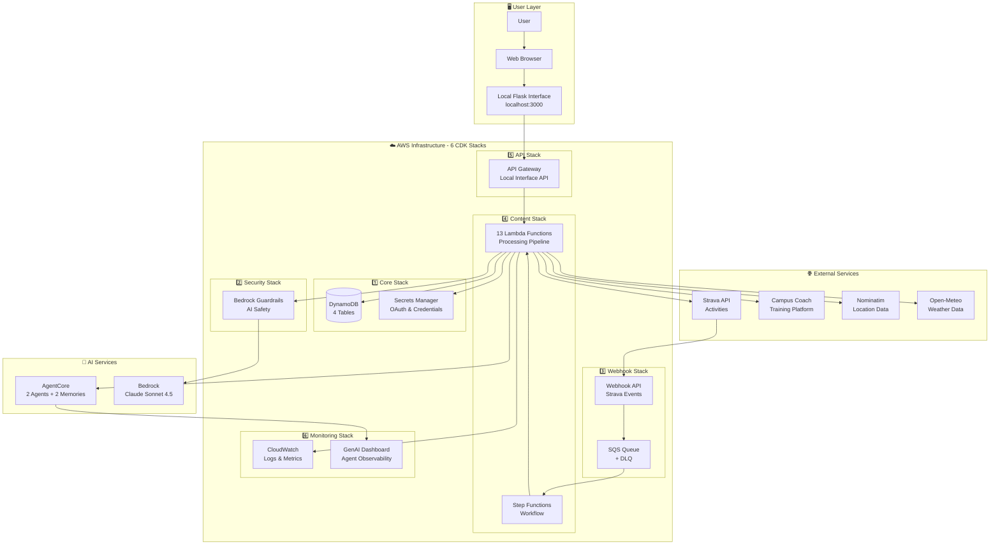
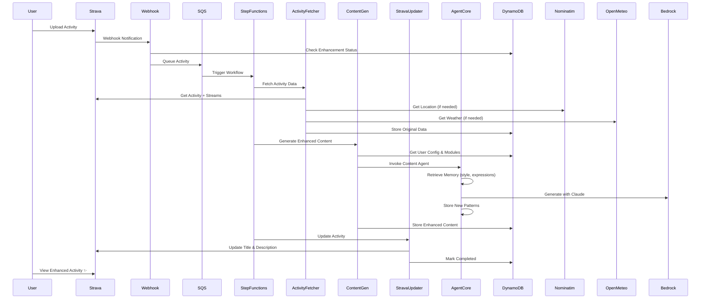
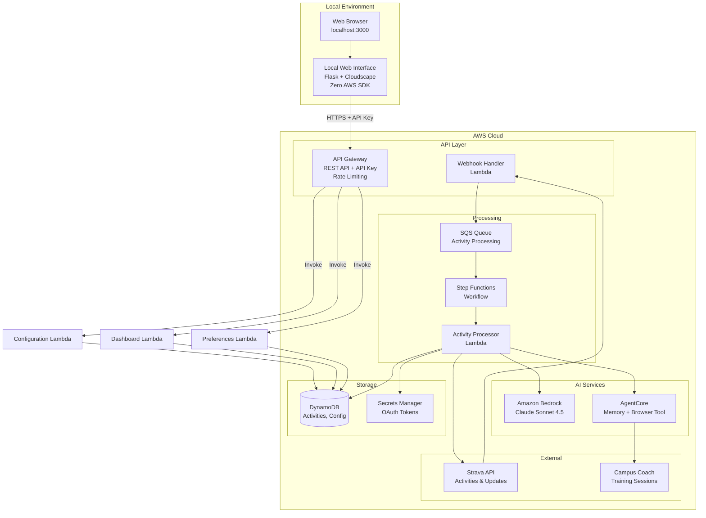
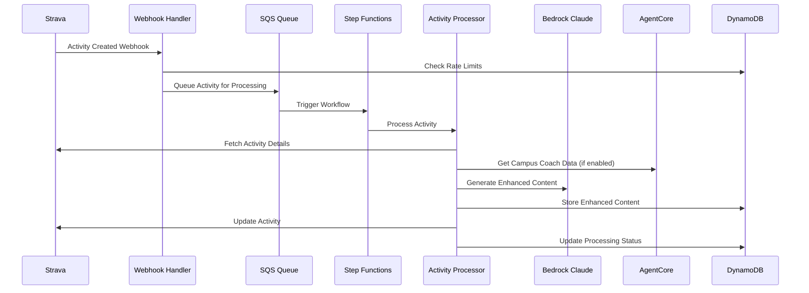

# Strava AI Boost

Strava AI Boost is a production-ready, modular serverless application that automatically enhances Strava activity titles and descriptions using Amazon Bedrock AI and AgentCore Memory. Built with a clean API Gateway + Lambda architecture, it provides secure, scalable functionality with zero direct AWS SDK dependencies in the frontend.

## ✅ System Status

**🎉 FULLY OPERATIONAL** - AgentCore content generation with Long-Term Memory + Security:
- ✅ **Phase 1 (Infrastructure)**: 6 CDK stacks deployed (Core, Security, Content, API, Webhook, Monitoring)
- ✅ **Phase 2 (LTM Memory)**: 2 LTM memories with semantic search (365-day retention)
- ✅ **Phase 3 (AgentCore)**: 2 AI agents deployed (`content_gen`, `campus_coach`)
- ✅ **Integration**: All 13 Lambda functions configured with agent ARNs
- ✅ **Content Generation**: Enhanced with semantic memory for style learning
- ✅ **Structured Tools**: Proper tool architecture for Strands framework
- ✅ **Strava Integration**: Webhook active with complete OAuth flow
- ✅ **Local Interface**: Running with real-time dashboard and configuration
- ✅ **AI Memory**: Long-term personalization with semantic search
- ✅ **Security**: Bedrock Guardrails + GenAI Observability Dashboard

## 🚀 Quick Start

**New to Strava AI Boost?** Get started in 5 minutes with 2-phase deployment:

👉 **[Quick Start Guide](docs/getting-started/QUICK-START.md)**

### Complete Deployment Workflow

**Phase 1: Infrastructure Deployment (Required)**

```bash
# 1. Deploy CDK Infrastructure (~10-15 min)
export AWS_PROFILE=your-aws-profile
./scripts/deploy.sh dev

# 2. Validate Deployment (~2 min)
./scripts/validate_deployment.sh dev

# 3. Setup Local Environment (~30 sec)
./scripts/setup_local_env.sh

# 4. Configure Strava Webhook (~1 min)
./scripts/configure_strava_webhook.sh dev --auto-configure
```

**Phase 2: AgentCore Enhancement (Optional - for advanced personalization)**

```bash
# 5. Create AgentCore Memories (~3 min)
./scripts/create_agentcore_memories.sh

# 6. Deploy AgentCore Agents (~5-10 min)
./scripts/deploy_agentcore_agents.sh

# 7. Configure Integration (~2 min)
./scripts/configure_agentcore_integration.sh

# 8. Redeploy Agents with Guardrails (~5 min)
./scripts/deploy_agentcore_agents.sh

# 9. Final CDK Deployment (~5 min)
cdk deploy --all --profile your-aws-profile --require-approval never
```

**Start Using the System**

```bash
# Launch local web interface
cd local_interface && python app.py

# Open http://localhost:3000
# - Connect with Strava OAuth
# - Configure your preferences
# - Enable modules (Campus Coach, Enduraw)
# - Process your activities!
```

**Deployment Phases:**
- Phase 1 only: Fully functional system with Bedrock fallback
- Phase 1 + 2: Advanced personalization with AgentCore Memory

---

### Available Scripts

All deployment and maintenance scripts are documented in **[scripts/README.md](scripts/README.md)**.

**Deployment Scripts (2):**
- `deploy.sh` - Main CDK infrastructure deployment
- `deploy_agentcore_agents.sh` - AgentCore agents with LTM

**Configuration Scripts (4):**
- `setup_local_env.sh` - Local environment variables
- `create_agentcore_memories.sh` - LTM memories creation
- `configure_agentcore_integration.sh` - IAM and Lambda configuration
- `configure_strava_webhook.sh` - Strava webhook setup

**Maintenance Scripts (2):**
- `cleanup_strava_webhook.sh` - Webhook cleanup
- `reprocess_dlq.sh` - DLQ message reprocessing

**Validation Scripts (1):**
- `validate_deployment.sh` - Post-deployment validation

**Uninstall Scripts (2):**
- `uninstall.sh` - Complete system removal
- `verify_uninstall.sh` - Uninstall verification

For detailed usage, examples, and troubleshooting, see **[scripts/README.md](scripts/README.md)**.

## 📚 Documentation

**📖 [Complete Documentation Hub](docs/README.md)** - Single entry point to all documentation

**Quick Links:**
- 🚀 **[Quick Start Guide](docs/getting-started/QUICK-START.md)** - Get running in 5 minutes
- 🎯 **[First Activity Guide](docs/getting-started/FIRST-STEPS.md)** - Your first enhancement
- 🔧 **[Troubleshooting](docs/user-guide/TROUBLESHOOTING.md)** - Common issues

## 🎯 Choose Your Path

### I'm New - Just Want to Try It
→ **[Quick Start Guide](docs/getting-started/QUICK-START.md)**

### I Want Full Control and Understanding  
→ **[Complete Setup Guide](docs/getting-started/COMPLETE-SETUP.md)**

### I Have Issues or Questions
→ **[Troubleshooting Guide](docs/user-guide/TROUBLESHOOTING.md)**

### I Want to Understand the Technical Details
→ **[Architecture Documentation](docs/reference/ARCHITECTURE.md)** or **[AgentCore Guide](docs/advanced/AGENTCORE.md)**

### I Need to Run Tests or Validate the System
→ **[Testing Guide](docs/advanced/TESTING.md)** - Complete end-to-end testing suite

### I Want to Understand Test Results
→ **[Testing Guide](docs/advanced/TESTING.md)** - Comprehensive validation procedures

## Overview

The system uses a local web interface approach to avoid complexity of user management, authentication systems, and secure web hosting. This prioritizes simplicity and rapid deployment for individual users who can install the system in their own AWS environment.

### Key Features

- **Local Web Interface**: Python Flask application with AWS Cloudscape components
- **User Preferences & Personalization**: Configure age, interests, sport approach, content style for tailored AI generation
- **Modular Architecture**: Extensible module system starting with Campus Coach integration  
- **AI-Powered Enhancement**: Amazon Bedrock Claude Sonnet 4.5 for intelligent content generation
- **Content Attribution**: All AI-generated content includes "@Generated by Strava AI Boost" signature
- **AgentCore Memory**: Persistent personalization avoiding repetitive expressions
- **Cultural References**: Subtle, age-appropriate references based on user profile
- **Campus Coach Integration**: AgentCore Browser Tool for automated session extraction
- **Webhook Loop Prevention**: Smart processing to avoid infinite execution cycles
- **Serverless Architecture**: Full AWS serverless stack for cost efficiency and scalability

## Prerequisites

### Required Services

1. **Strava Account** (social fitness platform)
   - API Limits: 100 req/15min, 1000 req/day
   - OAuth application registration required

2. **Campus Coach Account** (French training platform) - Optional Module
   - Subscription required for module activation
   - Website: https://campus.coach

3. **Enduraw Report Integration** (third-party Strava app) - Optional Module
   - **External Configuration Required**: Must be configured separately at https://enduraw-report-strava.onrender.com
   - **Not Managed by This System**: Enduraw Report is an independent service that connects directly to your Strava account
   - **How It Works**: When enabled, system uses SQS delay to wait 2 minutes for Enduraw to process your activity
   - **2-Minute Window Benefit**: During the wait, you can add your personal title/description on Strava - they will be preserved and incorporated into AI-generated content
   - **Cost-Optimized**: SQS delay mechanism (no Lambda cost during wait, ~$0.0000003 per activity)
   - **Graceful Fallback**: If Enduraw is not configured or times out, content generation proceeds without Enduraw data
   - **Enhanced Analytics**: Provides pace without wind, weather impact, elevation cost when available
   - Processing delay: 2 minutes when module enabled

4. **AWS Account**
   - Cost: ~$0.02 per activity (estimated)
   - Region: eu-west-1 recommended
   - AgentCore CLI access required

### Development Environment

- Python 3.12+
- AWS CDK CLI
- AgentCore CLI
- Node.js (for CDK)

## Architecture Overview

### System Components

Strava AI Boost is built on 4 main layers:



### Key Architecture Decisions

1. **Local Interface** - No cloud hosting complexity, runs on localhost
2. **Zero AWS SDK in Frontend** - All AWS operations via API Gateway + Lambda
3. **Modular Design** - Extensible module system (Campus Coach, Enduraw, future modules)
4. **Dual-Mode AI** - AgentCore (primary) + Bedrock fallback (always available)
5. **Serverless** - Pay-per-use, auto-scaling, no server management
6. **Security First** - Guardrails, encryption, least privilege IAM

### Data Flow: Activity Enhancement



### Infrastructure Components

**6 CDK Stacks**:
1. **Core** - DynamoDB (4 tables), Secrets Manager (3 secrets), Lambda Layer
2. **Security** - Bedrock Guardrails for AI safety
3. **Webhook** - SQS queues, webhook handler, activity processor
4. **Content** - Step Functions, 5 processing Lambdas
5. **API** - API Gateway for local interface (3 API Lambdas)
6. **Monitoring** - CloudWatch alarms, GenAI dashboard

**13 Lambda Functions**:
- **Processing Pipeline** (5): webhook_handler, activity_processor, activity_fetcher, content_generator, strava_updater
- **API Endpoints** (3): configuration_api, dashboard_api, user_preferences_api
- **Utilities** (4): rate_limiter, campus_coach_invoker, agentcore_health_check, stepfunctions_error_handler
- **Dependencies** (1): Lambda Layer with shared code

**4 DynamoDB Tables**:
- `activities` - Activity data and processing status (with GSI)
- `user_config` - User preferences and module configuration
- `rate_limits` - Strava API rate limit tracking (with TTL)
- `coaching_sessions` - Campus Coach training sessions (with GSI)

**2 AgentCore Agents**:
- `content_gen` - Content generation with LTM memory
- `campus_coach` - Session extraction with Browser Tool

**2 External APIs** (Free):
- Nominatim (OpenStreetMap) - Reverse geocoding
- Open-Meteo - Historical weather data

### High-Level System Flow



### Detailed Processing Flow



### Technology Stack

**Infrastructure:**
- AWS CDK: Python constructs
- Python Runtime: 3.12
- Region: eu-west-1 (Ireland)
- AgentCore CLI: Shell script deployment

**AWS Services:**
- Lambda: 13 functions (Python 3.12)
- DynamoDB: 4 tables with GSI
- Step Functions: Activity processing workflow
- SQS: Message queuing with DLQ
- Bedrock: Claude Sonnet 4.5
- Secrets Manager: OAuth tokens and credentials
- API Gateway: Local interface REST API

**AI/ML Framework:**
- Strands Agents: Agent orchestration framework
- AgentCore Memory: Persistent personalization (2 LTM memories)
- AgentCore Browser Tool: Campus Coach scraping
- Claude Sonnet 4.5: Content generation and analysis

**External APIs** (Free):
- Nominatim (OpenStreetMap): Reverse geocoding
- Open-Meteo: Historical weather data

## Performance Targets

- **Webhook Processing**: <5 seconds to queue
- **Content Generation**: <30 seconds end-to-end
- **Dashboard Loading**: <2 seconds
- **Configuration Changes**: <1 second
- **Cost per Activity**: ~$0.02 (target)

## Security

- **Bedrock Guardrails**: AI safety and prompt injection protection (v1.16.0+)
- **Data Encryption**: AWS managed encryption for all DynamoDB tables
- **Secure Communication**: HTTPS for all API endpoints
- **Credential Management**: AWS Secrets Manager with automatic rotation
- **IAM**: Least privilege principle with AWS managed policies
- **Local Interface**: Local-only access (127.0.0.1)
- **User Isolation**: Per-user configuration for future multi-user support

## Testing and Validation

The system includes a comprehensive testing suite that validates all core functionality:

- **End-to-End Pipeline Testing**: Complete webhook → SQS → Step Functions → Bedrock → Strava flow validation
- **Security Compliance Testing**: 100% encryption and IAM compliance verification  
- **Local Web Interface Testing**: Flask application component validation
- **Property-Based Testing**: Universal properties validation across all system components

Run the complete test suite:
```bash
# End-to-end pipeline test
python tests/test_end_to_end_pipeline.py

# Security compliance test (100% compliance achieved)
python tests/test_security_compliance.py

# Local web interface test
python tests/test_local_web_interface.py
```

For detailed testing procedures, see the **[Testing Guide](docs/advanced/TESTING.md)**.

## Contributing

1. Follow the property-based testing approach for all infrastructure changes
2. Update CHANGELOG.md for all significant changes
3. Ensure all tests pass before committing
4. Use AWS profile `your-aws-profile` for all AWS operations

## License

This project is licensed under the MIT License.