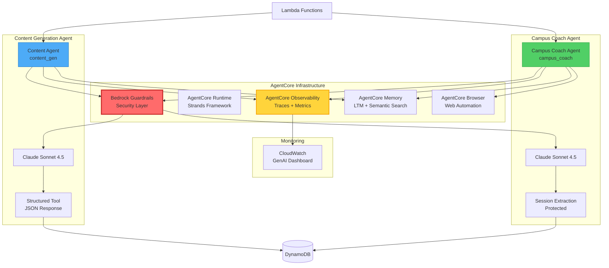

# AgentCore Guide

Complete guide to AgentCore integration in Strava AI Boost.

## Overview

AgentCore provides the AI agent runtime and memory system for Strava AI Boost, enabling:

- **Persistent Memory**: Learns your writing style and avoids repetition
- **Browser Tool**: Automated Campus Coach session extraction
- **Agent Runtime**: Scalable, serverless AI agent execution
- **Strands Framework**: Modern agent architecture with structured tools
- **Bedrock Guardrails**: AI safety and prompt injection protection (v1.16.0+)

## Architecture

### AgentCore Components with Security & Observability



**Key Points**:
- 🛡️ **Both agents** use the same Bedrock Guardrails (red)
- 📊 **Both agents** send traces to AgentCore Observability (yellow)
- 🧠 **Both agents** have their own AgentCore Memory
- 🔒 **Security layer** applied before Claude invocation
- 📈 **Monitoring** via CloudWatch GenAI Dashboard

### Integration Points

1. **Content Generation Agent**: Structured tools + JSON responses + guardrails
2. **Campus Coach Agent**: Browser Tool + web scraping + guardrails
3. **Lambda Functions**: Handle both old and new JSON formats for compatibility
4. **Step Functions**: Orchestrate agent workflows with error handling
5. **Bedrock Guardrails**: Automatic security layer for **both agents**

## Content Generation Tool (NEW v1.8.0)

### Structured Tool Implementation

The content generation now uses a structured tool approach:

```python
# src/agents/content_agent.py
def generate_strava_content(
    activity_data: Dict[str, Any],
    streams_data: Optional[Dict[str, Any]] = None,
    user_id: str = "",
    user_profile: Optional[Dict[str, Any]] = None,
    active_modules: Optional[List[Dict[str, Any]]] = None,
    campus_coach_session: Optional[Dict[str, Any]] = None,
    enduraw_data: Optional[Dict[str, Any]] = None
) -> Dict[str, Any]:
    """
    Generate enhanced Strava activity content with structured JSON response
    """
```

### JSON Response Format

```json
{
  "success": true,
  "generated_content": {
    "title": "Enhanced activity title",
    "description": "Enhanced activity description"
  },
  "content_metadata": {
    "length": "medium",
    "tone_used": "motivational",
    "fun_elements_included": ["performance_focus"],
    "metrics_highlighted": ["distance", "pace", "elevation"],
    "modules_integrated": ["campus_coach"],
    "confidence": 0.85,
    "user_profile_applied": true,
    "enduraw_detected": false
  },
  "memory_operations": {
    "retrieved": true,
    "stored": true,
    "expressions_avoided": ["previous_phrases"],
    "style_elements_learned": ["technical", "encouraging"],
    "profile_adaptations": ["sport_specific"]
  }
}
```

### Lambda Compatibility

The Lambda function now handles both formats:

```python
# lambda_functions/content_generator.py
if isinstance(result, dict) and 'generated_content' in result:
    # New structured format from AgentCore tool
    title = result['generated_content']['title']
    description = result['generated_content']['description']
else:
    # Legacy format fallback
    title, description = parse_legacy_format(result)
```

## AgentCore Memory

### Purpose

AgentCore Memory provides persistent, intelligent memory for AI agents:

- **Style Learning**: Remembers your preferred writing style
- **Expression Tracking**: Avoids repetitive phrases across activities
- **Context Retention**: Maintains conversation history and preferences
- **Semantic Search**: Finds relevant past interactions using vector embeddings

### Memory Architecture: Long-Term Memory (LTM)

Strava AI Boost uses **Long-Term Memory (LTM)** with semantic search strategy:

**Memory Configuration**:
- **Type**: LTM with semantic search (ComprehensiveLearning strategy)
- **Retention**: 365 days for persistent learning
- **Strategy**: Semantic memory with vector embeddings
- **Search**: Vector-based similarity search for style patterns

**Benefits over Short-Term Memory (STM)**:
- ✅ Persistent learning across months of activities
- ✅ Better style pattern recognition with semantic search
- ✅ More effective repetition avoidance
- ✅ Long-term preference adaptation

### Memory Types

**Event Memory (Short-Term)**:
- Stores specific activity enhancements
- Tracks successful content patterns
- Records user feedback and preferences
- Automatic expiry after 365 days

**Semantic Memory (Long-Term)**:
- Learns writing style patterns using vector embeddings
- Identifies preferred vocabulary and expressions
- Understands tone preferences
- Recognizes content structure preferences
- Enables similarity search for relevant past content

### Deployment Process

#### Complete Deployment Workflow

```bash
# Step 1: Deploy AWS Infrastructure
./scripts/deploy.sh dev

# Step 2: Validate Deployment
./scripts/validate_deployment.sh dev

# Step 3: Setup Local Environment
./scripts/setup_local_env.sh

# Step 4: Configure Strava Webhook
./scripts/configure_strava_webhook.sh dev --auto-configure

# Step 5: Create LTM Memories
./scripts/create_agentcore_memories.sh

# Step 6: Deploy AgentCore Agents
./scripts/deploy_agentcore_agents.sh

# Step 7: Configure Integration (detects guardrails)
./scripts/configure_agentcore_integration.sh

# Step 8: Redeploy Agents with Guardrails
./scripts/deploy_agentcore_agents.sh

# Step 9: Final CDK Deployment
cdk deploy --all --profile your-aws-profile --require-approval never
```

#### Step 5: Create LTM Memories

```bash
# Create LTM memories with semantic search (~6 minutes total)
./scripts/create_agentcore_memories.sh
```

This creates two LTM memories:
- `content_gen_mem`: For content generation agent
- `campus_coach_mem`: For campus coach agent

Each memory is configured with:
- Semantic search strategy (ComprehensiveLearning)
- 365-day retention
- Vector embeddings for similarity search

#### Verify Memory Status

```bash
# Check that memories are ACTIVE
agentcore memory list --region eu-west-1

# Get detailed memory information
agentcore memory get content_gen_mem-<ID> --region eu-west-1
```

Wait until both memories show `Status: ACTIVE` before deploying agents.

### Configuration

```yaml
# AgentCore Memory Configuration (.bedrock_agentcore.yaml)
memory:
  mode: STM_AND_LTM  # Hybrid mode with both short and long-term
  memory_id: content_gen_mem-<ID>
  memory_name: content_gen_mem
  event_expiry_days: 365
  was_created_by_toolkit: false  # Pre-created, not auto-generated
```

### Usage in Content Generation

The content generation agent automatically uses LTM for:

1. **Style Pattern Recognition**: Semantic search finds similar past activities
2. **Expression Avoidance**: Tracks and avoids recently used phrases
3. **Preference Learning**: Adapts to user's tone and technical level preferences
4. **Context Retention**: Remembers performance history and training patterns

```python
# Example: Agent automatically uses memory
# No explicit memory calls needed - AgentCore handles it

@app.entrypoint
def invoke(payload, context=None):
    # AgentCore automatically:
    # 1. Retrieves relevant memories via semantic search
    # 2. Includes memory context in agent prompt
    # 3. Stores new content patterns after generation
    
    result = agent(prompt)
    return result
```

## AgentCore Browser Tool

### Purpose

AgentCore Browser Tool enables automated web interaction for:

- **Campus Coach Session Extraction**: Automated login and data scraping
- **Dynamic Content Handling**: JavaScript-rendered pages
- **Secure Credential Management**: Encrypted credential storage
- **Retry Logic**: Handles network issues and rate limiting

### Browser Tool Configuration

```yaml
# Campus Coach Browser Agent
agent:
  name: "strava-ai-boost-campus-coach"
  runtime: "browser"
  tools:
    - name: "browser"
      config:
        headless: true
        timeout: 30000
        viewport:
          width: 1920
          height: 1080
        user_agent: "Mozilla/5.0 (compatible; StravaAIBoost/1.0)"
```

### Campus Coach Extraction Workflow

1. **Authentication**:
   ```python
   # Navigate to login page
   await browser.goto("https://campus.coach/login")
   
   # Enter credentials from Secrets Manager
   await browser.fill("#username", credentials["username"])
   await browser.fill("#password", credentials["password"])
   await browser.click("#login-button")
   ```

2. **Session Navigation**:
   ```python
   # Navigate to training sessions
   await browser.goto("https://campus.coach/training/sessions")
   
   # Extract current week sessions
   sessions = await browser.evaluate("""
       () => {
           const sessionElements = document.querySelectorAll('.session-card');
           return Array.from(sessionElements).map(el => ({
               title: el.querySelector('.session-title').textContent,
               description: el.querySelector('.session-description').textContent,
               date: el.querySelector('.session-date').textContent,
               type: el.querySelector('.session-type').textContent
           }));
       }
   """)
   ```

3. **Data Processing**:
   ```python
   # Process and store sessions
   for session in sessions:
       processed_session = {
           "session_id": generate_session_id(session),
           "title": clean_text(session["title"]),
           "description": parse_description(session["description"]),
           "planned_date": parse_date(session["date"]),
           "session_type": normalize_type(session["type"]),
           "extracted_at": datetime.now(UTC).isoformat()
       }
       
       # Store in DynamoDB
       store_session(processed_session)
   ```

### Error Handling

```python
# Retry logic for browser operations
async def extract_with_retry(max_retries=3):
    for attempt in range(max_retries):
        try:
            return await extract_sessions()
        except TimeoutError:
            if attempt < max_retries - 1:
                await asyncio.sleep(2 ** attempt)  # Exponential backoff
                continue
            raise
        except AuthenticationError:
            # Refresh credentials and retry
            credentials = await refresh_credentials()
            continue
```

## AgentCore Runtime

### Deployment

AgentCore agents are deployed using CLI scripts:

```bash
# Deploy AgentCore Agents (Content Generation + Campus Coach + Memory)
./scripts/deploy_agentcore_agents.sh

# This single script now handles:
# - Content generation agent deployment
# - Campus coach agent deployment  
# - AgentCore Memory setup
# - Lambda environment variable updates
```

### Agent Invocation

Agents are invoked from Lambda functions via Bedrock Agent Runtime:

```python
import boto3
from botocore.exceptions import ClientError

bedrock_agent_runtime = boto3.client('bedrock-agent-runtime', region_name='eu-west-1')

def invoke_content_generation_agent(activity_data, user_id):
    try:
        response = bedrock_agent_runtime.invoke_agent(
            agentId='strava-ai-boost-content-generator',
            agentAliasId='TSTALIASID',
            sessionId=f"session-{user_id}-{int(time.time())}",
            inputText=json.dumps({
                "activity_data": activity_data,
                "user_id": user_id,
                "task": "generate_enhanced_content"
            })
        )
        
        # Process streaming response
        content = ""
        for event in response['completion']:
            if 'chunk' in event:
                content += event['chunk']['bytes'].decode('utf-8')
        
        return json.loads(content)
        
    except ClientError as e:
        logger.error(f"AgentCore invocation failed: {e}")
        raise
```

### Monitoring

```bash
# Monitor AgentCore agent logs
aws logs tail /aws/bedrock-agentcore/runtimes/strava-ai-boost-content-generator --follow --profile your-aws-profile

# Check agent status
agentcore agent list --profile your-aws-profile

# Monitor memory usage
agentcore memory stats --name strava-ai-boost-memory --profile your-aws-profile
```

## Performance Optimization

### Memory Optimization

```python
# Optimize memory queries
memory_config = {
    "max_results": 10,
    "similarity_threshold": 0.8,
    "cache_ttl": 300,  # 5 minutes
    "batch_size": 50
}

# Use semantic search efficiently
relevant_memories = memory.semantic_search(
    query=f"writing style for {activity_type} activities",
    filters={"user_id": user_id, "feedback": "positive"},
    **memory_config
)
```

### Browser Tool Optimization

```yaml
# Optimized browser configuration
browser_config:
  headless: true
  disable_images: true
  disable_javascript: false  # Required for Campus Coach
  timeout: 15000
  navigation_timeout: 10000
  connection_pool_size: 5
```

### Agent Runtime Optimization

- **Warm Agents**: Keep agents warm to reduce cold start latency
- **Batch Processing**: Process multiple activities together when possible
- **Caching**: Cache frequently accessed data in memory
- **Async Operations**: Use async/await for I/O operations

## Troubleshooting

### Common Issues

**"AgentCore agent not found"**
```bash
# Check agent deployment
agentcore agent list --profile your-aws-profile

# Redeploy if missing
./scripts/deploy_agentcore_agents.sh
```

**"Memory service unavailable"**
```bash
# Check memory status
agentcore memory list --profile your-aws-profile

# Recreate memory if needed (handled by deploy_agentcore_agents.sh)
./scripts/deploy_agentcore_agents.sh
```

**"Browser Tool timeout"**
- Increase timeout in agent configuration
- Check Campus Coach website availability
- Verify credentials are valid

### Debug Commands

```bash
# Test agent connectivity
agentcore invoke strava-ai-boost-content-generator --input '{"test": true}'

# Check memory connectivity
agentcore memory query --name strava-ai-boost-memory --query "test"

# Monitor browser agent logs
aws logs filter-log-events --log-group-name /aws/bedrock-agentcore/runtimes/strava-ai-boost-campus-coach --filter-pattern "ERROR" --profile your-aws-profile
```

## Security Considerations

### Bedrock Guardrails (v1.16.0+)

**Automatic Protection**: Integrated at agent level via `BedrockModel`

- **Prompt Injection**: HIGH strength blocking of instruction override attempts
- **Content Safety**: Filters violence, hate, sexual content, insults
- **Topic Boundaries**: Keeps content within sports/fitness domain
- **PII Protection**: Blocks/anonymizes sensitive information
- **Deployment**: Fully automated via `deploy_agentcore_agents.sh`

**Configuration**: Environment variables in `.env.agentcore`
```bash
GUARDRAIL_ENABLED=true
GUARDRAIL_ID=<auto-detected-from-cloudformation>
GUARDRAIL_VERSION=1
```

**Reference**: See `docs/advanced/BEDROCK-GUARDRAILS.md`

### Credential Management

- Campus Coach credentials stored in AWS Secrets Manager
- Automatic credential rotation (when supported)
- Encrypted in transit and at rest
- Access logged and monitored

### Memory Security

- User data isolated by user_id
- Encryption at rest using AWS KMS
- Access controlled via IAM policies
- Regular security audits

### Browser Tool Security

- Sandboxed browser environment
- No persistent storage of sensitive data
- Network traffic monitoring
- Secure credential injection

## Best Practices

### Memory Management

1. **Regular Cleanup**: Remove old, irrelevant memories
2. **Quality Control**: Store only high-quality interactions
3. **Privacy**: Respect user privacy preferences
4. **Performance**: Monitor memory query performance

### Browser Automation

1. **Respectful Scraping**: Follow rate limits and robots.txt
2. **Error Handling**: Graceful degradation on failures
3. **Monitoring**: Track success rates and performance
4. **Maintenance**: Regular updates for website changes

### Agent Development

1. **Modular Design**: Separate concerns into different agents
2. **Error Recovery**: Implement retry logic and fallbacks
3. **Logging**: Comprehensive logging for debugging
4. **Testing**: Regular testing of agent functionality


## Observability

### GenAI Observability Dashboard

**Automatic Setup**: Configured automatically via CDK SecurityStack

The GenAI Observability Dashboard provides:
- 📊 **Agent Metrics**: Invocations, latency, errors, token usage
- 🔍 **Trace Visualization**: Detailed execution timeline for each invocation
- 🔗 **Session Tracking**: Group related invocations
- 🛡️ **Guardrail Monitoring**: Track security interventions

**Access**: https://console.aws.amazon.com/cloudwatch/home?region=eu-west-1#gen-ai-observability/agent-core/agents

### What's Monitored Automatically

**For Both Agents** (`content_gen` and `campus_coach`):
- ✅ Invocation count and frequency
- ✅ Latency (p50, p90, p99)
- ✅ Token usage (input/output)
- ✅ Error rate and types
- ✅ Guardrail interventions
- ✅ Memory operations
- ✅ Tool executions

### Setup (Automatic via CDK)

When you deploy the SecurityStack, it automatically:
1. ✅ Creates CloudWatch Logs resource policy
2. ✅ Configures X-Ray trace destination
3. ✅ Sets trace sampling to 1% (free tier)
4. ✅ Enables Transaction Search

**No manual configuration needed!**

### Requirements

Already configured in `src/agents/requirements.txt`:
```txt
strands-agents[otel]  # OpenTelemetry support
aws-opentelemetry-distro  # AWS distribution
```

### Viewing Data

**GenAI Dashboard**:
```
CloudWatch → GenAI Observability → AgentCore → Agents
```

**Logs**:
```bash
# Content generation agent
aws logs tail /aws/bedrock-agentcore/runtimes/content_gen-* --follow --profile your-aws-profile

# Campus coach agent
aws logs tail /aws/bedrock-agentcore/runtimes/campus_coach-* --follow --profile your-aws-profile
```

**Traces**:
```
CloudWatch → Transaction Search → Filter by service name
```

**Metrics**:
```
CloudWatch → Metrics → Bedrock-AgentCore namespace
```

### Key Metrics

| Metric | Target | Alert Threshold |
|--------|--------|-----------------|
| Content Gen Latency | <5s | >10s |
| Campus Coach Latency | <180s | >300s |
| Error Rate | <2% | >5% |
| Token Usage | <2000/activity | >5000 |
| Guardrail Blocks | <1% | >5% |

### Trace Timeline Example

```
Activity Processing Trace:
├─ Lambda Invocation (50ms)
├─ DynamoDB Read (20ms)
├─ AgentCore Invocation (3.2s)
│  ├─ Guardrails Check (15ms)
│  ├─ Memory Retrieval (100ms)
│  ├─ Claude Invocation (2.8s)
│  └─ Memory Storage (80ms)
└─ Strava API Update (200ms)

Total: 3.47s
```

### Cost

**Observability Costs**:
- Transaction Search: 100% sampling
- First 100K traces/month: FREE
- After 100K: $1 per 1M traces
- Estimated: ~$0.001 per activity
- Monthly (100 activities): ~$0.10

**Total System Cost**:
- Content Gen: $0.005
- Campus Coach: $0.01/day
- Guardrails: $0.000375
- Observability: $0.001
- **Total**: ~$0.0214 per activity

### Troubleshooting

**Traces not appearing?**
- Wait 10 minutes after first invocation
- Check Transaction Search is enabled
- Verify agents have `strands-agents[otel]` in requirements
- Check CloudWatch Logs for OTEL errors
- With 100% sampling, every invocation creates a trace

**Dashboard empty?**
- Invoke agents at least once
- Wait ~10 minutes for traces to appear
- Verify X-Ray destination is CloudWatchLogs
- Check `/aws/spans/default` log group exists

---

**Status**: ✅ Automatic observability via CDK, no manual setup required
