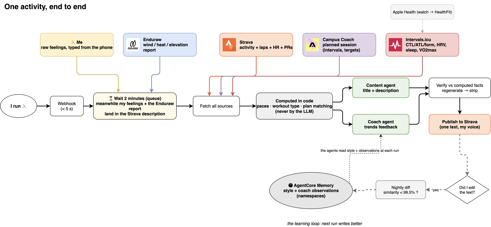
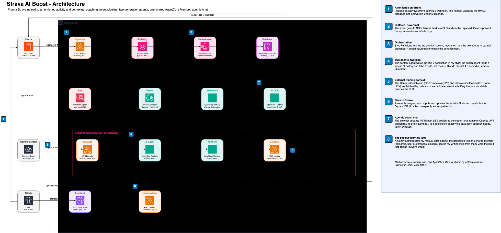
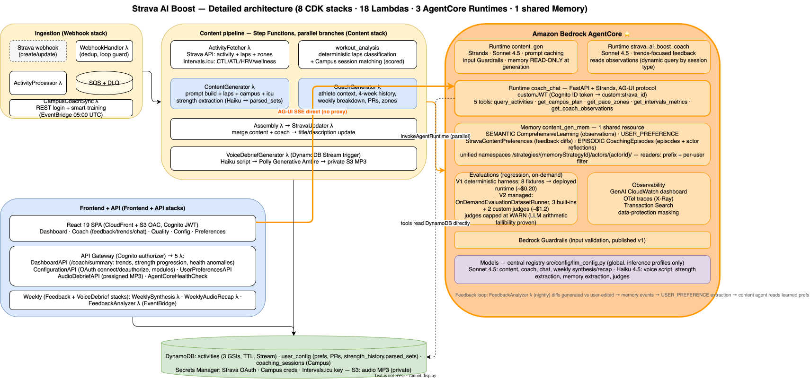

# Architecture

> Strava AI Boost is a **personal Amazon Bedrock AgentCore lab**: a real,
> deployed, single-athlete application used daily, built to exercise the
> AgentCore building blocks on a concrete problem. This page is the map.
>
> Editable diagrams: the `.drawio.svg` files below render on GitHub **and**
> stay fully editable — open them directly in
> [draw.io](https://app.diagrams.net/) (the SVG embeds the diagram XML).
> Raw sources: [`high-level.drawio`](architecture/high-level.drawio) ·
> [`detailed.drawio`](architecture/detailed.drawio).

## The AgentCore building blocks used here

| Brick | How this project uses it | Where to look |
|---|---|---|
| **Runtime** ×3 | `content_gen` (Strands agent, prompt caching, input Guardrails), `strava_ai_boost_coach` (trends-focused feedback), `coach_chat` (FastAPI + Strands, **AG-UI protocol**, 5 server-side tools) | `src/agents/`, `src/coach_chat/`, deployed by `scripts/deploy_agentcore_agents.sh` |
| **Memory** ×1 shared | `content_gen_mem` with **3 strategies**: SEMANTIC (coach observations), USER_PREFERENCE (learned content preferences from feedback diffs), EPISODIC (per-session episodes + actor-level reflections). Unified namespaces `/strategies/{memoryStrategyId}/actors/{actorId}/`; all readers use one pattern (prefix + per-user filter + session-type-aware query) | `scripts/configure_memory_strategy.py` (idempotent owner), design: [`design/memory-improvements.md`](design/memory-improvements.md) |
| **Evaluations** | On-demand **prompt regression**: V1 deterministic harness (8 synthetic fixtures replayed against the deployed runtime, ~$0.20/run) + V2 managed evaluations (3 built-ins + 2 custom LLM-as-a-Judge evaluators, ~$1.2/run). Empirical lesson baked in: judge outcomes are trend signals (warn), never hard gates | `scripts/run_prompt_regression.py`, `scripts/run_managed_evals.py`, design: [`design/regression-evals.md`](design/regression-evals.md) |
| **Observability** | GenAI CloudWatch dashboard, OTel traces (X-Ray), Transaction Search, data-protection masking on runtime logs | `scripts/enable_agentcore_observability.sh` |
| **customJWT authorizer** | The browser talks to the `coach_chat` runtime **directly on the AgentCore data plane** (SSE streaming, no proxy Lambda): Cognito ID token as Bearer, `user_id` derived server-side from the `custom:strava_id` claim | `src/coach_chat/coach_chat_agent.py`, README § Conversational Coach |
| Guardrails (Bedrock) | Input validation on user-provided title/description before prompt inclusion (prompt-injection screen), published v1 | `src/agents/content_agent.py` |

Not used (yet): Gateway, Identity token vault, Code Interpreter, Policy —
candidates for future lab iterations.

## Functional process flow

The life of one activity, sources included: the 2-minute enrichment window, the deterministic
computing stage (paces, workout type, plan matching are never left to the LLM), the two agents
reading the shared Memory, the fact verifier, and the nightly learning loop.

> Raw source: [`process-flow.drawio`](architecture/process-flow.drawio)

## High-level view

*(A mermaid equivalent lives in the [README](../README.md#system-components).)*

Three planes:

1. **Event-driven enrichment pipeline** (batch, per activity): Strava webhook
   → SQS → Step Functions → fetch (Strava laps + Intervals.icu wellness) →
   deterministic workout classification + Campus Coach session matching →
   **parallel** content + coach generation on AgentCore Runtimes → assembly →
   Strava update → voice debrief (Haiku → Polly MP3).
2. **Interactive plane**: React SPA (CloudFront + Cognito) → API Gateway for
   data (dashboard, trends, config), and → **AgentCore data plane directly**
   for the agentic coach chat (AG-UI SSE, tool loop server-side).
3. **Learning loop**: nightly feedback analyzer diffs generated vs
   user-edited descriptions → Memory events → USER_PREFERENCE extraction →
   the content agent reads learned preferences on the next generation.
   Weekly synthesis + audio recap read the same memory.

## Detailed view

8 CDK stacks, 18 Lambdas by role (api / processing / webhooks / support /
voice), the 3 runtimes, memory strategies and namespaces, evals loop, model
registry.

Key implementation choices worth stealing:

- **Deterministic before LLM**: workout classification and Campus Coach
  session matching are scored in code (`workout_analysis.py`,
  `modules_processing.py`); only the best match reaches the prompt. Same
  philosophy in the evals (deterministic checks are the gates, LLM judges are
  signals).
- **Central model registry** (`src/config/llm_config.py`): every model ID,
  IAM ARN and runtime env var derives from two constants; an anti-drift test
  fails the build if a literal model ID appears anywhere else.
- **Memory namespaces unified** on `/strategies/{id}/actors/{actorId}/` with
  a single reader pattern — new strategies become visible to every reader
  with zero code changes.
- **No proxy for streaming**: the AgentCore data plane returns
  `access-control-allow-origin: *`, so the browser consumes the SSE stream
  directly with a Cognito JWT. One less Lambda, real token-by-token UX.

## Documentation map & freshness contract

To keep this repo trustworthy for readers, docs follow a contract enforced by
`tests/regression/test_docs_sync.py` (counts and key claims are checked
against the code). It runs in the test suite and as a Kiro `stop` hook
(`scripts/check_docs_sync.sh`) that warns at the end of every AI-assisted
working turn when docs drift:

| Doc | Role | Freshness rule |
|---|---|---|
| [README](../README.md) | Entry point, deploy guide | Counts (stacks/lambdas/tests) sync-tested |
| [AGENTS.md](../AGENTS.md) | AI-assistant / contributor deep context | Counts sync-tested |
| [docs/ROADMAP.md](ROADMAP.md) | Single source of truth for plans & status | Updated per merged chantier |
| [docs/architecture.md](architecture.md) | This page + draw.io sources | Updated when a plane/brick changes |
| [docs/design/*](design/) | Decision records: research, challenged plans, live findings | **Append-only history** — status header updated at closure |
| [docs/THREAT-MODEL.md](THREAT-MODEL.md), [SECURITY-SCAN.md](SECURITY-SCAN.md) | Security posture | Reviewed at each release tag |
| [BACKLOG.md](../BACKLOG.md) | Long-tail ideas | Roadmap wins on conflict |
| [docs/COMPETITIVE-ANALYSIS.md](COMPETITIVE-ANALYSIS.md), [docs/design/coach-agent-spec.md](design/coach-agent-spec.md) | 🗄️ Archives (banner in-file) | Frozen |
