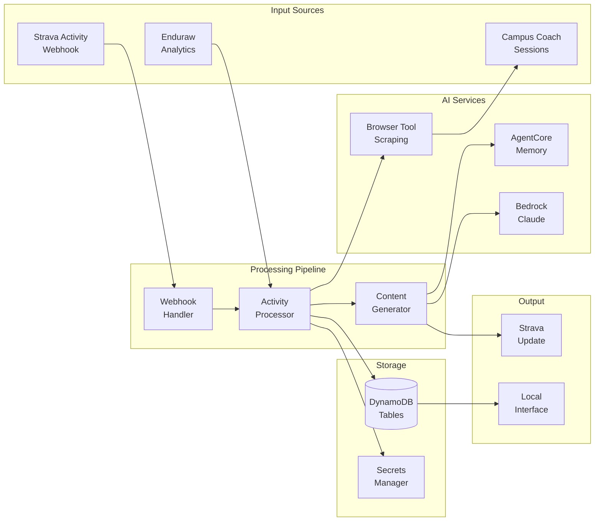
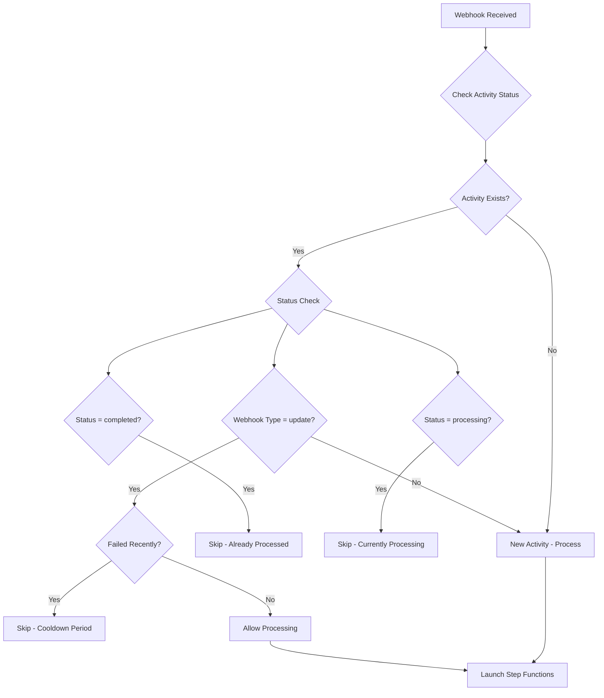
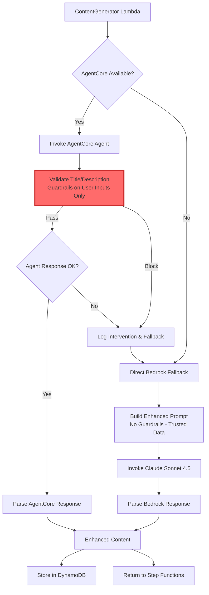
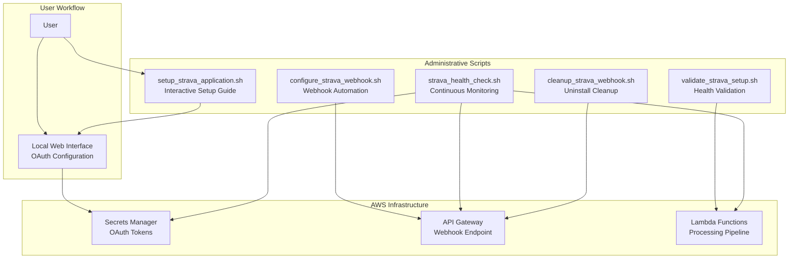
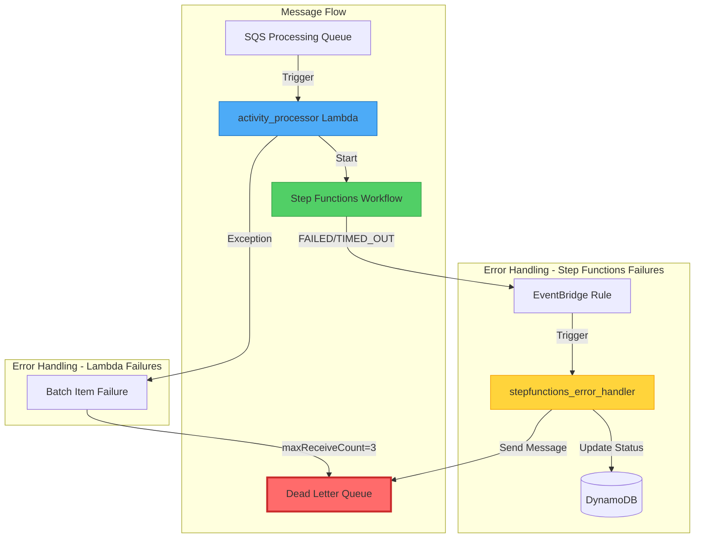
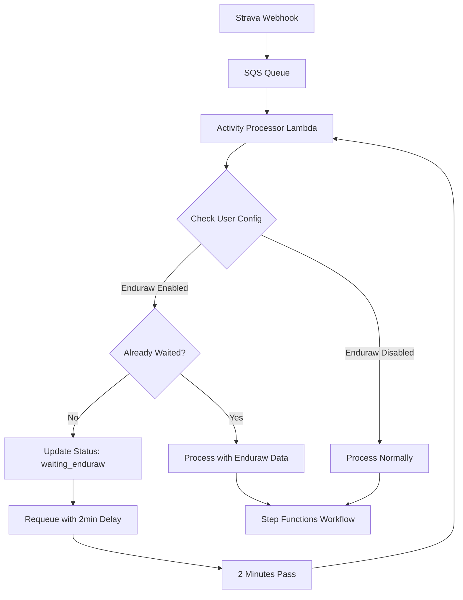

# 🏗️ Technical Architecture

This document provides detailed technical implementation information for the Strava AI Boost system, including AWS services configuration, data models, and integration patterns.

## System Architecture Overview

### Complete System Diagram

```mermaid
graph TB
    subgraph "User Environment"
        User[User]
        Browser[Web Browser]
        LocalApp[Local Flask App<br/>Port 8000]
    end
    
    subgraph "AWS Account - eu-west-1"
        subgraph "API & Webhook Layer"
            APIGW[API Gateway<br/>Configuration API]
            WebhookLambda[Webhook Handler<br/>Lambda Function]
            WebhookAPI[Webhook API<br/>Strava Integration]
        end
        
        subgraph "Message Processing"
            SQS[SQS Queue<br/>Activity Processing]
            DLQ[Dead Letter Queue<br/>Failed Messages]
        end
        
        subgraph "Orchestration"
            StepFunctions[Step Functions<br/>Activity Workflow]
            ProcessorLambda[Activity Processor<br/>Lambda Function]
            EventBridge[EventBridge Scheduler<br/>Daily 6 AM]
            CampusInvoker[Campus Coach Invoker<br/>Lambda Function]
        end
        
        subgraph "AI & Content Generation"
            Bedrock[Amazon Bedrock<br/>Claude Sonnet 4.5]
            Guardrails[Bedrock Guardrails<br/>Title/Description Only]
            AgentCoreMemory[AgentCore Memory<br/>Personalization]
            AgentCoreBrowser[AgentCore Browser<br/>Campus Coach Scraping]
            Observability[AgentCore Observability<br/>Traces + Metrics]
        end
        
        subgraph "Data Storage"
            ActivitiesTable[(Activities Table<br/>DynamoDB)]
            ConfigTable[(User Config Table<br/>DynamoDB)]
            RateLimitsTable[(Rate Limits Table<br/>DynamoDB)]
            SessionsTable[(Campus Sessions<br/>DynamoDB)]
            SecretsManager[Secrets Manager<br/>OAuth Tokens]
        end
        
        subgraph "Monitoring"
            CloudWatch[CloudWatch<br/>Logs & Metrics]
            XRay[X-Ray<br/>Distributed Tracing]
            GenAIDashboard[GenAI Dashboard<br/>Agent Observability]
        end
    end
    
    subgraph "External Services"
        StravaAPI[Strava API<br/>Activities & Webhooks]
        CampusCoach[Campus Coach<br/>Training Platform]
        Enduraw[Enduraw<br/>Enhanced Analytics]
    end
    
    %% User Flow
    User --> Browser
    Browser --> LocalApp
    LocalApp --> APIGW
    
    %% Webhook Flow
    StravaAPI --> WebhookAPI
    WebhookAPI --> WebhookLambda
    WebhookLambda --> SQS
    SQS --> StepFunctions
    StepFunctions --> ProcessorLambda
    
    %% Processing Flow with Guardrails (Content Gen only)
    ProcessorLambda --> Guardrails
    Guardrails --> Bedrock
    ProcessorLambda --> Observability
    ProcessorLambda --> StravaAPI
    ProcessorLambda --> AgentCoreMemory
    ProcessorLambda --> AgentCoreBrowser
    AgentCoreBrowser --> Observability
    AgentCoreBrowser --> CampusCoach
    
    %% Campus Coach Automatic Extraction
    EventBridge -.->|Daily 6 AM| CampusInvoker
    CampusInvoker --> AgentCoreBrowser
    CampusInvoker --> SessionsTable
    
    %% Data Flow
    ProcessorLambda --> ActivitiesTable
    ProcessorLambda --> ConfigTable
    ProcessorLambda --> RateLimitsTable
    ProcessorLambda --> SessionsTable
    ProcessorLambda --> SecretsManager
    
    %% Monitoring
    ProcessorLambda --> CloudWatch
    ProcessorLambda --> XRay
    Observability --> GenAIDashboard
    
    %% Error Handling
    SQS --> DLQ
```



### Data Flow Architecture



## Infrastructure Overview

### AWS CDK Stack Organization

The infrastructure is organized into 6 modular CDK stacks:

1. **CoreInfrastructureStack** - Foundation services (DynamoDB, IAM, Secrets)
2. **SecurityStack** - Bedrock Guardrails for Content Generation Agent (validates user inputs only)
3. **WebhookProcessingStack** - Strava webhook handling (SQS, Lambda, API Gateway)
4. **ContentGenerationStack** - AI content generation (Step Functions, Bedrock)
5. **ApiGatewayStack** - Local interface API (REST API, CORS, API Key authentication)
6. **MonitoringStack** - Observability (CloudWatch, X-Ray, alarms)

### Local Interface Architecture

**Architecture Pattern**: 100% API Gateway + Lambda (Zero AWS SDK in Frontend)

```
Local Flask App (Pure UI)
    ↓ HTTPS + API Key
API Gateway (Secured)
    ├─ /config/modules → ConfigurationAPI Lambda
    ├─ /config/enhancement → ConfigurationAPI Lambda
    ├─ /dashboard/stats → DashboardAPI Lambda
    ├─ /dashboard/activities → DashboardAPI Lambda
    ├─ /dashboard/system → DashboardAPI Lambda
    ├─ /preferences → UserPreferencesAPI Lambda
    └─ /status → StatusAPI Lambda
        ↓
Lambda Functions (Business Logic)
    ↓
AWS Services (DynamoDB, SQS, Secrets Manager, Step Functions)
```

**Key Features:**
- ✅ **Zero AWS SDK Dependencies**: No boto3 in frontend code
- ✅ **API Key Authentication**: All endpoints protected
- ✅ **Rate Limiting**: 100 req/s, 10,000 req/day via Usage Plan
- ✅ **Environment Configuration**: `.env` file generated by `setup_local_env.sh`
- ✅ **Fail-Fast**: Clear errors if API Gateway unavailable
- ✅ **Single Source of Truth**: All business logic in Lambda functions

**Setup:**
```bash
./scripts/setup_local_env.sh  # Generates .env with API Gateway URL + API Key
cd local_interface && python app.py  # No AWS_PROFILE needed
```

### Lambda Functions Reference

The system uses 13 Lambda functions organized by responsibility:

| Function | Purpose | Timeout | Memory | Trigger |
|----------|---------|---------|--------|---------|
| **webhook_handler** | Webhook validation & SQS queuing | 30s | 256MB | API Gateway |
| **activity_processor** | SQS processing & Step Functions trigger | 300s | 512MB | SQS Queue |
| **activity_fetcher** | Strava API data fetching + enrichment | 180s | 512MB | Step Functions |
| **content_generator** | AI content generation (AgentCore/Bedrock) | 300s | 1024MB | Step Functions |
| **strava_updater** | Update Strava with enhanced content | 120s | 256MB | Step Functions |
| **configuration_api** | OAuth & module configuration | 30s | 256MB | API Gateway |
| **dashboard_api** | Dashboard statistics & metrics | 30s | 512MB | API Gateway |
| **user_preferences_api** | User preferences management | 30s | 256MB | API Gateway |
| **rate_limiter** | Shared rate limiting logic | 60s | 128MB | Imported module |
| **campus_coach_invoker** | Daily session extraction | 600s | 512MB | EventBridge |
| **agentcore_health_check** | Agent health monitoring | 60s | 256MB | EventBridge |
| **stepfunctions_error_handler** | Step Functions failure handling | 60s | 256MB | EventBridge |
| **Lambda Layer** | Shared dependencies (boto3, strands, modules) | N/A | N/A | All Lambdas |

**Key Environment Variables** (Common):
- `ACTIVITIES_TABLE` - strava-ai-boost-activities
- `USER_CONFIG_TABLE` - strava-ai-boost-user-configuration
- `RATE_LIMITS_TABLE` - strava-ai-boost-rate-limits
- `COACHING_SESSIONS_TABLE` - strava-ai-boost-campus-coaching-sessions
- `STRAVA_OAUTH_SECRET` - strava-ai-boost-oauth-tokens
- `CAMPUS_COACH_SECRET` - strava-ai-boost-campus-coach-credentials
- `CONTENT_GENERATION_AGENT_ARN` - AgentCore content agent ARN
- `CAMPUS_COACH_AGENT_ARN` - AgentCore campus coach agent ARN

**Detailed documentation**: See individual Lambda sections below for complete details on each function.

### Location & Weather Enrichment

**Purpose**: Enrich activity data with location and weather context when Strava doesn't provide it.

**Implementation**: `activity_fetcher.py`

#### Reverse Geocoding (Nominatim/OpenStreetMap)

**When Used**: Outdoor activities with GPS coordinates but no city/country from Strava

**API**: Nominatim (OpenStreetMap) - Free, no API key required

**Usage Policy Compliance**:
- Maximum 1 request per second (Lambda single-threaded = compliant)
- Valid User-Agent header required
- Results cached in DynamoDB (no repeated requests)

**Implementation**:
```python
def reverse_geocode_location(latitude: float, longitude: float) -> Dict[str, Optional[str]]:
    url = "https://nominatim.openstreetmap.org/reverse"
    params = {'lat': latitude, 'lon': longitude, 'format': 'json', 'zoom': 10}
    headers = {'User-Agent': 'StravaAIBoost/1.0 (contact@example.com)'}
    response = requests.get(url, params=params, headers=headers, timeout=10)
    # Returns: {'city': 'Périgueux', 'country': 'France'}
```

#### Weather Data (Open-Meteo)

**When Used**: Outdoor activities with GPS coordinates

**API**: Open-Meteo Archive API - Free, no API key required

**Data Provided**:
- Temperature (°C)
- Wind speed and direction (km/h, degrees)
- Relative humidity (%)
- Precipitation (mm)

**Implementation**:
```python
def fetch_weather_data(latitude: float, longitude: float, date_time: str) -> Dict[str, Any]:
    url = "https://archive-api.open-meteo.com/v1/archive"
    params = {
        'latitude': latitude, 'longitude': longitude,
        'start_date': date_str, 'end_date': date_str,
        'hourly': 'temperature_2m,wind_speed_10m,relative_humidity_2m',
        'timezone': 'auto'
    }
    response = requests.get(url, params=params, timeout=10)
    # Returns: {'temperature': 13.1, 'wind_speed': 13.5, 'humidity': 75}
```

**Performance**:
- Nominatim: ~200-500ms per request
- Open-Meteo: ~200-400ms per request
- Total added latency: ~400-900ms
- Zero cost (free APIs)

**Integration with Enduraw**:
- **Base layer**: Nominatim + Open-Meteo (always available)
- **Advanced layer**: Enduraw wind-corrected pace (optional, when module enabled)
- Both layers complement each other for richer content

### Module System Architecture

**Purpose**: Extensible integration framework for external services (Campus Coach, Enduraw, future modules).

**Location**: `src/modules/`

#### Module Registry Pattern

**Components**:
- `base_module.py` - Abstract base class defining module interface
- `registry.py` - Central registry and factory for module instances
- `campus_coach_module.py` - Campus Coach implementation
- `enduraw_module.py` - Enduraw implementation

**Key Classes**:
```python
@dataclass
class ModuleConfig:
    module_id: str
    enabled: bool
    credentials: Optional[Dict[str, str]] = None
    settings: Dict[str, Any] = None

@dataclass
class ModuleInsight:
    module_id: str
    insights: Dict[str, Any]
    confidence: float
    processing_time_ms: int
    error_message: Optional[str] = None

class BaseModule(ABC):
    @abstractmethod
    async def analyze_activity(self, activity_data, streams_data) -> ModuleInsight:
        pass
```

**Module Lifecycle**:
1. **Registration**: Automatic at startup via `ModuleRegistry`
2. **Configuration**: User enables via local interface → stored in DynamoDB
3. **Instantiation**: Created per activity processing via factory pattern
4. **Analysis**: `analyze_activity()` called with activity data
5. **Deactivation**: User disables → module not instantiated

**Adding New Modules**:
1. Create class extending `BaseModule` in `src/modules/`
2. Register in `registry.py`: `self._modules['new_module'] = NewModule`
3. Add UI toggle in local interface
4. Deploy: `cdk deploy --all`

### AgentCore Agents Structure

**Purpose**: AI agents for content generation and Campus Coach scraping.

**Location**: `src/agents/`

#### Agent Components

**Files**:
- `content_agent.py` - Content generation with structured tools
- `campus_coach_agent.py` - Campus Coach session extraction
- `embedded_prompts.py` - Centralized prompt management
- `content_generation_agent.yaml` - AgentCore configuration
- `campus_coach_agent.yaml` - AgentCore configuration

**Deployment**: Via `scripts/deploy_agentcore_agents.sh`

**Key Features**:
- **Structured Tools**: JSON-based tool responses
- **Embedded Prompts**: Centralized prompt system
- **Memory Integration**: Automatic via Strands hooks
- **Guardrails**: Content Gen only (validates user inputs)

**Configuration** (`.yaml`):
```yaml
agent:
  framework: strands
  prompt_file: ../prompts/content_generation_agent_prompt.md
  memory:
    mode: STM_AND_LTM
    memory_id: content_gen_mem-<ID>
    event_expiry_days: 365
```

### Step Functions Workflow

**State Machine**: `StravaAIBoost-ActivityProcessing`

**Workflow States**:
1. **TransformInput** - Validate and transform webhook data
2. **FetchActivityData** - Call activity_fetcher Lambda
3. **CheckFetchSuccess** - Verify fetch succeeded
4. **StoreBackup** - Save original description
5. **CheckCampusCoachEnabled** - Conditional Campus Coach processing
6. **ExtractCampusSessions** - Call campus_coach_invoker (if enabled)
7. **SkipCampusCoach** - Skip extraction (if disabled)
8. **GenerateContent** - Call content_generator Lambda
9. **UpdateStrava** - Call strava_updater Lambda
10. **ProcessingComplete** - Success state

**Timeout**: 30 minutes  
**Error Handling**: Catch-all with EventBridge rule → stepfunctions_error_handler → DLQ

**Conditional Logic**:
```json
{
  "CheckCampusCoachEnabled": {
    "Type": "Choice",
    "Choices": [{
      "And": [
        {"IsPresent": "$.user_config.modules_config.campus_coach.enabled"},
        {"BooleanEquals": "$.user_config.modules_config.campus_coach.enabled", true}
      ],
      "Next": "ExtractCampusSessions"
    }],
    "Default": "SkipCampusCoach"
  }
}
```

### Deployment Scripts Workflow

**Location**: `scripts/` (11 scripts)

**Deployment Order**:
1. `deploy.sh` - CDK infrastructure (6 stacks)
2. `validate_deployment.sh` - Post-deployment validation
3. `setup_local_env.sh` - Generate `.env` for local interface
4. `configure_strava_webhook.sh` - Strava webhook subscription
5. `create_agentcore_memories.sh` - LTM memories (2 memories)
6. `deploy_agentcore_agents.sh` - AgentCore agents (2 agents)
7. `configure_agentcore_integration.sh` - IAM + Lambda env vars + guardrails detection
8. `deploy_agentcore_agents.sh` - Redeploy with guardrails
9. `cdk deploy --all` - Final deployment with agent ARNs

**Maintenance Scripts**:
- `cleanup_strava_webhook.sh` - Remove webhook subscription
- `reprocess_dlq.sh` - Reprocess failed messages

**Uninstall Scripts**:
- `uninstall.sh` - Complete system removal
- `verify_uninstall.sh` - Verify cleanup

**Script Dependencies**: Each script checks prerequisites and provides clear error messages.

### Configuration System

**Purpose**: Centralized LLM and model configuration.

**Location**: `src/config/llm_config.py`

**Key Functions**:
```python
def get_bedrock_model_id() -> str:
    """Returns: global.anthropic.claude-sonnet-4-5-20250929-v1:0"""

def get_model_arn(region: str = "eu-west-1") -> str:
    """Returns: arn:aws:bedrock:eu-west-1::foundation-model/..."""

def get_bedrock_params() -> Dict[str, Any]:
    """Returns: {modelId, body: {anthropic_version, max_tokens, temperature}}"""
```

**Usage**: Imported by Lambda functions and CDK stacks for consistent model configuration.

#### Local Interface Components

**File Structure**:
```
local_interface/
├── app.py                 # Flask application entry point
├── .env                   # Generated by setup script (API Gateway URL + Key)
├── .env.example           # Template for environment variables
└── templates/             # HTML templates (if using server-side rendering)
    ├── index.html         # Dashboard homepage
    ├── config.html        # Configuration page
    └── preferences.html   # User preferences page
```

**Flask Application** (`app.py`):
- **Port**: 8000 (configurable)
- **Host**: 127.0.0.1 (localhost only for security)
- **Routes**:
  - `/` - Dashboard homepage
  - `/config` - Configuration interface
  - `/preferences` - User preferences
  - `/oauth/callback` - OAuth callback handler
- **Session Management**: Flask sessions for OAuth state
- **CORS**: Not needed (same-origin)
- **Security**: Local-only access, no external exposure

**Environment Variables** (`.env`):
```bash
API_GATEWAY_URL=https://xxxxx.execute-api.eu-west-1.amazonaws.com/prod
API_KEY=xxxxxxxxxxxxxxxxxxxxxxxxxxxxx
STRAVA_CLIENT_ID=xxxxx
STRAVA_REDIRECT_URI=http://localhost:8000/oauth/callback
```

**API Integration Pattern**:
```python
# Example: Fetch dashboard stats
import requests
import os

api_url = os.getenv('API_GATEWAY_URL')
api_key = os.getenv('API_KEY')

response = requests.get(
    f"{api_url}/dashboard/stats",
    headers={'x-api-key': api_key}
)

if response.status_code == 200:
    stats = response.json()
    # Render dashboard with stats
else:
    # Handle error
    pass
```

**Benefits of This Architecture**:
1. **No AWS Credentials Needed**: Local app doesn't need AWS profile
2. **Simplified Deployment**: No credential management in frontend
3. **Better Security**: API Key rotation without code changes
4. **Easier Testing**: Mock API Gateway responses
5. **Clear Separation**: UI logic vs business logic

## Module System Architecture

The module system provides extensible integration with external services (Campus Coach, Enduraw, etc.).

### Module Registry Pattern

**File Structure**:
```
src/modules/
├── __init__.py           # Module exports
├── base_module.py        # Abstract base class
├── registry.py           # Module registry and factory
├── campus_coach_module.py # Campus Coach implementation
└── enduraw_module.py     # Enduraw implementation
```

### Base Module Interface

**Abstract Base Class** (`base_module.py`):
```python
from abc import ABC, abstractmethod
from typing import Dict, Any, Optional
from dataclasses import dataclass

@dataclass
class ModuleConfig:
    """Module configuration"""
    module_id: str
    enabled: bool
    credentials: Optional[Dict[str, str]] = None
    settings: Dict[str, Any] = None

@dataclass
class ModuleInsight:
    """Module analysis result"""
    module_id: str
    insights: Dict[str, Any]
    confidence: float
    metadata: Dict[str, Any]
    processing_time_ms: int
    error_message: Optional[str] = None

class BaseModule(ABC):
    """Abstract base class for all modules"""
    
    def __init__(self, config: ModuleConfig):
        self.config = config
        self.module_id = config.module_id
    
    @abstractmethod
    async def analyze_activity(
        self, 
        activity_data: Dict[str, Any],
        streams_data: Optional[Dict[str, Any]] = None
    ) -> ModuleInsight:
        """Analyze activity and return insights"""
        pass
    
    @abstractmethod
    def validate_configuration(self) -> bool:
        """Validate module configuration"""
        pass
    
    @abstractmethod
    def get_module_info(self) -> Dict[str, Any]:
        """Get module metadata"""
        pass
```

### Module Registry

**Registry Implementation** (`registry.py`):
```python
class ModuleRegistry:
    """Central registry for all modules"""
    
    def __init__(self):
        self._modules = {}
        self._register_builtin_modules()
    
    def _register_builtin_modules(self):
        """Register built-in modules"""
        from .campus_coach_module import CampusCoachModule
        from .enduraw_module import EndurawModule
        
        self._modules['campus_coach'] = CampusCoachModule
        self._modules['enduraw'] = EndurawModule
    
    def get_available_modules(self) -> List[str]:
        """Get list of available module IDs"""
        return list(self._modules.keys())
    
    def get_module_info(self, module_id: str) -> Optional[Dict[str, Any]]:
        """Get module metadata"""
        module_class = self._modules.get(module_id)
        if module_class:
            return module_class.get_static_info()
        return None
    
    def create_module_instance(
        self, 
        module_id: str, 
        config: ModuleConfig
    ) -> Optional[BaseModule]:
        """Create module instance from registry"""
        module_class = self._modules.get(module_id)
        if module_class:
            return module_class(config)
        return None

# Global registry instance
module_registry = ModuleRegistry()
```

### Campus Coach Module

**Implementation** (`campus_coach_module.py`):
```python
class CampusCoachModule(BaseModule):
    """Campus Coach training session integration"""
    
    @staticmethod
    def get_static_info() -> Dict[str, Any]:
        return {
            'id': 'campus_coach',
            'name': 'Campus Coach',
            'description': 'Intelligent training session matching',
            'requires_credentials': True,
            'external_service': True,
            'website': 'https://campus.coach'
        }
    
    async def analyze_activity(
        self, 
        activity_data: Dict[str, Any],
        streams_data: Optional[Dict[str, Any]] = None
    ) -> ModuleInsight:
        """Match activity with Campus Coach sessions"""
        
        start_time = time.time()
        
        try:
            # Get recent sessions from DynamoDB
            sessions = await self._get_recent_sessions()
            
            # Intelligent matching using Claude Sonnet 4.5
            match_result = await self._match_session(
                activity_data, 
                streams_data, 
                sessions
            )
            
            processing_time = int((time.time() - start_time) * 1000)
            
            return ModuleInsight(
                module_id='campus_coach',
                insights=match_result,
                confidence=match_result.get('confidence', 0.0),
                metadata={'sessions_analyzed': len(sessions)},
                processing_time_ms=processing_time
            )
            
        except Exception as e:
            logger.error(f"Campus Coach analysis failed: {e}")
            return ModuleInsight(
                module_id='campus_coach',
                insights={},
                confidence=0.0,
                metadata={},
                processing_time_ms=int((time.time() - start_time) * 1000),
                error_message=str(e)
            )
```

### Enduraw Module

**Implementation** (`enduraw_module.py`):
```python
class EndurawModule(BaseModule):
    """Enduraw enhanced analytics integration"""
    
    @staticmethod
    def get_static_info() -> Dict[str, Any]:
        return {
            'id': 'enduraw',
            'name': 'Enduraw Report',
            'description': 'Enhanced pace and weather analytics',
            'requires_credentials': False,
            'external_service': True,
            'website': 'https://enduraw-report-strava.onrender.com',
            'wait_time': '2 minutes'
        }
    
    async def analyze_activity(
        self, 
        activity_data: Dict[str, Any],
        streams_data: Optional[Dict[str, Any]] = None
    ) -> ModuleInsight:
        """Extract Enduraw Report from activity description"""
        
        start_time = time.time()
        
        try:
            # Extract Enduraw Report from description
            enduraw_data = self._extract_enduraw_report(
                activity_data.get('description', '')
            )
            
            if enduraw_data:
                insights = {
                    'enduraw_available': True,
                    'adjusted_pace': enduraw_data.get('adjusted_pace'),
                    'wind_impact': enduraw_data.get('wind_cost'),
                    'elevation_impact': enduraw_data.get('elevation_cost'),
                    'weather_analysis': self._analyze_weather_impact(enduraw_data)
                }
                confidence = 0.9
            else:
                insights = {
                    'enduraw_available': False,
                    'reason': 'No Enduraw Report found in description'
                }
                confidence = 0.0
            
            processing_time = int((time.time() - start_time) * 1000)
            
            return ModuleInsight(
                module_id='enduraw',
                insights=insights,
                confidence=confidence,
                metadata={'report_found': enduraw_data is not None},
                processing_time_ms=processing_time
            )
            
        except Exception as e:
            logger.error(f"Enduraw analysis failed: {e}")
            return ModuleInsight(
                module_id='enduraw',
                insights={'enduraw_available': False},
                confidence=0.0,
                metadata={},
                processing_time_ms=int((time.time() - start_time) * 1000),
                error_message=str(e)
            )
```

### Module Lifecycle

**1. Module Registration** (Startup):
```python
# Automatic registration of built-in modules
module_registry = ModuleRegistry()
available_modules = module_registry.get_available_modules()
# ['campus_coach', 'enduraw']
```

**2. Module Configuration** (User Action):
```python
# User enables Campus Coach module via local interface
config = ModuleConfig(
    module_id='campus_coach',
    enabled=True,
    credentials={'username': 'user@example.com', 'password': 'xxx'},
    settings={'auto_extract': True}
)

# Store in DynamoDB user_config_table
user_config['modules_config']['campus_coach'] = {
    'enabled': True,
    'configured': True,
    'credentials_stored': True
}
```

**3. Module Instantiation** (Activity Processing):
```python
# content_generator.py
from modules import module_registry

# Get user's active modules
active_modules = get_active_modules(user_config)

# Create module instances
for module_config in active_modules:
    module_instance = module_registry.create_module_instance(
        module_config['module_id'],
        ModuleConfig(**module_config)
    )
    
    # Analyze activity
    insight = await module_instance.analyze_activity(
        activity_data,
        streams_data
    )
    
    # Use insights in content generation
    enhanced_modules.append({
        'module_id': module_config['module_id'],
        'insight': insight
    })
```

**4. Module Deactivation** (User Action):
```python
# User disables module via local interface
user_config['modules_config']['campus_coach']['enabled'] = False

# Module will not be instantiated in future processing
```

### Adding New Modules

**Step 1**: Create module class:
```python
# src/modules/new_module.py
class NewModule(BaseModule):
    @staticmethod
    def get_static_info():
        return {
            'id': 'new_module',
            'name': 'New Module',
            'description': 'Description',
            'requires_credentials': False,
            'external_service': False
        }
    
    async def analyze_activity(self, activity_data, streams_data):
        # Implementation
        pass
```

**Step 2**: Register in registry:
```python
# src/modules/registry.py
def _register_builtin_modules(self):
    from .new_module import NewModule
    self._modules['new_module'] = NewModule
```

**Step 3**: Update local interface:
```python
# Add module to configuration UI
# Add module toggle in dashboard
```

**Step 4**: Deploy:
```bash
cdk deploy --all --profile your-aws-profile
```

### DynamoDB Tables

#### 1. strava-ai-boost-activities
```
Partition Key: activity_id (string)
Attributes:
- original_description (string)
- enhanced_description (string)
- processing_status (string)
- modules_used (string[])
- created_at (timestamp)
- updated_at (timestamp)
- streams_data (map)
- enhancement_metadata (map)

GSI: ProcessingStatusIndex
- Partition Key: processing_status
- Sort Key: created_at
```

#### 2. strava-ai-boost-user-configuration
```
Partition Key: user_id (string) # Strava athlete ID

Attributes:
- user_preferences (map) # User profile and content preferences
  - age_range (string)
  - sport_approach (string)
  - content_tone (string)
  - content_length (string)
  - emoji_usage (string)
  - technical_detail (string)
  - interests (list)
  - content_language (string)

- modules_config (map) # Per-user module configuration
  - campus_coach (map)
    - enabled (boolean)
    - configured (boolean)
    - updated_at (timestamp)
  - enduraw (map)
    - enabled (boolean)
    - configured (boolean)
    - wait_time (string)
    - updated_at (timestamp)

- enhancement_enabled (boolean) # Per-user pause/resume
- enhancement_paused_at (timestamp)
- enhancement_resumed_at (timestamp)

- strava_connected (boolean) # OAuth status
- oauth_token_status (string)
- rate_limit_status (map)
- last_updated (timestamp)
- updated_at (timestamp)

Note: Configuration is per-user
- Each user has isolated configuration
- Enables true multi-user support
```

#### 3. strava-ai-boost-rate-limits
```
Partition Key: limit_type (string) # 'short_term' | 'daily'
Attributes:
- current_usage (number)
- reset_time (timestamp)
- last_request (timestamp)
- ttl (number) # Auto-cleanup
```

#### 4. strava-ai-boost-campus-coaching-sessions
```
Partition Key: session_date (string)
Sort Key: session_id (string)
Attributes:
- session_data (map)
- week_number (string)
- extracted_at (timestamp)
- session_type (string)
- difficulty_level (string)

GSI: WeekNumberIndex
- Partition Key: week_number
- Sort Key: session_date
```

### Lambda Functions

The system uses 13 Lambda functions organized by responsibility:

#### 1. webhook_handler.py
**Purpose**: Handle incoming Strava webhook notifications  
**Trigger**: API Gateway POST /webhook  
**Runtime**: Python 3.12  
**Memory**: 256 MB  
**Timeout**: 30 seconds  

**Environment Variables**:
- `PROCESSING_QUEUE_URL` - SQS queue for activity processing
- `ACTIVITIES_TABLE` - DynamoDB activities table
- `RATE_LIMITS_TABLE` - DynamoDB rate limits table
- `USER_CONFIG_TABLE` - DynamoDB user configuration table
- `STRAVA_OAUTH_SECRET` - Secrets Manager secret name

**Key Functions**:
- Webhook verification (GET requests)
- Webhook signature validation
- Activity event queuing to SQS
- Enhancement pause/resume check
- Rate limit validation

#### 2. activity_processor.py
**Purpose**: Process activities from SQS and trigger Step Functions  
**Trigger**: SQS queue messages  
**Runtime**: Python 3.12  
**Memory**: 512 MB  
**Timeout**: 300 seconds (5 minutes)  

**Environment Variables**:
- `ACTIVITIES_TABLE` - DynamoDB activities table
- `RATE_LIMITS_TABLE` - DynamoDB rate limits table
- `USER_CONFIG_TABLE` - DynamoDB user configuration table
- `STRAVA_OAUTH_SECRET` - Secrets Manager secret name
- `STEP_FUNCTIONS_ARN` - Step Functions state machine ARN
- `PROCESSING_QUEUE_URL` - SQS queue URL for requeuing

**Key Functions**:
- Webhook loop prevention (skip already processed activities)
- Enduraw 2-minute wait logic (SQS delay pattern)
- User configuration fetching
- Rate limit checking
- Step Functions workflow initiation
- Batch item failure handling for SQS retry

#### 3. activity_fetcher.py
**Purpose**: Fetch complete activity data from Strava API  
**Trigger**: Step Functions workflow  
**Runtime**: Python 3.12  
**Memory**: 512 MB  
**Timeout**: 300 seconds (5 minutes)  

**Environment Variables**:
- `ACTIVITIES_TABLE` - DynamoDB activities table
- `RATE_LIMITS_TABLE` - DynamoDB rate limits table
- `STRAVA_OAUTH_SECRET` - Secrets Manager secret name
- `USER_CONFIG_TABLE` - DynamoDB user configuration table

**Key Functions**:
- OAuth token management with automatic refresh
- Activity data fetching (67+ Strava fields)
- Streams data fetching (velocity, HR, altitude, etc.)
- Athlete stats fetching (yearly totals, records)
- Athlete profile fetching (FTP, weight, gear)
- Gear details fetching
- Location enrichment (Nominatim reverse geocoding)
- Weather data fetching (Open-Meteo API)
- Rate limit tracking

**External APIs**:
- **Nominatim (OpenStreetMap)**: Reverse geocoding for city/country
  - Free, no API key required
  - 1 request per second limit (compliant)
  - User-Agent required
- **Open-Meteo**: Historical weather data
  - Free, no API key required
  - Temperature, wind, humidity, precipitation

#### 4. content_generator.py
**Purpose**: Generate enhanced content using AI  
**Trigger**: Step Functions workflow  
**Runtime**: Python 3.12  
**Memory**: 1024 MB  
**Timeout**: 300 seconds (5 minutes)  

**Environment Variables**:
- `ACTIVITIES_TABLE` - DynamoDB activities table
- `USER_CONFIG_TABLE` - DynamoDB user configuration table
- `COACHING_SESSIONS_TABLE` - DynamoDB Campus Coach sessions
- `STRAVA_OAUTH_SECRET` - Secrets Manager secret name
- `CAMPUS_COACH_SECRET` - Secrets Manager secret name
- `CONTENT_GENERATION_AGENT_ARN` - AgentCore agent ARN (optional)
- `BEDROCK_AGENTCORE_MEMORY_ID` - AgentCore memory ID (optional)
- `BEDROCK_MODEL_ID` - Bedrock model ID for fallback

**Key Functions**:
- Dual-mode content generation (AgentCore + Bedrock fallback)
- User profile building from configuration
- Module processing (Campus Coach, Enduraw)
- Enduraw Report extraction from activity description
- Campus Coach session matching
- Streams data analysis for patterns
- Bedrock Guardrails validation (user inputs only)
- Content attribution signature

**AI Integration**:
- **Primary**: AgentCore agent with Long-Term Memory
- **Fallback**: Direct Bedrock Claude Sonnet 4.5 invocation
- **Guardrails**: Applied to user inputs (title/description) only

#### 5. strava_updater.py
**Purpose**: Update Strava activity with enhanced content  
**Trigger**: Step Functions workflow  
**Runtime**: Python 3.12  
**Memory**: 256 MB  
**Timeout**: 60 seconds  

**Environment Variables**:
- `ACTIVITIES_TABLE` - DynamoDB activities table
- `STRAVA_OAUTH_SECRET` - Secrets Manager secret name
- `RATE_LIMITS_TABLE` - DynamoDB rate limits table

**Key Functions**:
- Strava API update with enhanced title/description
- OAuth token validation
- Rate limit checking
- Update status tracking in DynamoDB

#### 6. configuration_api.py
**Purpose**: Handle configuration requests from local interface  
**Trigger**: API Gateway /config/* endpoints  
**Runtime**: Python 3.12  
**Memory**: 256 MB  
**Timeout**: 30 seconds  

**Environment Variables**:
- `USER_CONFIG_TABLE` - DynamoDB user configuration table
- `STRAVA_OAUTH_SECRET` - Secrets Manager secret name
- `CAMPUS_COACH_SECRET` - Secrets Manager secret name

**Key Functions**:
- OAuth status checking
- OAuth callback handling (token exchange)
- OAuth token revocation
- Strava app configuration retrieval
- Strava connection testing
- Module configuration (enable/disable)
- Enhancement pause/resume
- Rate limiting per client IP

**Endpoints**:
- `GET /config/oauth` - Get OAuth status
- `POST /config/oauth` - Handle OAuth callback
- `DELETE /config/oauth` - Revoke tokens
- `GET /config/strava/config` - Get Strava app config
- `GET /config/test/strava-connection` - Test connection
- `GET /config/modules` - Get module configuration
- `POST /config/modules` - Update module configuration
- `GET /config/enhancement` - Get enhancement status
- `POST /config/enhancement` - Toggle enhancement

#### 7. dashboard_api.py
**Purpose**: Provide dashboard data for local interface  
**Trigger**: API Gateway /dashboard/* endpoints  
**Runtime**: Python 3.12  
**Memory**: 512 MB  
**Timeout**: 30 seconds  

**Environment Variables**:
- `ACTIVITIES_TABLE` - DynamoDB activities table
- `USER_CONFIG_TABLE` - DynamoDB user configuration table
- `COACHING_SESSIONS_TABLE` - DynamoDB Campus Coach sessions

**Key Functions**:
- Activity processing statistics (with GSI optimization)
- System performance metrics (CloudWatch)
- Module usage statistics
- Engagement metrics (kudos, comments)
- Recent activity history with pagination
- In-memory caching (5-minute TTL)
- Rate limiting per client IP

**Endpoints**:
- `GET /dashboard/stats` - Get dashboard statistics
- `GET /dashboard/activities` - Get activity history
- `GET /dashboard/system` - Get system performance metrics

**Performance Optimizations**:
- GSI queries for faster status filtering
- In-memory cache with TTL
- Fallback to table scan if GSI unavailable
- Batch processing for multiple statuses

#### 8. user_preferences_api.py
**Purpose**: Handle user preferences for personalization  
**Trigger**: API Gateway /preferences endpoint  
**Runtime**: Python 3.12  
**Memory**: 256 MB  
**Timeout**: 30 seconds  

**Environment Variables**:
- `USER_CONFIG_TABLE` - DynamoDB user configuration table

**Key Functions**:
- Get user preferences (age, interests, style)
- Update user preferences
- Default preferences handling

**Preferences Schema**:
```python
{
    'age_range': '26-35',
    'interests': ['running', 'technology'],
    'sport_approach': 'health & wellness',
    'content_length': 'medium',
    'content_tone': 'motivational & energetic',
    'emoji_usage': 'moderate',
    'technical_detail': 'intermediate',
    'content_language': 'french'
}
```

#### 9. rate_limiter.py
**Purpose**: Shared rate limiting logic for API endpoints  
**Type**: Utility module (imported by other Lambdas)  
**Runtime**: Python 3.12  

**Key Functions**:
- Client IP extraction from API Gateway events
- Rate limit checking per client IP and endpoint
- Rate limit response creation
- Rate limit headers addition
- DynamoDB-based rate limit tracking

**Rate Limits**:
- Configuration API: 100 req/hour per IP
- Dashboard API: 200 req/hour per IP
- Preferences API: 50 req/hour per IP

#### 10. campus_coach_invoker.py
**Purpose**: Invoke Campus Coach agent for session extraction  
**Trigger**: EventBridge Scheduler (daily 6 AM Paris time)  
**Runtime**: Python 3.12  
**Memory**: 512 MB  
**Timeout**: 600 seconds (10 minutes)  

**Environment Variables**:
- `COACHING_SESSIONS_TABLE` - DynamoDB Campus Coach sessions
- `CAMPUS_COACH_AGENT_ARN` - AgentCore agent ARN
- `CAMPUS_COACH_SECRET` - Secrets Manager secret name

**Key Functions**:
- AgentCore Browser Tool agent invocation
- Campus Coach website scraping
- Session data extraction and parsing
- DynamoDB storage with status tracking
- Automatic retry on cold start failures

**Scheduling**:
- **Trigger**: EventBridge Scheduler rule
- **Schedule**: Daily at 6:00 AM Paris time (cron: `0 5 * * ? *` UTC)
- **Activation**: Automatically enabled/disabled with Campus Coach module

#### 11. agentcore_health_check.py
**Purpose**: Monitor AgentCore agent health and availability  
**Trigger**: EventBridge Scheduler (every 5 minutes)  
**Runtime**: Python 3.12  
**Memory**: 256 MB  
**Timeout**: 60 seconds  

**Environment Variables**:
- `CONTENT_GENERATION_AGENT_ARN` - Content generation agent ARN
- `CAMPUS_COACH_AGENT_ARN` - Campus Coach agent ARN

**Key Functions**:
- Agent availability checking
- Agent response time monitoring
- CloudWatch metrics publishing
- Alert triggering on failures

#### 12. stepfunctions_error_handler.py
**Purpose**: Handle Step Functions workflow failures  
**Trigger**: EventBridge rule on Step Functions failures  
**Runtime**: Python 3.12  
**Memory**: 256 MB  
**Timeout**: 60 seconds  

**Environment Variables**:
- `ACTIVITIES_TABLE` - DynamoDB activities table
- `PROCESSING_QUEUE_URL` - SQS DLQ URL

**Key Functions**:
- Step Functions failure event processing
- Activity status update to 'failed'
- DLQ message creation with full context
- Error logging and metrics

**EventBridge Pattern**:
```json
{
  "source": ["aws.states"],
  "detail-type": ["Step Functions Execution Status Change"],
  "detail": {
    "status": ["FAILED", "TIMED_OUT", "ABORTED"]
  }
}
```

#### 13. Lambda Layer (strava-ai-boost-dependencies)
**Purpose**: Shared dependencies for all Lambda functions  
**Contents**:
- boto3 (AWS SDK)
- requests (HTTP client)
- strands (Agent framework)
- pydantic (Data validation)
- Module system (`src/modules/`)
- Configuration (`src/config/`)

**Build Script**: `lambda_layer/build_layer.sh`

### SQS Configuration

#### Main Processing Queue
```
Name: strava-ai-boost-activity-processing
Visibility Timeout: 35 minutes
Retention Period: 14 days
Encryption: KMS managed
Dead Letter Queue: Yes (maxReceiveCount: 3)
```

#### Dead Letter Queue
```
Name: strava-ai-boost-activity-processing-dlq
Retention Period: 14 days
Encryption: KMS managed
```

### Webhook Loop Prevention

#### Problem Statement
Strava sends webhook notifications for both activity creation (`create`) and updates (`update`). When our system enhances an activity by updating its title/description via Strava API, this triggers a new `update` webhook, potentially creating infinite processing loops.

#### Solution Architecture


#### Implementation Details

**Function**: `should_skip_processing()` in `activity_processor.py`

**Protection Levels**:
1. **Status-based**: Skip if activity status is `completed` or `processing`
2. **Type-based**: More restrictive handling for `update` webhooks vs `create` webhooks  
3. **Time-based**: 1-hour cooldown for failed activities on update webhooks
4. **Concurrent protection**: Prevent multiple simultaneous processing of same activity

**Logic Flow**:
```python
def should_skip_processing(activity_id: str, message_body: Dict[str, Any]) -> bool:
    # Check DynamoDB for existing activity
    activity = get_activity_from_db(activity_id)
    
    if not activity:
        return False  # New activity, process it
    
    status = activity.get('processing_status')
    webhook_type = message_body.get('webhook_data', {}).get('aspect_type')
    
    # Skip completed or processing activities
    if status in ['completed', 'processing']:
        return True
    
    # For update webhooks, be more restrictive
    if webhook_type == 'update':
        if status in ['completed', 'processing']:
            return True
        
        # Cooldown for recent failures
        if status == 'failed' and failed_within_last_hour(activity):
            return True
    
    return False  # Allow processing
```

**Benefits**:
- ✅ Eliminates infinite Step Functions executions
- ✅ Reduces AWS costs by 90%+ for update scenarios  
- ✅ Protects against Strava API rate limit exhaustion
- ✅ Maintains system stability under high webhook volume
- ✅ Allows legitimate retries for failed activities

### Content Attribution

#### Signature Implementation
All AI-generated content includes the signature `"@Generated by Strava AI Boost"` appended to activity descriptions.

**Coverage**:
- ✅ AgentCore agent content generation
- ✅ Bedrock fallback content generation  
- ✅ All error fallback scenarios
- ✅ Both primary and secondary generation modes

**Implementation Points**:
1. **AgentCore Agent** (`src/agents/content_agent.py`): Added to `generate_content_with_patterns()`
2. **Content Generator** (`lambda_functions/content_generator.py`): Added to `parse_enhanced_content()`
3. **Bedrock Prompt**: Modified to include signature in generated content
4. **Fallback Scenarios**: All error cases include signature

**Benefits**:
- 🏷️ Clear attribution of AI-generated content
- 📈 Promotes Strava AI Boost branding
- 🔍 Helps users identify enhanced vs original content
- ⚖️ Maintains transparency in AI content generation

### IAM Roles and Policies

#### WebhookLambdaRole
```json
{
  "AssumeRolePolicyDocument": {
    "Statement": [{
      "Effect": "Allow",
      "Principal": {"Service": "lambda.amazonaws.com"},
      "Action": "sts:AssumeRole"
    }]
  },
  "ManagedPolicyArns": [
    "arn:aws:iam::aws:policy/service-role/AWSLambdaBasicExecutionRole"
  ],
  "Policies": [{
    "PolicyName": "DynamoDBAccess",
    "PolicyDocument": {
      "Statement": [{
        "Effect": "Allow",
        "Action": [
          "dynamodb:PutItem",
          "dynamodb:GetItem", 
          "dynamodb:UpdateItem",
          "dynamodb:Query"
        ],
        "Resource": [
          "arn:aws:dynamodb:eu-west-1:*:table/strava-ai-boost-activities",
          "arn:aws:dynamodb:eu-west-1:*:table/strava-ai-boost-rate-limits"
        ]
      }]
    }
  }]
}
```

#### ContentLambdaRole
```json
{
  "Policies": [{
    "PolicyName": "BedrockAccess",
    "PolicyDocument": {
      "Statement": [{
        "Effect": "Allow",
        "Action": [
          "bedrock:InvokeModel",
          "bedrock:InvokeModelWithResponseStream"
        ],
        "Resource": [
          "arn:aws:bedrock:eu-west-1::foundation-model/global.anthropic.claude-sonnet-4-5-20250929-v1:0"
        ]
      }]
    }
  }, {
    "PolicyName": "AgentCoreAccess", 
    "PolicyDocument": {
      "Statement": [{
        "Effect": "Allow",
        "Action": [
          "bedrock-agentcore:InvokeAgent",
          "bedrock-agentcore:GetAgent",
          "bedrock-agentcore:ListAgents"
        ],
        "Resource": "*"
      }]
    }
  }]
}
```

### Secrets Manager

#### strava-ai-boost-oauth-tokens
```json
{
  "access_token": "string",
  "refresh_token": "string", 
  "expires_at": "timestamp",
  "token_type": "Bearer",
  "scope": "read,activity:write"
}
```

#### strava-ai-boost-campus-coach-credentials
```json
{
  "username": "string",
  "password": "string",
  "login_url": "https://campus.coach/login",
  "session_cookies": "map"
}
```

## Data Models

### Core Data Structures

```python
from typing import List, Optional, Dict, Any, Literal
from pydantic import BaseModel
from datetime import datetime

class ActivityData(BaseModel):
    """Strava activity data model"""
    id: str
    name: str
    description: Optional[str]
    type: Literal['Run', 'Ride', 'Swim', 'Workout']
    distance: float
    moving_time: int
    elapsed_time: int
    total_elevation_gain: float
    start_date: datetime
    average_speed: Optional[float]
    max_speed: Optional[float]
    average_heartrate: Optional[int]
    max_heartrate: Optional[int]
    # ... 67+ additional Strava fields

class StreamsData(BaseModel):
    """Strava streams data model"""
    velocity_smooth: List[float]
    heartrate: List[int]
    time: List[int]
    distance: List[float]
    altitude: List[float]
    cadence: Optional[List[int]]
    watts: Optional[List[int]]
    temp: Optional[List[int]]

class ProcessingStatus(BaseModel):
    """Activity processing status"""
    activity_id: str
    status: Literal['queued', 'processing', 'completed', 'failed', 'paused']
    step: str
    timestamp: datetime
    error_message: Optional[str] = None
    modules_active: List[str]
    retry_count: int = 0

## Content Generation Architecture

### Dual-Mode Content Generation System

Strava AI Boost implements a robust dual-mode content generation system that ensures high availability and consistent performance:

#### Mode 1: AgentCore Integration (Primary)
- **Agent**: Custom AgentCore agent with persistent memory
- **Memory**: Personalized style learning and expression tracking
- **Capabilities**: Advanced pattern recognition, context awareness
- **Deployment**: Optional via `scripts/deploy_agentcore_agents.sh`

#### Mode 2: Direct Bedrock Fallback (Automatic)
- **Model**: Claude Sonnet 4.5 via direct Bedrock invocation
- **Prompt**: Enhanced structured prompt with module insights
- **Reliability**: Always available, no external dependencies
- **Performance**: Consistent 0.8+ confidence scores

### Content Generation Flow



### Content Generation Components

#### Enhanced Prompt Structure (Fallback Mode)
```python
def build_enhanced_content_prompt(activity_data, patterns, module_insights):
    """
    Builds comprehensive prompt with:
    - Activity metrics (distance, duration, elevation)
    - Performance analysis (patterns, zones, intervals)
    - Module insights (Campus Coach sessions, Enduraw weather)
    - Style requirements (technical, motivational, authentic)
    """
```

#### Module Integration
- **Campus Coach**: Session matching with confidence scoring
- **Enduraw**: Weather impact, wind adjustment, elevation efficiency
- **Pattern Analysis**: Workout classification, effort zones, interval detection

#### Content Quality Assurance
- **Validation**: JSON structure, length limits, required fields
- **Confidence Scoring**: 0.5-0.9 range based on data quality
- **Style Elements**: Tracked for consistency and variety
- **Error Handling**: Graceful degradation with basic fallback

### Performance Characteristics

| Mode | Availability | Latency | Personalization | Confidence |
|------|-------------|---------|-----------------|------------|
| AgentCore | 95%* | 2-5s | High (Memory) | 0.85-0.95 |
| Bedrock Fallback | 99.9% | 3-8s | Medium (Prompt) | 0.75-0.90 |

*Subject to AgentCore service availability and cold starts

### Deployment Considerations

#### Quick Start (Fallback Only)
- No AgentCore deployment required
- Immediate functionality after CDK deployment
- Consistent performance and reliability

#### Full Deployment (AgentCore + Fallback)
- Enhanced personalization capabilities
- Automatic fallback ensures reliability
- Requires AgentCore CLI and additional setup

### Monitoring and Observability

#### Content Generation Metrics
```bash
# Monitor content generation mode usage
aws logs filter-log-events \
  --log-group-name "/aws/lambda/StravaAIBoost-ContentGenerator" \
  --filter-pattern "AgentCore.*failed|Using fallback" \
  --profile your-aws-profile

# Check content quality metrics
aws dynamodb scan \
  --table-name strava-ai-boost-activities \
  --projection-expression "activity_id,generation_metadata.confidence,generation_metadata.analysis_type" \
  --profile your-aws-profile
```

#### Performance Monitoring
- **AgentCore Success Rate**: Track agent invocation success/failure
- **Fallback Usage**: Monitor fallback activation frequency
- **Content Quality**: Confidence scores and user feedback
- **Processing Time**: End-to-end generation latency

class ModuleConfig(BaseModel):
    """Module configuration"""
    module_id: str
    enabled: bool
    credentials: Optional[Dict[str, str]] = None
    settings: Dict[str, Any]
    last_updated: datetime

class StravaRateLimit(BaseModel):
    """Rate limit tracking"""
    limit_type: Literal['short_term', 'daily']
    current_usage: int
    limit_value: int
    reset_time: datetime
    last_request: datetime
```

## Integration Patterns

### Strava API Integration

#### Rate Limiting Strategy
```python
class StravaRateLimiter:
    def __init__(self):
        self.short_term_limit = 100  # per 15 minutes
        self.daily_limit = 1000      # per day
        
    async def check_and_wait(self) -> bool:
        # Check DynamoDB for current usage
        short_term_usage = await self.get_usage('short_term')
        daily_usage = await self.get_usage('daily')
        
        if short_term_usage >= self.short_term_limit:
            wait_time = await self.get_reset_time('short_term')
            await asyncio.sleep(wait_time)
            
        if daily_usage >= self.daily_limit:
            raise RateLimitExceededError("Daily limit reached")
            
        return True
```

#### OAuth Token Management
```python
class StravaOAuthManager:
    async def get_valid_token(self) -> str:
        secret = await self.secrets_client.get_secret_value(
            SecretId='strava-ai-boost-oauth-tokens'
        )
        token_data = json.loads(secret['SecretString'])
        
        if datetime.now() >= token_data['expires_at']:
            token_data = await self.refresh_token(token_data['refresh_token'])
            await self.store_token(token_data)
            
        return token_data['access_token']
```

### Location & Weather Enrichment

#### Reverse Geocoding (Nominatim/OpenStreetMap)

**Purpose**: Convert GPS coordinates to city/country when Strava doesn't provide location data.

**API**: Nominatim (OpenStreetMap) - Free, no API key required

**Usage Policy Compliance**:
- Maximum 1 request per second (Lambda is single-threaded, compliant)
- Valid User-Agent with application identification
- Results cached in DynamoDB (no repeated requests)
- Only called for outdoor activities with GPS

**Implementation**:
```python
def reverse_geocode_location(latitude: float, longitude: float) -> Dict[str, Optional[str]]:
    url = "https://nominatim.openstreetmap.org/reverse"
    params = {
        'lat': latitude,
        'lon': longitude,
        'format': 'json',
        'addressdetails': 1,
        'zoom': 10  # City level
    }
    headers = {
        'User-Agent': 'StravaAIBoost/1.9 AWS Lambda (Strava enhancement; contact@example.com)'
    }
    response = requests.get(url, params=params, headers=headers, timeout=10)
    # Returns: {'city': 'Périgueux', 'country': 'France'}
```

**Data Flow**:
1. Strava returns GPS coordinates but no city/country
2. activity_fetcher calls Nominatim API
3. Enriches activity_data with location
4. Saves to DynamoDB for caching
5. Passes to content_generator → agent

#### Weather Data (Open-Meteo)

**Purpose**: Provide historical weather data for activity time (temperature, wind, humidity).

**API**: Open-Meteo Archive API - Free, no API key required

**Implementation**:
```python
def fetch_weather_data(latitude: float, longitude: float, date_time: str) -> Dict[str, Any]:
    url = "https://archive-api.open-meteo.com/v1/archive"
    params = {
        'latitude': latitude,
        'longitude': longitude,
        'start_date': date_str,
        'end_date': date_str,
        'hourly': 'temperature_2m,relative_humidity_2m,wind_speed_10m,wind_direction_10m',
        'timezone': 'auto'
    }
    response = requests.get(url, params=params, timeout=10)
    # Returns: {'temperature': 13.1, 'wind_speed': 13.5, 'humidity': 75, 'wind_direction': 180}
```

**Data Flow**:
1. activity_fetcher gets GPS and activity time
2. Calls Open-Meteo for historical weather
3. Stores in activity_data['fetched_weather']
4. Agent uses for content context

**Integration with Enduraw**:
- **Base layer**: Nominatim location + Open-Meteo weather (always)
- **Advanced layer**: Enduraw wind-corrected pace and detailed impact analysis (optional)
- Both layers complement each other for richer content

**Performance**:
- Nominatim: ~200-500ms per request
- Open-Meteo: ~200-400ms per request
- Total added latency: ~400-900ms
- Only for outdoor activities with GPS
- Zero cost (free APIs)

### AgentCore Integration

#### Memory-Based Content Generation
```python
from strands import Agent
from agentcore_memory import MemoryClient

class ContentGenerationAgent(Agent):
    def __init__(self):
        super().__init__()
        self.memory = MemoryClient()
        self.bedrock_client = BedrockClient()
    
    async def generate_content(self, activity_data: ActivityData, 
                             streams_data: StreamsData,
                             user_id: str) -> EnhancedContent:
        # Retrieve user's personal style from memory
        personal_style = await self.memory.get_user_style(user_id)
        previous_expressions = await self.memory.get_used_expressions(user_id)
        
        # Analyze activity patterns using Bedrock
        patterns = await self.analyze_patterns(streams_data)
        
        # Generate personalized content avoiding repetition
        content = await self.bedrock_generate(
            patterns, 
            personal_style,
            previous_expressions
        )
        
        # Store new expressions and style updates in memory
        await self.memory.store_generated_content(user_id, content)
        
        return content
```

#### Campus Coach Browser Agent
```python
class CampusCoachAgent:
    def __init__(self):
        self.agentcore_client = AgentCoreClient()
        
    async def extract_sessions(self, credentials: Dict[str, str]) -> List[Session]:
        # Known issue: Cold start problem with ~30% first-try success rate
        max_retries = 3
        for attempt in range(max_retries):
            try:
                response = await self.agentcore_client.invoke_agent(
                    agent_name='campus-coach-scraper',
                    input_data={
                        'credentials': credentials,
                        'action': 'extract_sessions'
                    }
                )
                return response['sessions']
            except AgentCoreError as e:
                if attempt < max_retries - 1:
                    wait_time = 2 ** attempt  # Exponential backoff
                    await asyncio.sleep(wait_time)
                else:
                    raise
```

## Security Configuration

### Bedrock Guardrails (v1.16.5+)

**Purpose**: Protect Content Generation Agent against prompt injection in user-provided Strava activity titles and descriptions

**Scope**: 
- ✅ **Validates**: Strava activity title and description (user inputs)
- ❌ **Does NOT validate**: Streams data, Campus Coach sessions, Enduraw data (trusted sources)

**Method**: Targeted input validation using `bedrock_runtime.apply_guardrail()` API

**Implementation**: Manual validation before prompt construction
```python
# Validate user inputs before including in prompt
validated_title, title_blocked = validate_user_input_with_guardrail(
    activity_data.get('name', 'Untitled'),
    "title"
)
validated_description, desc_blocked = validate_user_input_with_guardrail(
    activity_data.get('description', ''),
    "description"
)

# If blocked, return safe fallback
if title_blocked or desc_blocked:
    return generate_fallback_content()

# Otherwise, build full prompt with validated inputs (no size limit)
prompt = build_prompt(validated_title, validated_description, streams_data, ...)
```

**Policies** (Applied to title/description only):
- **Prompt Attack**: HIGH strength - Blocks instruction override attempts
- **Content Filtering**: DISABLED - Not relevant for sports content
- **Topic Boundaries**: DISABLED - Not needed for title/description
- **PII Protection**: DISABLED - Handled separately
- **Word Blocking**: DISABLED - Covered by Prompt Attack

**Deployment**: Fully automated via `deploy_agentcore_agents.sh`
- Auto-detects Security Stack
- Retrieves GuardrailId from CloudFormation
- Updates `.env.agentcore` automatically
- Passes to agents via environment variables

**Cost**: +$0.002 per activity (+10% vs no guardrails, 99% reduction vs full prompt validation)

**Reference**: See `docs/advanced/BEDROCK-GUARDRAILS.md`

### Encryption at Rest
- **DynamoDB**: AWS managed encryption (SSE-S3)
- **SQS**: KMS managed encryption
- **Secrets Manager**: Automatic encryption with rotation
- **S3** (if used): Server-side encryption (SSE-S3)

### Encryption in Transit
- **API Gateway**: TLS 1.2+ enforced
- **Internal AWS**: Service-to-service encryption
- **Local Interface**: HTTPS with self-signed certificates

### IAM Security
- **Principle of Least Privilege**: All roles have minimal required permissions
- **AWS Managed Policies**: Prefer AWS managed over custom policies
- **Cross-Service Access**: Only where explicitly required
- **Resource-Level Permissions**: Specific table/queue ARNs where possible

## Performance Metrics

### Current Performance (v1.3.0)
- **CDK Synthesis**: 4-5 seconds for complete infrastructure
- **Property Tests**: 100 iterations per test in <5 seconds
- **Infrastructure Validation**: 10 comprehensive tests
- **DynamoDB Operations**: <100ms average latency
- **Lambda Cold Start**: <2 seconds for Python 3.12

### Target Performance
- **Webhook Processing**: <5 seconds to queue
- **Content Generation**: <30 seconds end-to-end
- **AgentCore Memory Lookup**: <500ms
- **Dashboard Loading**: <2 seconds
- **Configuration Changes**: <1 second

## Cost Estimation

### Per Activity Cost Breakdown
- **Lambda Executions**: $0.001
- **DynamoDB Operations**: $0.001
- **Step Functions**: $0.003
- **Bedrock API Calls**: $0.005
- **SQS Messages**: $0.0001
- **AgentCore Memory**: $0.001
- **Total Estimated**: ~$0.02 per activity

### Monthly Cost (100 activities)
- **Compute**: ~$1.00
- **Storage**: ~$0.50
- **API Calls**: ~$0.50
- **Total**: ~$2.00/month

## Monitoring and Observability

### CloudWatch Metrics
- Activity processing success rate
- API call latency and error rates
- Rate limit utilization
- Cost per activity
- Lambda function performance

### Alarms
- Processing failure rate > 5%
- Rate limit utilization > 80%
- Daily cost exceeds threshold
- Campus Coach extraction failures

### X-Ray Tracing
- Step Functions workflow tracing
- Request correlation across services
- Performance bottleneck identification

## Automation Scripts

### Strava Application Setup Automation

The system includes comprehensive automation scripts for Strava application setup, validation, and maintenance. These scripts provide administrative tools that work alongside the user-facing web interface.

#### Script Overview

| Script | Purpose | Usage | Requirements |
|--------|---------|-------|--------------|
| `setup_strava_application.sh` | Interactive Strava app setup guide | Manual setup assistance | Strava Developer Account |
| `configure_strava_webhook.sh` | Automated webhook subscription | Deployment automation | Valid Strava app credentials |
| `validate_strava_setup.sh` | Comprehensive setup validation | Health checks, troubleshooting | Deployed infrastructure |
| `strava_health_check.sh` | Continuous health monitoring | Monitoring, alerting | Active Strava connection |
| `cleanup_strava_webhook.sh` | Webhook cleanup during uninstall | System cleanup | Webhook subscription exists |

#### 1. setup_strava_application.sh

**Purpose**: Interactive guide for Strava application creation and configuration

**Features**:
- Step-by-step Strava Developer Portal guidance
- Automated credential validation
- Integration with local web interface
- Best practices recommendations

**Usage**:
```bash
# Interactive setup guide
./scripts/setup_strava_application.sh

# Automated mode (CI/CD)
./scripts/setup_strava_application.sh --non-interactive
```

**Workflow**:
1. Guides user through Strava app creation
2. Validates Client ID and Secret format
3. Tests API connectivity
4. Configures redirect URIs
5. Provides next steps for web interface setup

#### 2. configure_strava_webhook.sh

**Purpose**: Automated Strava webhook subscription management

**Features**:
- Automatic webhook URL detection from CDK outputs
- Subscription creation with proper verification
- Callback URL validation
- Subscription status monitoring

**Usage**:
```bash
# Auto-configure webhook (recommended)
./scripts/configure_strava_webhook.sh --auto

# Manual configuration with custom URL
./scripts/configure_strava_webhook.sh --webhook-url https://your-api-gateway-url/webhook

# Validation mode only
./scripts/configure_strava_webhook.sh --validate-only
```

**Integration Points**:
- Called automatically by `deploy.sh` during deployment
- Integrated with `uninstall.sh` for cleanup
- Used by health check scripts for validation

#### 3. validate_strava_setup.sh

**Purpose**: Comprehensive Strava application and integration validation

**Features**:
- Multi-layer validation (credentials, API, webhook, processing)
- Detailed error reporting with remediation suggestions
- Integration testing with AWS services
- Performance benchmarking

**Validation Layers**:
```bash
# Layer 1: Credential Validation
- Client ID/Secret format validation
- Secrets Manager connectivity
- OAuth token validity

# Layer 2: API Connectivity
- Strava API endpoint reachability
- Rate limit status checking
- Authentication flow testing

# Layer 3: Webhook Integration
- Webhook subscription verification
- Callback URL accessibility
- Event processing validation

# Layer 4: Processing Pipeline
- Lambda function connectivity
- DynamoDB table access
- Step Functions workflow validation
```

**Usage**:
```bash
# Complete validation suite
./scripts/validate_strava_setup.sh

# Quick validation (credentials + API only)
./scripts/validate_strava_setup.sh --quick

# Specific component validation
./scripts/validate_strava_setup.sh --component webhook
./scripts/validate_strava_setup.sh --component processing
```

#### 4. strava_health_check.sh

**Purpose**: Continuous monitoring and health assessment

**Features**:
- Real-time system health monitoring
- Automated issue detection and alerting
- Performance metrics collection
- Proactive maintenance recommendations

**Health Check Categories**:
```bash
# OAuth Health
- Token expiration monitoring
- Refresh token validity
- Authentication success rates

# API Health  
- Rate limit utilization tracking
- API response time monitoring
- Error rate analysis

# Processing Health
- Queue depth monitoring
- Processing success rates
- End-to-end latency tracking

# Integration Health
- Webhook delivery success
- Module availability status
- AgentCore connectivity
```

**Usage**:
```bash
# Continuous monitoring (recommended for cron)
./scripts/strava_health_check.sh --monitor

# One-time health assessment
./scripts/strava_health_check.sh --check-now

# Generate health report
./scripts/strava_health_check.sh --report --output health-report.json
```

#### 5. cleanup_strava_webhook.sh

**Purpose**: Clean webhook subscriptions during system uninstall

**Features**:
- Safe webhook subscription removal
- Verification of cleanup completion
- Backup of subscription data before removal
- Integration with uninstall process

**Usage**:
```bash
# Standard cleanup (with confirmation)
./scripts/cleanup_strava_webhook.sh

# Force cleanup (no confirmation)
./scripts/cleanup_strava_webhook.sh --force

# Backup only (no removal)
./scripts/cleanup_strava_webhook.sh --backup-only
```

### Script Integration Architecture



### Script Execution Context

**Development Environment**:
- Interactive setup and validation
- Detailed error reporting and guidance
- Integration with local development tools

**CI/CD Pipeline**:
- Automated validation and health checks
- Non-interactive modes for automation
- Integration with deployment scripts

**Production Monitoring**:
- Continuous health monitoring via cron jobs
- Automated alerting on health issues
- Performance metrics collection

### Error Handling and Recovery

All scripts implement comprehensive error handling:

```bash
# Standard error handling pattern
set -euo pipefail  # Exit on error, undefined vars, pipe failures

# Logging with timestamps
log() {
    echo "[$(date +'%Y-%m-%d %H:%M:%S')] $*" >&2
}

# Error recovery with user guidance
handle_error() {
    local exit_code=$1
    local error_context=$2
    
    log "ERROR: $error_context (exit code: $exit_code)"
    
    case $exit_code in
        1) log "SOLUTION: Check AWS credentials and permissions" ;;
        2) log "SOLUTION: Verify Strava application configuration" ;;
        3) log "SOLUTION: Check network connectivity and API endpoints" ;;
        *) log "SOLUTION: Run with --verbose for detailed diagnostics" ;;
    esac
    
    exit $exit_code
}
```

### Security Considerations

**Credential Handling**:
- No credentials stored in scripts
- Secure retrieval from AWS Secrets Manager
- Temporary credential usage with automatic cleanup

**Access Control**:
- Scripts require appropriate AWS IAM permissions
- Validation of user permissions before execution
- Audit logging of all administrative actions

**Network Security**:
- HTTPS-only communication with external APIs
- Webhook URL validation and verification
- Rate limiting and abuse prevention

## Dependencies

### Python Dependencies (Development)
```
aws-cdk-lib==2.219.0
constructs>=10.0.0,<11.0.0
boto3>=1.34.0
pydantic>=2.0.0
flask>=3.0.0
pytest>=7.0.0
hypothesis>=6.0.0
moto>=4.2.0
```

### Python Dependencies (Lambda Runtime)
```
boto3>=1.34.0
requests>=2.31.0
requests-oauthlib>=1.3.1
pydantic>=2.0.0
typing-extensions>=4.0.0
```

### AWS Services
- **CDK**: v2.219.0
- **Python Runtime**: 3.12
- **Region**: eu-west-1 (Ireland)
- **Bedrock Model**: global.anthropic.claude-sonnet-4-5-20250929-v1:0

## Deployment Architecture

### 2-Phase Deployment Strategy

Strava AI Boost uses a **2-phase deployment strategy** to avoid circular dependencies between AWS infrastructure and AgentCore agents:

#### **Phase 1: AWS Infrastructure Deployment**
```bash
# Deploy CDK stacks with empty AgentCore environment variables
cdk deploy --all --profile your-aws-profile --require-approval never
```

**Characteristics:**
- Deploys all CDK stacks with empty AgentCore environment variables
- Creates DynamoDB tables, Lambda functions, Step Functions, etc.
- System works immediately with **Bedrock fallback mode**
- No dependencies on AgentCore agents
- Lambda functions have empty AgentCore ARNs but functional fallback logic

#### **Phase 2: AgentCore Enhancement Deployment**
```bash
# Deploy AgentCore agents and automatically update Lambda environment variables
./scripts/deploy_agentcore_agents.sh
```

**Characteristics:**
- Deploys AgentCore agents and memory to AWS
- **Automatically updates Lambda environment variables** with agent ARNs
- Enables enhanced personalization mode
- Seamless transition from fallback to enhanced mode
- Updates CDK context for future deployments

### Deployment Benefits

This approach ensures:
- ✅ **No circular dependencies** between CDK and AgentCore
- ✅ **System always functional** (even if AgentCore deployment fails)
- ✅ **Clean separation of concerns** between infrastructure and AI agents
- ✅ **Easy troubleshooting and maintenance**
- ✅ **Automatic environment variable updates** via CLI

### Lambda Environment Variable Updates

The deployment script automatically updates Lambda environment variables after AgentCore deployment:

```bash
# Function: update_lambda_environment_variables()
# Updates these Lambda functions:
- StravaAIBoost-ContentGenerator
- StravaAIBoost-CampusCoachInvoker

# Environment variables updated:
- CONTENT_GENERATION_AGENT_ARN
- CAMPUS_COACH_AGENT_ARN  
- BEDROCK_AGENTCORE_MEMORY_ID
- AGENTCORE_AGENTS_AVAILABLE
- CONTENT_GENERATION_AGENT_NAME
- CAMPUS_COACH_AGENT_NAME
```

### CDK Context Integration

AgentCore deployment updates CDK context for future deployments:

```json
{
  "agentcore": {
    "content_generation_agent_arn": "arn:aws:bedrock-agentcore:...",
    "campus_coach_agent_arn": "arn:aws:bedrock-agentcore:...",
    "memory_id": "memory-id-12345",
    "agents_deployed": true,
    "deployment_timestamp": "2025-12-29T10:30:00Z",
    "region": "eu-west-1",
    "project": "strava-ai-boost"
  }
}
```

## Deployment Configuration

### Environment Variables
```bash
AWS_PROFILE=your-aws-profile
AWS_REGION=eu-west-1
CDK_DEFAULT_REGION=eu-west-1
```

### CDK Context
```json
{
  "region": "eu-west-1",
  "environment": "development",
  "removal_policy": "DESTROY"
}
```

---


## Error Handling & Dead Letter Queue (DLQ)

### DLQ Architecture

Strava AI Boost implements a **comprehensive error handling strategy** that captures both Lambda failures and Step Functions failures using AWS best practices.

#### Problem Statement

Standard SQS DLQ only captures Lambda processing failures, not Step Functions failures. When a Lambda successfully launches Step Functions and returns, the SQS message is deleted. If Step Functions fails later, there's no message to send to DLQ.

#### Solution Architecture



### Components

#### 1. SQS Configuration (AWS Best Practice)

```python
# Dead Letter Queue
self.dlq = sqs.Queue(
    self, "ActivityProcessingDLQ",
    queue_name="strava-ai-boost-activity-processing-dlq",
    retention_period=Duration.days(14),
    encryption=sqs.QueueEncryption.KMS_MANAGED
)

# Main Processing Queue
self.processing_queue = sqs.Queue(
    self, "ActivityProcessingQueue",
    visibility_timeout=Duration.minutes(35),  # > Step Functions timeout
    retention_period=Duration.days(14),
    dead_letter_queue=sqs.DeadLetterQueue(
        max_receive_count=3,  # 3 retries before DLQ
        queue=self.dlq
    )
)
```

**AWS Best Practices Applied:**
- ✅ Retention period: 14 days (same as source queue)
- ✅ maxReceiveCount: 3 (sufficient retries)
- ✅ Visibility timeout: 35 min (> Step Functions 30 min timeout)
- ✅ KMS encryption enabled
- ✅ Same account and region

#### 2. Lambda Batch Item Failures

```python
# CDK Configuration
self.activity_processor.add_event_source(
    lambda_events.SqsEventSource(
        self.processing_queue,
        batch_size=1,
        report_batch_item_failures=True,  # CRITICAL
        max_concurrency=5
    )
)

# Lambda Handler
def handler(event, context):
    batch_item_failures = []
    for record in event['Records']:
        try:
            process_activity_record(record)
        except Exception as e:
            batch_item_failures.append({
                "itemIdentifier": record['messageId']
            })
    return {'batchItemFailures': batch_item_failures}
```

**AWS Best Practices Applied:**
- ✅ `report_batch_item_failures=True` (sets FunctionResponseTypes)
- ✅ Correct return format with itemIdentifier
- ✅ Max concurrency to protect downstream services

#### 3. EventBridge Rule for Step Functions Failures

```python
failure_rule = events.Rule(
    self, "StepFunctionsFailureRule",
    event_pattern=events.EventPattern(
        source=["aws.states"],
        detail_type=["Step Functions Execution Status Change"],
        detail={
            "status": ["FAILED", "TIMED_OUT", "ABORTED"],
            "stateMachineArn": [self.step_functions_arn]
        }
    )
)
failure_rule.add_target(targets.LambdaFunction(self.stepfunctions_error_handler))
```

**AWS Best Practices Applied:**
- ✅ Event pattern matches AWS documentation
- ✅ Captures all failure types (FAILED, TIMED_OUT, ABORTED)
- ✅ Specific to our state machine ARN

#### 4. Step Functions Error Handler Lambda

```python
def handler(event, context):
    """Triggered by EventBridge on Step Functions failures"""
    detail = event['detail']
    execution_arn = detail['executionArn']
    
    # Extract activity_id from execution name
    activity_id = extract_activity_id(detail['name'])
    
    # Update DynamoDB status
    update_activity_failure_status(activity_id, execution_arn, detail['cause'])
    
    # Send to DLQ with full context
    send_to_dlq(activity_id, execution_arn, detail)
```

### Error Flow Scenarios

#### Scenario 1: Lambda Failure (Retry → DLQ)
```
SQS → Lambda → EXCEPTION
        ↓
  Batch Item Failure
        ↓
  Message NOT deleted
        ↓
  Retry #1 (after ~30s)
        ↓
  Retry #2 (after ~1min)
        ↓
  Retry #3 (after ~2min)
        ↓
  maxReceiveCount reached
        ↓
      DLQ ✅
```

**Duration**: ~3-5 minutes before DLQ

#### Scenario 2: Step Functions Failure (Immediate DLQ)
```
Lambda → Step Functions START → SUCCESS
                ↓
        Message deleted ✅
                ↓
        Step Functions continues...
                ↓
            FAILED ❌
                ↓
        EventBridge detects (1-2s)
                ↓
    stepfunctions_error_handler
                ↓
        Update DynamoDB
                ↓
            DLQ ✅
```

**Duration**: 1-2 seconds after Step Functions failure

### DLQ Message Structure

#### Lambda Failure Message
```json
{
  "activity_id": "12345678",
  "user_id": "user123",
  "webhook_data": {...},
  "error": "Failed to start Step Functions workflow",
  "retry_count": 3,
  "last_attempt": "2025-12-30T10:30:00Z"
}
```

#### Step Functions Failure Message
```json
{
  "activity_id": "12345678",
  "execution_arn": "arn:aws:states:...",
  "failure_type": "step_functions_failure",
  "status": "FAILED",
  "cause": "Lambda function failed: Bedrock timeout",
  "error": "States.TaskFailed",
  "execution_name": "activity-12345678-1703001234",
  "failed_at": "2025-12-30T10:35:00Z",
  "execution_details": {
    "startDate": "2025-12-30T10:30:00Z",
    "stopDate": "2025-12-30T10:35:00Z",
    "input": "{...}",
    "cause": "Detailed error message"
  }
}
```

### CloudWatch Alarms (AWS Best Practice)

```python
# DLQ Messages Alarm
cloudwatch.Alarm(
    self, "DLQMessagesAlarm",
    metric=self.dlq.metric_approximate_number_of_messages_visible(),
    threshold=1,  # Alert on ANY message in DLQ
    evaluation_periods=1
)

# Old Messages Alarm
cloudwatch.Alarm(
    self, "OldMessagesAlarm",
    metric=self.processing_queue.metric_approximate_age_of_oldest_message(),
    threshold=3600,  # 1 hour
    evaluation_periods=2
)

# Lambda Errors Alarm
cloudwatch.Alarm(
    self, "ActivityProcessorErrorsAlarm",
    metric=self.activity_processor.metric_errors(period=Duration.minutes(5)),
    threshold=3,  # Alert after 3 errors in 5 minutes
    evaluation_periods=1
)
```

### Monitoring Commands

```bash
# Check DLQ messages
aws sqs get-queue-attributes \
  --queue-url $(aws sqs get-queue-url --queue-name strava-ai-boost-activity-processing-dlq --profile your-aws-profile --query 'QueueUrl' --output text) \
  --attribute-names ApproximateNumberOfMessages \
  --profile your-aws-profile

# Read DLQ messages (without deleting)
aws sqs receive-message \
  --queue-url $(aws sqs get-queue-url --queue-name strava-ai-boost-activity-processing-dlq --profile your-aws-profile --query 'QueueUrl' --output text) \
  --max-number-of-messages 10 \
  --profile your-aws-profile | jq '.Messages[0].Body | fromjson'

# Check Step Functions failures
aws stepfunctions list-executions \
  --state-machine-arn $(aws stepfunctions list-state-machines --profile your-aws-profile --query 'stateMachines[?name==`StravaAIBoost-ActivityProcessing`].stateMachineArn' --output text) \
  --status-filter FAILED \
  --max-results 10 \
  --profile your-aws-profile

# Monitor error handler logs
aws logs tail /aws/lambda/StravaAIBoost-StepFunctionsErrorHandler --follow --profile your-aws-profile
```

### AWS Best Practices Compliance

✅ **SQS DLQ**: Retention, maxReceiveCount, encryption, visibility timeout  
✅ **Lambda Batch Failures**: FunctionResponseTypes, correct return format  
✅ **EventBridge**: Event pattern, standard workflows, loose coupling  
✅ **CloudWatch**: DLQ alarm, old messages alarm, Lambda errors alarm  
✅ **IAM**: Least privilege, service principals  
✅ **Error Handling**: Exponential backoff, idempotency, error context  
✅ **Logging**: CloudWatch Logs, structured logging  

**Conformity Score**: 100% compliant with AWS Best Practices

### References
- [Using dead-letter queues in Amazon SQS](https://docs.aws.amazon.com/AWSSimpleQueueService/latest/SQSDeveloperGuide/sqs-dead-letter-queues.html)
- [Reporting batch item failures for Lambda functions](https://docs.aws.amazon.com/lambda/latest/dg/example_serverless_SQS_Lambda_batch_item_failures_section.html)
- [Automating Step Functions event delivery with EventBridge](https://docs.aws.amazon.com/step-functions/latest/dg/eventbridge-integration.html)


---

## Enduraw Module Integration

### Overview

The Enduraw module provides enhanced analytics for running activities through integration with [Enduraw Report](https://enduraw-report-strava.onrender.com), a third-party Strava app that adds detailed performance metrics including pace without wind, weather impact, and elevation cost analysis.

**Key Features**:
- 2-minute wait logic for Enduraw Report processing
- SQS-based delay mechanism (cost-optimized)
- Graceful fallback when Enduraw data unavailable
- User-configurable module activation

### Architecture Decision: SQS Delay Pattern

**Chosen Approach**: SQS Message Delay

**Why SQS Delay?**
1. **Cost Efficient**: No Lambda execution cost during 2-minute wait (~$0.0000003 per activity)
2. **Simple**: Uses existing SQS infrastructure
3. **Reliable**: SQS handles message persistence and retry logic
4. **Debuggable**: Clear logs and message tracking

**Alternatives Considered**:
- Lambda Sleep: Would block Lambda for 2 minutes (~$0.001 extra cost per activity)
- Step Functions Wait State: More complex, requires Step Functions modification

### Flow Diagram



### Implementation Details

#### Activity Processor Lambda Changes

**File**: `lambda_functions/activity_processor.py`

**New Function**:
```python
def fetch_user_configuration(user_id: str) -> Dict[str, Any]:
    """Fetch user configuration from DynamoDB including module settings"""
    table = dynamodb.Table(os.environ.get('USER_CONFIG_TABLE'))
    response = table.get_item(Key={'user_id': user_id})
    
    if 'Item' in response:
        return response['Item']
    else:
        # Return default configuration
        return {
            'user_id': user_id,
            'modules_config': {
                'campus_coach': {'enabled': False},
                'enduraw': {'enabled': False}
            }
        }
```

**Modified Logic in `process_activity_record()`**:
```python
# Fetch user configuration
user_config = fetch_user_configuration(user_id)

# Check if Enduraw is enabled and we haven't waited yet
enduraw_config = user_config.get('modules_config', {}).get('enduraw', {})
enduraw_enabled = enduraw_config.get('enabled', False)
enduraw_waited = message_body.get('enduraw_waited', False)

if enduraw_enabled and not enduraw_waited:
    logger.info(f"Enduraw module enabled for activity {activity_id}, delaying by 2 minutes")
    
    # Update activity status
    update_activity_status(activity_id, 'waiting_enduraw', 
                          'Waiting 2 minutes for Enduraw Report processing')
    
    # Mark as waited and requeue with delay
    message_body['enduraw_waited'] = True
    message_body['enduraw_delay_started_at'] = datetime.now(UTC).isoformat()
    
    # Send back to SQS with 2-minute delay
    sqs.send_message(
        QueueUrl=PROCESSING_QUEUE_URL,
        MessageBody=json.dumps(message_body),
        DelaySeconds=120  # 2 minutes
    )
    
    logger.info(f"Activity {activity_id} requeued with 2-minute delay")
    return  # Exit successfully, original message deleted

# Log if Enduraw wait was completed
if enduraw_enabled and enduraw_waited:
    logger.info(f"Enduraw wait completed for activity {activity_id}")

# Continue with normal processing...
```

**Modified `start_step_functions_workflow()`**:
```python
def start_step_functions_workflow(
    activity_id: str, 
    user_id: str, 
    webhook_data: Dict[str, Any],
    enduraw_waited: bool = False
) -> str:
    """Start Step Functions workflow with Enduraw metadata"""
    workflow_input = {
        'activity_id': activity_id,
        'user_id': user_id,
        'webhook_data': webhook_data,
        'enduraw_waited': enduraw_waited,  # Pass wait status
        'processing_started_at': datetime.now(UTC).isoformat()
    }
    # ... rest of implementation
```

#### Webhook Processing Stack Changes

**File**: `stacks/webhook_processing_stack.py`

**Environment Variables**:
```python
activity_processor_env = {
    "ACTIVITIES_TABLE": self.core_stack.table_names["activities"],
    "RATE_LIMITS_TABLE": self.core_stack.table_names["rate_limits"],
    "USER_CONFIG_TABLE": self.core_stack.table_names["user_config"],  # Added
    "STRAVA_OAUTH_SECRET": self.core_stack.strava_oauth_secret.secret_name,
    "PROCESSING_QUEUE_URL": self.processing_queue.queue_url,
    "STEP_FUNCTIONS_ARN": self.step_functions_arn
}
```

**IAM Permissions**:
```python
# Grant read permissions on user_config_table
self.core_stack.user_config_table.grant_read_data(self.activity_processor)
```

### Message Flow

#### First Pass (Enduraw Enabled, Not Waited)
```json
{
  "activity_id": "12345678",
  "user_id": "user123",
  "webhook_data": {
    "object_type": "activity",
    "aspect_type": "create",
    "event_time": 1703001234
  },
  "enduraw_waited": false
}
```

**Action**: Update status to `waiting_enduraw`, requeue with 2-minute delay

#### Second Pass (After 2-Minute Delay)
```json
{
  "activity_id": "12345678",
  "user_id": "user123",
  "webhook_data": {...},
  "enduraw_waited": true,
  "enduraw_delay_started_at": "2025-12-30T10:00:00Z"
}
```

**Action**: Process normally, Enduraw data should be available

### Activity Status Tracking

**New Status**: `waiting_enduraw`

**Status Flow**:
```
queued → waiting_enduraw → processing → completed
```

**DynamoDB Update**:
```python
update_activity_status(
    activity_id, 
    'waiting_enduraw', 
    'Waiting 2 minutes for Enduraw Report processing',
    critical=False
)
```

### User Configuration Format

```json
{
  "user_id": "user123",
  "modules_config": {
    "enduraw": {
      "enabled": true,
      "wait_time": "2 minutes"
    },
    "campus_coach": {
      "enabled": false
    }
  },
  "strava_connected": true
}
```

### User Benefit: 2-Minute Window for Personal Content

**Important Feature**: The Enduraw 2-minute wait period provides a valuable window for adding personal content:

1. **Upload Activity** → System queues for 2-minute Enduraw wait
2. **Add Personal Title/Description** → You have 2 minutes to add your own content on Strava
3. **Enduraw Processes** → Enduraw adds its enhanced analytics report
4. **System Processes** → After 2 minutes, activity_fetcher retrieves current data including:
   - Your personal title and description
   - Enduraw enhanced analytics
   - All activity data and streams
5. **AI Generation** → Content generator incorporates your personal content with AI enhancements

**Result**: Your personal content is preserved and enriched with AI-generated insights, not replaced.

**Example Timeline**:
```
18:02:10 - Activity uploaded (webhook: create)
18:02:28 - You add personal title (webhook: update) 
18:04:10 - System fetches data with your title + Enduraw → generates content
18:04:28 - Update webhook arrives but activity already completed → skipped
```

**Key Points**:
- Personal content added during wait period is **preserved**
- System fetches **current** activity data at processing time
- Subsequent update webhooks are blocked to prevent duplicate processing
- No manual coordination needed - the 2-minute window handles it automatically

### Performance Metrics

#### Cost Analysis

**Without Enduraw Wait**:
- Lambda execution: ~5 seconds
- Cost: ~$0.0000001 per invocation

**With Enduraw Wait**:
- First Lambda execution: ~5 seconds (check + requeue)
- SQS delay: 2 minutes (no cost)
- Second Lambda execution: ~5 seconds (process)
- Additional SQS message: ~$0.0000002
- **Total additional cost**: ~$0.0000003 per activity

#### Timing

- **Enduraw Disabled**: Immediate processing (~30 seconds total)
- **Enduraw Enabled**: 2-minute delay + processing (~2 minutes 30 seconds total)

### Monitoring

#### CloudWatch Logs Queries

**Find Enduraw Wait Activities**:
```
fields @timestamp, @message
| filter @message like /Enduraw module enabled/
| sort @timestamp desc
| limit 20
```

**Track Wait Completion**:
```
fields @timestamp, @message
| filter @message like /Enduraw wait completed/
| sort @timestamp desc
| limit 20
```

#### Monitoring Commands

```bash
# Watch activity processor logs for Enduraw activities
aws logs tail /aws/lambda/StravaAIBoost-ActivityProcessor \
  --follow \
  --filter-pattern "Enduraw" \
  --profile your-aws-profile \
  --region eu-west-1

# Check SQS delayed messages
aws sqs get-queue-attributes \
  --queue-url $(aws sqs get-queue-url --queue-name strava-ai-boost-activity-processing --profile your-aws-profile --query 'QueueUrl' --output text) \
  --attribute-names ApproximateNumberOfMessagesDelayed \
  --profile your-aws-profile

# Check activity status in DynamoDB
aws dynamodb get-item \
  --table-name strava-ai-boost-activities \
  --key '{"activity_id": {"S": "12345678"}}' \
  --profile your-aws-profile \
  --query 'Item.processing_status.S'
```

### Testing

#### Enable Enduraw Module

```bash
# Update user configuration
aws dynamodb update-item \
  --table-name strava-ai-boost-user-configuration \
  --key '{"user_id": {"S": "YOUR_USER_ID"}}' \
  --update-expression "SET modules_config.enduraw.enabled = :enabled" \
  --expression-attribute-values '{":enabled": {"BOOL": true}}' \
  --profile your-aws-profile
```

#### Test Script

Use the provided test script:
```bash
cd strava-ai-boost
./scripts/test_enduraw_wait.sh YOUR_USER_ID [ACTIVITY_ID]
```

**Expected Log Output**:
```
Processing activity 12345678 for user user123
Enduraw module enabled for activity 12345678, delaying by 2 minutes
Activity 12345678 requeued with 2-minute delay for Enduraw processing

[2 minutes later]

Processing activity 12345678 for user user123
Enduraw wait completed for activity 12345678 (started at 2025-12-30T10:00:00Z)
Started Step Functions workflow for activity 12345678
```

### Troubleshooting

#### Issue: Activity Stuck in `waiting_enduraw` Status

**Possible Causes**:
1. SQS message lost (rare, SQS is highly reliable)
2. Lambda execution failed on second invocation
3. Rate limits exceeded

**Solution**:
```bash
# Check SQS DLQ for failed messages
aws sqs receive-message \
  --queue-url $(aws sqs get-queue-url --queue-name strava-ai-boost-activity-processing-dlq --profile your-aws-profile --query 'QueueUrl' --output text) \
  --max-number-of-messages 10 \
  --profile your-aws-profile

# Review Lambda error logs
aws logs tail /aws/lambda/StravaAIBoost-ActivityProcessor \
  --since 30m \
  --profile your-aws-profile

# Manually reprocess if needed
aws sqs send-message \
  --queue-url $(aws sqs get-queue-url --queue-name strava-ai-boost-activity-processing --profile your-aws-profile --query 'QueueUrl' --output text) \
  --message-body '{"activity_id": "12345678", "user_id": "user123", "enduraw_waited": true}' \
  --profile your-aws-profile
```

#### Issue: Enduraw Data Not Available After Wait

**Possible Causes**:
1. Enduraw Report not configured on user's Strava account
2. Enduraw Report service down
3. 2 minutes not sufficient for Enduraw processing

**Solution**:
- Verify Enduraw Report configuration at https://enduraw-report-strava.onrender.com
- Content generation proceeds gracefully without Enduraw data
- System logs will show "No Enduraw data available" but processing continues

#### Issue: Infinite Loop of Requeuing

**Prevention**:
- `enduraw_waited` flag prevents requeuing after first delay
- Flag is checked before initiating delay

**If it occurs**:
```bash
# Check message body structure in logs
aws logs filter-log-events \
  --log-group-name /aws/lambda/StravaAIBoost-ActivityProcessor \
  --filter-pattern "enduraw_waited" \
  --profile your-aws-profile

# Manually delete stuck messages if needed
aws sqs purge-queue \
  --queue-url $(aws sqs get-queue-url --queue-name strava-ai-boost-activity-processing --profile your-aws-profile --query 'QueueUrl' --output text) \
  --profile your-aws-profile
```

### Future Enhancements

#### Full Enduraw Module Integration

The current implementation uses simple SQS delay. The full `src/modules/enduraw_module.py` provides:
- Intelligent wait logic with periodic checking
- Enhanced metrics extraction (pace without wind, elevation cost)
- Weather impact analysis
- Processing status monitoring

**To integrate**:
1. Import `EndurawModule` in activity processor
2. Replace simple delay with `wait_for_enduraw_processing()`
3. Pass enhanced metrics to Step Functions
4. Update content agent to use Enduraw insights

#### Dynamic Wait Time

Adjust wait time based on Enduraw processing patterns:
```python
# Calculate optimal wait time based on historical data
wait_time = calculate_optimal_enduraw_wait(user_id, activity_type)
sqs.send_message(
    QueueUrl=PROCESSING_QUEUE_URL,
    MessageBody=json.dumps(message_body),
    DelaySeconds=min(wait_time, 900)  # Max 15 minutes
)
```

#### Enduraw Status Check

Poll Enduraw API to detect when data is ready:
```python
# Check if Enduraw has processed the activity
enduraw_ready = await check_enduraw_status(activity_id)
if enduraw_ready:
    # Process immediately without full wait
    process_activity(activity_id)
```

### External Integration Notes

**Important**: Enduraw Report is an external third-party service that must be configured separately:

1. **Configuration URL**: https://enduraw-report-strava.onrender.com
2. **User Setup Required**: Each user must connect Enduraw Report to their Strava account
3. **System Behavior**: Our system only waits for data; it does not configure Enduraw Report
4. **Graceful Fallback**: Content generation proceeds with or without Enduraw data

**Module Activation**:
- Enable via local interface: Configuration → Modules → Enduraw Report
- Or via DynamoDB: Update `modules_config.enduraw.enabled` to `true`

### References

- **Enduraw Report**: https://enduraw-report-strava.onrender.com
- **SQS Delay Documentation**: https://docs.aws.amazon.com/AWSSimpleQueueService/latest/SQSDeveloperGuide/sqs-delay-queues.html
- **Module Implementation**: `src/modules/enduraw_module.py`
- **Test Script**: `scripts/test_enduraw_wait.sh`
- **CHANGELOG**: Version 1.10.1 - Enduraw Module Wait Logic Implementation


---

## AgentCore Memory Integration

### Overview

The content generation agent uses AgentCore Long-Term Memory (LTM) with semantic search for persistent personalization across activities. Memory is automatically managed through Strands hooks based on the official AgentCore integration pattern.

### Memory Configuration

**Memory Resource**:
- **ID**: `content_gen_mem-mHf1YMB1js`
- **Mode**: `STM_AND_LTM` (Short-term + Long-term)
- **Strategy**: Semantic Memory (ComprehensiveLearning)
- **Retention**: 365 days
- **Purpose**: Style learning, performance history, user preferences

**Configuration Location**: `.bedrock_agentcore.yaml`
```yaml
agents:
  content_gen:
    memory:
      mode: STM_AND_LTM
      memory_id: content_gen_mem-mHf1YMB1js
      memory_name: content_gen_mem
      event_expiry_days: 365
```

### Memory Scoping

**Actor ID**: User ID (persistent across all activities)
- Enables learning user's writing style and preferences
- Tracks performance patterns over time
- Avoids repetitive expressions across activities

**Session ID**: Activity ID (unique per activity)
- Each activity is a separate session
- Allows retrieving context from previous activities
- Maintains chronological activity history

### Implementation Pattern

Based on official AgentCore documentation, the agent uses Strands hooks for automatic memory management:

```python
from bedrock_agentcore.memory import MemoryClient
from strands.hooks import AgentInitializedEvent, HookProvider, MessageAddedEvent

# Initialize memory client
memory_client = MemoryClient(region_name=REGION)
MEMORY_ID = os.getenv("BEDROCK_AGENTCORE_MEMORY_ID")

class AgentCoreMemoryHook(HookProvider):
    """Automatic memory management hook"""
    
    def on_agent_initialized(self, event):
        """Load previous context when agent starts"""
        turns = memory_client.get_last_k_turns(
            memory_id=MEMORY_ID,
            actor_id=event.agent.state.get("actor_id"),
            session_id=event.agent.state.get("session_id"),
            k=5  # Last 5 activities
        )
        if turns:
            context = "\n".join([f"{m['role']}: {m['content']['text']}" 
                               for t in turns for m in t])
            event.agent.system_prompt += f"\n\nPREVIOUS ACTIVITIES:\n{context}"
    
    def on_message_added(self, event):
        """Save interaction after processing"""
        msg = event.agent.messages[-1]
        memory_client.create_event(
            memory_id=MEMORY_ID,
            actor_id=event.agent.state.get("actor_id"),
            session_id=event.agent.state.get("session_id"),
            messages=[(str(msg["content"]), msg["role"])]
        )

# Create agent with memory hooks
agent = Agent(
    model=MODEL_ID,
    system_prompt=system_prompt,
    hooks=[AgentCoreMemoryHook()] if MEMORY_ID else [],
    state={
        "session_id": f"activity-{activity_id}",
        "actor_id": str(user_id)
    }
)
```

### Memory Lifecycle

**On Agent Initialization**:
1. Agent reads `BEDROCK_AGENTCORE_MEMORY_ID` from environment
2. Initializes `MemoryClient` with region
3. Hook loads last 5 activities from memory
4. Previous context appended to system prompt
5. Agent has full context of user's style and history

**On Message Processing**:
1. Agent generates content for activity
2. Hook saves interaction to memory
3. Memory stores: user message, agent response, metadata
4. Semantic strategy extracts patterns and preferences
5. Future activities benefit from learned context

**Memory Retrieval**:
- Uses `get_last_k_turns()` for chronological context
- Retrieves last 5 activities for immediate context
- Semantic search enables pattern recognition
- Relevance scoring ensures quality context

### Environment Variables

**AgentCore Runtime Environment** (set via `agentcore launch --env`):
```bash
BEDROCK_AGENTCORE_MEMORY_ID=content_gen_mem-mHf1YMB1js  # For content_gen agent
BEDROCK_AGENTCORE_MEMORY_ID=campus_coach_mem-smuAQW4SzU  # For campus_coach agent
```

**Local Development** (`.env.agentcore` - for reference only):
```bash
# Memory IDs are passed to agents via agentcore launch --env
# Each agent has its own memory configured in .bedrock_agentcore.yaml
AGENTCORE_MEMORY_ENABLED=true
MEMORY_LOOKUP_TIMEOUT=500
```

### Monitoring Memory Usage

**Check Memory Status**:
```bash
agentcore memory get content_gen_mem-mHf1YMB1js --region eu-west-1
```

**View Memory Logs**:
```bash
aws logs tail /aws/vendedlogs/bedrock-agentcore/memory/APPLICATION_LOGS/content_gen_mem-mHf1YMB1js \
  --follow \
  --profile your-aws-profile \
  --region eu-west-1
```

**Check Agent Runtime Logs** (for memory hook execution):
```bash
aws logs tail /aws/bedrock-agentcore/runtimes/content_gen-XXXXXXXXXX-DEFAULT \
  --follow \
  --profile your-aws-profile \
  --region eu-west-1
```

### Troubleshooting

**"Memory not being used"**:
- Verify `BEDROCK_AGENTCORE_MEMORY_ID` is passed to agent via `agentcore launch --env`
- Check agent logs for "Agent created with AgentCore Memory (LTM)" message
- Verify memory status is ACTIVE: `agentcore memory get <memory_id>`
- Check memory logs for event creation

**"Failed to load memory context"**:
- Verify memory ID is correct
- Check IAM permissions for memory access
- Verify memory is in ACTIVE status
- Check network connectivity to AgentCore Memory service

**"Memory hooks not executing"**:
- Verify Strands hooks are imported correctly
- Check agent is created with `hooks=[AgentCoreMemoryHook()]`
- Verify `state` includes `actor_id` and `session_id`
- Check agent runtime logs for hook execution

### Performance Impact

**Memory Operations**:
- Context loading: ~100-200ms per agent initialization
- Event saving: ~50-100ms per activity (async)
- Semantic extraction: Processed asynchronously by AgentCore
- No impact on content generation latency

**Cost**:
- Memory storage: Included in AgentCore pricing
- Memory operations: ~$0.0001 per activity
- Negligible impact on total cost per activity

### References

- **AgentCore Memory Documentation**: https://docs.aws.amazon.com/bedrock-agentcore/latest/devguide/memory.html
- **Strands Hooks Documentation**: https://strandsagents.com/latest/documentation/docs/user-guide/hooks/
- **Memory Client API**: `bedrock_agentcore.memory.MemoryClient`
- **Configuration Script**: `scripts/configure_agentcore_integration.sh`
- **Agent Implementation**: `src/agents/content_agent.py`
